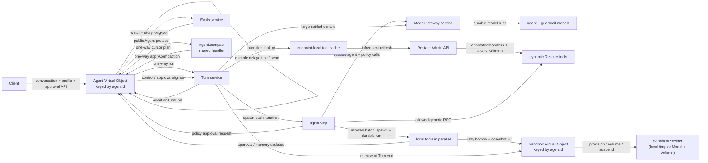

# Restate durable agent reference

A small, end-to-end reference implementation of a modern agent runtime on
Restate. The interesting part is not another prompt-and-tools loop: it is
making that loop durable, steerable, interruptible, policy-gated, observable,
bounded, and evaluable without hiding the control flow behind a framework.

The project is intentionally compact enough to read from ingress to model call
and back. It demonstrates production-oriented execution semantics around a
simple weather agent, while keeping the model and tool domain deliberately
unimportant.

## Documentation

Start with [`docs/README.md`](docs/README.md) for the complete maintainer guide.
It links the architecture and data flow, supported Agent protocol, Turn
semantics, built-in and dynamically discovered tool contracts, sandbox
providers, local development, and durable evals.

For Codex, Claude Code, or another coding agent, point it first to
[`docs/agent-guide.md`](docs/agent-guide.md). That guide records the
source-of-truth order, ownership boundaries, invariants, common traps, and the
files that should change for each kind of task.

## State-of-the-art capabilities

| Capability | What this implementation does |
| --- | --- |
| Durable agent turns | A Turn is a Restate invocation. Model calls, timers, signals, tool results, and control decisions survive process crashes and replay deterministically. |
| Per-agent serialization | Each `Agent` virtual object is keyed by `agentId`; exclusive handlers serialize conversation control without a separate lock or database transaction protocol. |
| Mid-turn steering | Steering is a durable FIFO signal protocol. It never cancels the current model/tool step: completed work is committed first, pending operations continue, and the update enters the next model round. |
| Graceful interruption | Interruption stops and joins unfinished work, preserves completed results, and makes one tool-free final model call that explains what was achieved relative to the original request. |
| Parallel tool batches | Independent tool calls from one model response are spawned together and joined as a batch. Restate journals the concurrency while preserving deterministic recovery. |
| Restate-native dynamic tools | Any JSON handler in the cluster can opt in with `restate.dev/agent: <tool-name>` metadata. Each Turn journals one catalog snapshot from a replica-local read-through cache and invokes selected handlers as ordinary durable Restate RPCs. |
| Long-running operations | Tools such as `sleep` and `humanApproval` can return a pending acknowledgement and continue across later agent steps. The Turn owns their stable IDs and lifecycle. |
| Selective cancellation | The model can cancel one pending operation by ID without killing the Turn or unrelated operations. Completion-versus-cancellation races are represented honestly. |
| Runtime guardrails | A separate, cheaper policy model gates the exact proposed text or complete tool batch before anything is published or executed. Decisions are `allow`, `deny`, or `require_approval`. |
| Durable human approval | Policy gates and the explicit approval tool register requests on the Agent and resume through Turn-scoped signals. Request, resolution, and cancellation events make the complete lifecycle discoverable through history; resolved decisions also become model-visible context. |
| Immutable transcript | Conversation history is an append-only, sequenced event log. User messages, steering, interruption, runtime stops, dispatch, concise activity, structured tool lifecycle, profile changes, approval lifecycle, progress, and terminal outcomes retain their natural observation order. |
| Push-style history updates | Any client long-polls the shared `watchHistory` handler, which parks inside the Agent until the cursor becomes readable or its wait window elapses. Registration closes the empty-read race; the transcript itself remains available through the cursor API. |
| Persistent agent profile | User instructions, model-managed keyed memories, and user-defined guardrails are durable per Agent and snapshotted at Turn start. |
| Agent-owned schedules | The model or an external client can create, replace, list, and cancel durable one-shot or fixed-interval messages. Delayed self-sends wake the Agent, which starts, queues, steers, or interrupts according to the schedule's busy policy. |
| Non-destructive compaction | Older finished conversation prefixes are summarized asynchronously for model context, but the canonical transcript is never rewritten or replaced. Recent entries remain exact. |
| Turn-local context reduction | Large settled model/tool prefixes accumulated during one active Turn are reduced between steps. Initial conversation context and the newest working messages remain exact, while canonical history is untouched. |
| Semantic execution events | Short model-authored activity plus structured tool-batch start/finish events make multi-step turns readable. `thinking`, `waiting`, and `finalizing` remain semantic milestones; raw reasoning, tool arguments, and tool results stay private. |
| Model admission control | Agent and policy calls go through a scoped gateway with provider-, model-, and agent-level concurrency keys, bounded retries, and cancellation propagation. |
| Agent-scoped sandboxes | A `Sandbox` virtual object keyed by `agentId` lazily provisions or resumes a sandbox, serializes its lifecycle, lends it to one Turn, and durably schedules idle suspension after release. Choose the zero-config local workspace or secure Modal compute backed by one persistent Volume per Agent. |
| Explicit command lifetime | Sandbox commands are one-shot foreground calls returning an exit code, stdout, and stderr. Asynchronous work is an explicit shell concern rather than a hidden pending-tool protocol. |
| Restate-native evals | Durable eval invocations drive fresh Agents through the same public protocol, synchronize on `watchHistory` wait windows, inject control events, and return structured assertions plus the observed transcript. |

These features compose rather than live as isolated demos. For example, a Turn
can run ten weather calls as one parallel batch, keep a durable timer alive
across later rounds, accept steering without losing either, request fresh
approval for newly protected work, and still produce one ordered,
cursor-consumable transcript after recovery.

## Control semantics at a glance

| Action | When idle | While a Turn is active |
| --- | --- | --- |
| `ask(message)` | Appends the user message and starts a Turn. | Appends the message immediately and queues it for the next Turn. |
| `steer(message)` | Returns `false`. | Moves queued messages plus the new instruction into the active Turn. Current tools are not cancelled. Returns `false` once interruption has begun. |
| `interrupt(reason, message?)` | Returns `false`. | Cancels and joins unfinished work, finalizes the current Turn, and optionally queues a replacement message for a new Turn. |
| `cancelOperation(id)` | Not a controller action. | A model tool selectively stops one pending operation while the Turn continues. |
| Scheduled message | Starts a Turn. | Queues by default, or uses its configured `steer` or `interrupt` policy. A due message never disappears while a Turn is already interrupting; it falls back to the next-Turn queue. |
| External invocation cancellation | Nothing to cancel. | Stops the invocation, cleans up owned work, records the boundary, and rethrows cancellation to Restate. |

The distinction is deliberate: queueing changes *when* a request runs,
steering changes *the active request without discarding work*, interruption
ends the active request gracefully, and selective cancellation targets only
one long-running operation.

## Deliberate scope

This is a reference runtime, not a complete agent product. The weather tool is
synthetic so execution semantics stay visible. The local sandbox provider is a
convenient `/tmp` workspace rather than a security boundary; the optional Modal
provider supplies isolated remote compute and persistent Agent files.
Token-by-token output streaming, pub/sub fan-out, authentication, and
multi-tenant policy administration are not implemented. History watch windows
provide durable point-to-point change notification, not a replacement for a
broadcast event bus. Scheduling intentionally supports relative one-shot and
fixed-interval delivery rather than cron expressions, timezones, or catch-up
calendars.

Natural-language guardrail classification and answer quality remain
probabilistic model behavior; the runtime deterministically enforces the
decision it receives. The current evals exercise the live stack and protocol
semantics but do not yet include a suite coordinator, repeated statistical
runs, a scripted model, or an independent semantic judge.

## Architecture



## Why this structure

- `Agent` is the durable controller. Its exclusive handlers serialize changes
  to the active turn, pending messages, and conversation history for one
  `agentId`. It coordinates five independent components: `agent-turn.ts` owns
  turn state and signal lifecycle, `agent-history.ts` owns the durable
  transcript, `agent-profile.ts` owns instructions, memories, and guardrails,
  `agent-approval.ts` owns pending human approvals, and `agent-schedules.ts`
  owns scheduled-message state.
  Each component exports a handler-scoped capability namespace: its operations
  use Restate's current handler context and hold no process-local state.
- `Turn` has no service state, but one durable invocation owns the transient
  state machine for an agent turn: model messages, budgets, steering, pending
  operations, and graceful finalization. `Turn.run` supervises that state
  machine as a spawned task. The state machine repeatedly spawns one bounded
  `agentStep`, applies the returned data, and reports one structured
  `completed | interrupted | stopped | failed` result.
- `turn-step.ts` owns the functional execution seam and the small supervisor
  that settles each spawned step against interruption. A step receives a
  message snapshot and remaining tool budget, performs one agent-model call,
  gates that proposed response against the guardrail snapshot, runs an allowed
  foreground tool batch in parallel, and owns no work after returning.
  `turn-steering.ts` drains durable steering signals into a Turn-scoped inbox,
  while `turn-pending.ts` owns tasks that survive across steps.
- `agent-tools.ts` owns the concrete tools. Each definition keeps its model
  description, input schema, validation, local durable behavior, and result
  projection together. It exposes each step a single concrete tool collection.
  Sandbox tools borrow the agent-scoped resource lazily; each file or command
  operation remains an ordinary foreground tool call.
- `dynamic-tools.ts` discovers opted-in cluster handlers once per Turn. The
  journaled catalog is passed unchanged to model inference and execution;
  built-in names take precedence, duplicate annotations resolve
  deterministically, and generic calls remain ordinary Restate child
  invocations.
- `sandbox.ts` owns durable lifecycle state for one agent's sandbox. It cancels
  a pending idle suspension when a Turn borrows the resource, resumes it when
  needed, and schedules suspension after the Turn releases it.
  `sandbox-provider.ts` is the vendor-neutral boundary. Its synchronous
  `connect` only constructs a client; every provider and client operation runs
  separately inside `restate.run`. The local adapter lives beside that boundary;
  `modal-sandbox-provider.ts` owns Modal-specific compute and storage behavior.
- `model.ts` owns provider-specific inference and the shared model contracts. It
  reconstructs AI SDK tool definitions from serializable manifests while
  deliberately receiving no executors.
- The shared `Agent.compact` handler asynchronously maintains a rolling summary
  of older finished turns without blocking exclusive conversation handlers.
  The model operation stays in `conversation-compactor.ts`; the exact
  transcript remains on the Agent and messages after the checkpoint remain
  verbatim.
- `model-gateway.ts` is the Restate boundary for full agent inference and cheap
  guardrail evaluation and Turn-local context reduction. It owns scoped
  admission, model-specific limit keys, retries, and cancellation propagation
  before delegating provider calls to `model.ts`.
- `eval.ts` contains durable black-box protocol evaluations. One suite
  invocation concurrently drives fresh Agents through public handlers and
  waits for transcript milestones through `watchHistory` wait windows instead of
  polling.

The controller stores the canonical transcript: user and assistant messages,
explicit lifecycle boundaries, semantic progress, short user-facing activity,
and structured tool names and statuses. Raw provider reasoning, tool arguments,
tool results, and intermediate model messages stay in Restate's invocation
journal and observability tools. A turn reports exactly one structured outcome:
`completed`, `interrupted`, `stopped`, or `failed`. A graceful interruption can
include a final assistant response based on completed tool results; execution
limits use `stopped` with a structured cause.

Every handler on `Agent`, `Turn`, `ModelGateway`, `Sandbox`, and `Evals` is
ingress-public in this reference implementation. This keeps the complete
protocol inspectable and easy to invoke while experimenting. Public visibility
does not make every handler a user API: normal clients should use `ask`,
`history`, `steer`, `interrupt`, `profile`, `setInstructions`,
`setGuardrails`, `scheduleMessage`, `cancelSchedule`, `schedules`, `approvals`,
and `resolveApproval`; the remaining handlers are coordination paths used by
the services themselves. Every handler has a runtime input/output schema,
including AI SDK model messages at the gateway and compaction cursor ranges on
the Agent.

## Conversation history and compaction

The complete user-facing transcript is a canonical append-only event log and
is never replaced by a model summary. User entries record how they originally
arrived; later steering and dispatch decisions are appended as lifecycle
events instead of rewriting those entries. `agent-history.ts` stores the log in
fixed-size state chunks with stable internal sequence numbers. Its lazy entry
reader hides those chunks and stops loading state as soon as a consumer has
enough entries. The public `history` handler exposes an inclusive cursor over
the same sequence numbers. Any client — a Restate service or a plain HTTP
caller — long-polls the shared `watchHistory` handler with that cursor. The
handler checks shared state, registers an internal awakeable through a brief
exclusive re-check that closes the empty-read race, and parks until the cursor
becomes readable or its wait window elapses; callers simply loop. Waiting
happens in a shared handler, so transcript writers are never blocked, and a
timed-out window withdraws its registration so idle watchers do not
accumulate. The request window defaults to its five-minute safety ceiling. Its
handler-level `inactivityTimeout` is independently set to 1 second so Restate
can suspend a parked endpoint session while preserving the longer durable wait.

After a turn finishes, the Agent first activates any queued work and starts its
next Turn from the exact transcript. It then counts conversation messages since
the last checkpoint. At 32 messages it reserves the observed prefix—including
the dispatch boundary for those queued messages—and self-sends its cursor range
to the shared `compact` handler. That handler reads the relevant summary and
history chunks directly from Agent state, including interruption and failure
boundaries, merges them with a cheap model, and one-way self-sends the derived
checkpoint to the exclusive `applyCompaction` handler. Newer appended entries
do not invalidate the checkpoint, and a failed compaction leaves the prior
summary untouched.

Each `TurnRequest` carries a stable snapshot of the Agent's instructions,
memories, guardrails, rolling summary, and exact model-relevant entries since
the checkpoint. Progress, activity, tool lifecycle, profile-change metadata,
pending approval lifecycle, memory, and schedule events remain in the canonical
transcript but are filtered before the request is serialized. The due scheduled
user message remains model-visible. Resolved approval decisions remain
model-visible. The Turn projects steering metadata and
interruption, queued-message dispatch, or failure entries as explicit
model-visible boundaries. Only the reserved handoff prefix is summarized:
profile state, live model messages, tool calls, tool results, pending
operations, and later steering inside the active Turn are not part of that
checkpoint.

The active Turn separately bounds its private working context. Its initial
Agent-provided messages stay exact. Between steps, once later settled
model/tool messages exceed the Turn's character budget and no operation is
pending, the Turn asks the scoped gateway to reduce the prefix already seen by
the agent model. Newly appended tool results, steering, and runtime events stay
exact until that model has observed them. The result exists only inside that
Turn invocation. It does not rewrite canonical history or affect future Turns,
and a failed reduction leaves the exact working context in place.

## Scheduled messages

Schedules are durable Agent state rather than a separate service. The
`scheduleMessage` tool or handler creates or replaces a stable `scheduleId`,
then records the invocation ID of a delayed `Agent/fireSchedule` self-send.
Cancellation stops that timer, and every fire checks that its invocation ID is
still current. A cancelled or replaced delayed invocation therefore cannot act
on newer schedule state.

A schedule carries a message, a relative first delay, an optional fixed repeat
delay, and a `whenBusy` policy. When the Agent is idle, the due message is
appended and starts a Turn. While busy, `queue` appends it for the next Turn,
`steer` promotes the existing queue plus the due message into the active Turn,
and `interrupt` gracefully stops current work while preserving the due message
for the next Turn. An already-interrupting Turn always falls back to `queue`.
One-shot schedules are removed before delivery; repeating schedules install
their next fixed-delay timer first.

Creation, replacement, cancellation, and firing are immutable `schedule`
events in history. The firing event records the routing decision and is
immediately followed by the corresponding user message. Schedule metadata is
omitted from model context and compaction; the user message itself remains
ordinary conversation input. `schedules` is the authoritative current
snapshot. The demo bounds each Agent to 32 active schedules.

## Sandbox lifecycle and tools

`Sandbox` is a Virtual Object keyed by the same `agentId` as its `Agent`, and
the resource belongs to that Agent across conversation Turns. The first
sandbox tool in a Turn lazily calls `borrow(turnId)`; parallel tools share that
in-flight call and later steps reuse its result. The first-ever borrow
provisions the resource, while a later Turn resumes it if idle suspension has
already occurred. A different Turn cannot take an active lease. When
`Turn.run` reaches any terminal outcome, it calls `release(turnId)`.
Release schedules a durable delayed `suspend` invocation and records its
invocation ID. A subsequent borrow cancels that exact timer, and stale delayed
invocations cannot suspend a resource that has been borrowed again.
Provision, borrow, release, resume, suspend, and destroy remain infrastructure
details visible through Restate observability rather than conversation events.

The provider interface separates connection from effects. `connect(ref)` is a
synchronous, process-local operation. `listFiles`, `readFile`, `writeFile`, and
`executeCommand` are one-shot client calls individually wrapped in
`restate.run`, receiving its `AbortSignal`. `executeCommand` always waits for a
terminal `{ exitCode, stdout, stderr }` result. If the model intentionally
wants asynchronous work, it must launch and track a background shell script;
the agent runtime does not turn a sandbox process into an implicit pending
operation.

The default `local` provider stores each Agent under
`/tmp/restate-agent-sandboxes/<agentId>`, so later Turns see files created by
earlier Turns. It uses Node filesystem APIs for files and executes commands as
one bounded child process. Relative file paths and command working directories
are constrained to that Agent directory. This is only a convenient demo
workspace, not a security boundary: shell commands still run with the service
process's host permissions.

Set `SANDBOX_PROVIDER=modal` to use the Modal adapter. It derives a stable,
non-identifying resource name from the `agentId`, creates one named Modal Volume
for that Agent, and mounts it at `/workspace` in a named Sandbox. Provision and
resume recover that deterministic name after an ambiguous retry, rather than
creating duplicate compute. Idle suspension terminates the Sandbox after Modal
has committed the Volume; resume creates fresh compute over the same files.
Destroy terminates any live Sandbox and deletes its Volume. The base image,
Modal App, and maximum Sandbox lifetime are configurable:

```sh
SANDBOX_PROVIDER=modal
MODAL_TOKEN_ID=...
MODAL_TOKEN_SECRET=...

# Optional defaults:
MODAL_APP_NAME=restate-agent-sandboxes
MODAL_SANDBOX_NAMESPACE=restate-agent-sandboxes
MODAL_SANDBOX_IMAGE=debian:bookworm-slim
MODAL_SANDBOX_TIMEOUT_MS=86400000
```

The namespace participates in the hashed Volume and Sandbox name; set it
explicitly when several Restate deployments share one Modal environment.
The official Modal SDK also supports credentials from `~/.modal.toml`, but
environment credentials are the usual choice for a deployed Restate endpoint.
Modal's JavaScript API does not currently expose termination of one individual
`Sandbox.exec` process. The adapter therefore checks Restate's abort signal at
operation boundaries and still awaits an in-flight command, bounded by the
tool's timeout, instead of pretending it was cancelled while it continues in
the background. Suspending or destroying the Agent sandbox terminates the
whole remote Sandbox.

## Dynamic Restate handler tools

A third-party JSON handler can become a model tool without being linked into
this application. Add handler metadata whose key is the exported
`AGENT_TOOL_ANNOTATION` constant (`restate.dev/agent`) and whose value is a
valid model tool name:

```ts
const Grafana = restate.service({
  name: "Grafana",
  handlers: {
    query: restate.schemas(
      {input: QuerySchema, output: QueryResultSchema},
      function* (request) {
        // ...
      },
    ),
  },
  options: {
    handlers: {
      query: {
        metadata: {
          "restate.dev/agent": "query_grafana",
        },
      },
    },
  },
});
```

At the beginning of every Turn, `dynamic-tools.ts` reads an endpoint-local
catalog cache inside a journaled `restate.run`. A cache miss or five-minute
expiry refreshes it from the Restate Admin API's `GET /services` endpoint.
Concurrent refreshes within one service process are coalesced; other Turns use
the last known-good snapshot instead of accumulating behind the Admin request.
Each endpoint replica owns its cache, so Turn traffic does not converge on a
single Restate key or process. The discovered catalog selects annotated
handlers and reads their advertised input JSON schemas. The model sees a
wrapper object with `input` for the handler payload;
Virtual Object and Workflow tools additionally require `key`. A selected tool
is invoked through `restate.call`, so it appears as a durable child invocation
and participates in the same parallel batch and guardrail check as built-in
tools. Third-party tools are foreground calls in this first version; they do
not participate in the pending-operation protocol. The Admin API also exposes
the output schema, but the model tool protocol needs only the input contract;
the actual handler response is returned as the ordinary tool result.

The shared Admin request has a five-second timeout. A failed refresh keeps the
last known-good catalog and waits 30 seconds before retrying. A cold cache
still uses the bounded Restate retry policy and falls back to built-in tools if
discovery remains unavailable. The Admin API defaults to
`http://localhost:9070`. Set `RESTATE_ADMIN_URL` when the service reaches it at
another address, and optionally `RESTATE_ADMIN_TOKEN` for a bearer token.
Annotated handlers must use JSON-compatible input/output serialization. Treat
the annotation as a trusted cluster capability-registration boundary: handler
descriptions enter the model prompt and the agent may invoke the handler with
its service identity.

## Instructions, memories, and guardrails

Each Agent owns one durable profile. User-set instructions are appended to the
application's system instructions and apply to every model call in a Turn,
including graceful interruption finalization. Memories are a separate keyed
collection of contextual data: they are injected before conversation history
and explicitly marked as facts rather than instructions. Current user messages
and newer tool results take precedence over stale memory.

The model manages memory through one atomic `manageMemory` tool. A batch can set
or delete keys, and the Agent accepts it only from its active,
non-interrupting Turn. Memory is limited only by entry count: at most 32 entries
per Agent. A successful update is durable even if later work in that Turn
fails, and its keys are recorded as a metadata-only transcript event. Memory
events are omitted from model context and compaction because the current
profile snapshot is authoritative.

Changing instructions or guardrails likewise appends a metadata-only `profile`
event. It identifies the changed section, whether instructions are configured,
or the current guardrail IDs without duplicating instruction or policy text in
the immutable log. A history consumer can therefore invalidate its cached
profile and read the authoritative `profile` snapshot.

Guardrails are user-configured natural-language policies with stable IDs. A
cheap policy model evaluates every proposed assistant response or complete tool
batch before text is published or any tool in that batch starts. It returns
`allow`, `deny`, or `require_approval`. A denial is returned to the agent model
as runtime feedback so it gets one chance to refuse or choose a compliant
alternative. If the same policy blocks the next proposal, Turn completes with
a deterministic tool-free refusal instead of spending its remaining step
budget in a policy loop. An approval requirement creates a durable request on
the Agent and waits for a human decision before executing the exact proposal.

Guardrails are not included in the main agent model's system prompt. This keeps
policy enforcement in one place: the agent proposes the actual work, and the
runtime independently gates it. The explicit `humanApproval` tool remains
available for approvals the agent decides it needs for reasons unrelated to a
runtime guardrail. The evaluator receives the exact proposed action plus
structurally tracked context starting at the latest real user input, including
execution evidence produced after it. It never infers message provenance from
prompt prefixes. Historical approval prose remains available to the agent but
cannot turn a conditional policy into an allowlist; current-Turn decisions are
supplied to the evaluator separately.

An approval record retains its policy ID, human question, and exact approved
proposal. Every later proposal is still evaluated: the policy model may reuse
the approval only when the new action is materially within that recorded scope.
A changed action can therefore require fresh approval even without steering.
Rejection blocks the proposal and prevents another approval loop for that
request. Steering changes the request, so Turn invalidates both decisions and
evaluates the updated work again. Graceful interruption cannot open a new
approval while ending the Turn: its final text is checked and withheld if the
policy model does not allow it. The evaluator is deliberately model-based and
therefore probabilistic; the runtime deterministically enforces the decision it
returns. Instructions and guardrail changes affect the next Turn.

Every newly registered request is appended as `approval_request` with its ID,
question, Turn, and optional policy ID. Resolution appends the existing
structured `approval` event with the decision and optional reason; abandoned
requests append `approval_cancelled`. History is therefore sufficient to
discover approval changes, while `approvals` remains the authoritative snapshot
of what is pending now. Later Turns and conversation compaction retain resolved
decisions so the agent does not treat them as unresolved, without turning one
approval into blanket authorization for materially changed work.

## Agent handlers

| Handler | Input | Behavior |
| --- | --- | --- |
| `ask` | `{ message: string }` | Starts a turn when idle or queues the message when busy. `start` returns its new `turnId`; `queue` returns `turnId: null`, the currently active `activeTurnId`, and the pending-message count because the queued message has not yet been assigned to a Turn. |
| `history` | `{ fromSequence?: number, limit?: number }` | Returns up to `limit` sequenced transcript entries starting at the inclusive cursor, plus the cursor for the next read. Defaults to sequence 1 and 50 entries; the maximum page size is 100. |
| `watchHistory` | `{ fromSequence, timeoutSeconds? }` | Shared long-poll: returns `true` as soon as the cursor is readable, or `false` when the wait window (default and maximum 300s) elapses. Callers loop and re-read `history`. |
| `registerHistoryWatcher` | `{ fromSequence, awakeableId }` | Internal exclusive registration path used by `watchHistory`; re-checks the cursor so no append is lost. |
| `unregisterHistoryWatcher` | `{ awakeableId }` | Internal cleanup path that withdraws a timed-out watch registration. |
| `profile` | void | Returns this Agent's instructions, model-managed memories, and natural-language guardrails. |
| `setInstructions` | `{ instructions: string \| null }` | Replaces the persistent user instructions and appends a profile-change event; `null` clears them. Running Turns keep their snapshot. |
| `setGuardrails` | `{ guardrails: [{ id, rule }] }` | Replaces the persistent policy list and appends its IDs as a profile-change event. IDs must be unique; running Turns keep their snapshot. |
| `interrupt` | `{ reason, message? }` | Records an interruption event and signals the active Turn to cancel unfinished work and produce a final response. An optional replacement message is appended immediately and queued for the next Turn. |
| `steer` | instruction string | Sends queued messages and the new instruction to the active turn, then appends a steering lifecycle event without rewriting their transcript entries. |
| `scheduleMessage` | `{ turnId: string \| null, schedule: { scheduleId, message, delaySeconds, repeatEverySeconds, whenBusy? } }` | Creates or replaces a durable one-shot or fixed-interval message. A Turn supplies its ID; external administration uses `null`; omitted `whenBusy` defaults to `queue`. |
| `cancelSchedule` | `{ turnId: string \| null, scheduleId }` | Idempotently removes a schedule and cancels its current delayed invocation. |
| `schedules` | void | Shared read of the Agent's authoritative active schedules and next delivery times. |
| `fireSchedule` | `{ scheduleId }` | Delayed self-send target. Rejects stale invocation IDs, advances recurrence, and routes the due message. |
| `approvals` | void | Returns the human approvals currently waiting on this agent. |
| `resolveApproval` | `{ approvalId, decision, reason? }` | Resolves and removes a pending approval only while its Turn is still eligible to receive the decision, then records the delivered decision in history. Returns whether the signal was delivered. |
| `reportProgress` | `{ turnId, phase, message }` | One-way path used by the active Turn; appends an ordered transcript event only for the current invocation. |
| `reportExecution` | structured activity/tool reports | One-way path used by the active Turn; atomically appends concise model-authored activity and tool-batch lifecycle events for the current invocation. |
| `requestApproval` | `{ approvalId, turnId, question, guardrailId? }` | Registers a tool or policy approval request only while its Turn remains active and is not interrupting, then appends a structured request event. |
| `cancelApproval` | `{ approvalId, turnId }` | Idempotently removes an abandoned approval request and records the cancellation when one existed. |
| `updateMemory` | `{ turnId, changes }` | Coordination path used by `manageMemory`; atomically applies a bounded memory batch only for the active Turn. |
| `onTurnEnd` | structured turn outcome | Accepts the active Turn's one terminal result, reconciles unconsumed steering, appends user-facing history, dispatches queued work, and then considers compaction. Stale or duplicate Turn IDs are ignored. |
| `compact` | reserved history cursor range | Shared handler that reads and summarizes one finished transcript prefix, then sends the result to `applyCompaction`. |
| `applyCompaction` | structured compaction result | Exclusively validates and installs the current summary checkpoint, or clears a failed reservation. |

`history`, `watchHistory`, `profile`, `schedules`, `approvals`, and `compact`
are shared handlers; the other Agent handlers are exclusive. Lazy state allows
shared readers and the compactor to load only the state keys and history chunks
they need.

The remaining services expose these public handlers:

- `Turn/run` accepts the Agent's profile snapshot, rolling summary, and exact
  uncompacted transcript, runs one transient state machine made of bounded
  agent steps, and awaits one structured outcome call to `Agent/onTurnEnd`.
- `Sandbox/borrow` lazily provisions or resumes the agent-scoped resource,
  `release` schedules idle suspension, `suspend` applies that lifecycle
  transition, and `destroy` removes an idle resource.
- `ModelGateway/complete` accepts instructions, model messages, and serializable
  tool manifests. `ModelGateway/evaluateGuardrails` separately accepts the
  policy snapshot and exact proposed action. `ModelGateway/reduceContext`
  reduces a settled prefix of one active Turn. All three use the `openai` scope
  so model-specific concurrency limits apply.
- `Evals/all` accepts optional isolation settings and an optional case subset,
  concurrently drives each selected scenario against a fresh Agent, and returns
  one aggregate of structured assertions and complete observed transcripts.

A successful interruption is visible immediately as
`{ role: "event", type: "interrupt", turnId, reason }`. The active Turn then
cancels and joins unfinished tools, retains completed results, and makes one
tool-free model call that answers as far as those results allow. That response
is appended as an assistant entry with status `interrupted`. A later turn sees
both the boundary and final response. External invocation cancellation still
creates a boundary without attempting graceful finalization.

Execution limits use a separate
`{ role: "event", type: "stop", turnId, cause, reason }` boundary followed by
an assistant entry with status `stopped`. They share the guarded, tool-free
finalization machinery without pretending that a user or operator interrupted
the Turn.

`ask` deliberately makes no model decision: it starts work when idle and
queues when busy. Clients choose `steer` or `interrupt` explicitly when a
message should affect the active turn. The interrupt reason is only a control
instruction for finalizing the old Turn. A distinct optional `message` is
recorded as a user request and queued for the next Turn.

The controller flow is therefore:

- An idle `ask` records its message and starts a Turn with the resulting
  transcript.
- An `ask` received while a Turn is active is recorded immediately at its
  natural transcript position; the pending FIFO controls only when it runs.
- `steer` drains that queue into one structured steering signal, then appends
  the steering request and a lifecycle event recording its target Turn and
  queued-message count.
- `interrupt` leaves the queue intact. When it carries a replacement message,
  the Agent appends and queues that user request before recording the
  interruption event. The old Turn appends its graceful final response, then a
  dispatch event activates all queued entries and starts one new Turn with the
  complete transcript.

Repeated resolutions of the `steering` signal form a durable queue. Each
`steer` call resolves one structured `{ queued, message }` signal: messages
waiting in the next-turn queue retain their FIFO order as `queued`, while the
explicit instruction remains distinct as `message`. Turn converts that
batch into one structured model update, while conversation history retains the
individual user messages.

The controller tracks each signal's message count, while Turn reports how many
signals it consumed. If normal completion wins the race with a steer, the
original entries remain unchanged and a later dispatch event activates the
unconsumed requests in a new Turn. An explicit interrupt supersedes outstanding
steering. External cancellation does not: steering accepted before cancellation
is recovered into the next turn.

## Execution activity

Turn one-way sends semantic milestones to `Agent.reportProgress` and structured
step detail to `Agent.reportExecution`. For each allowed tool batch, the latter
records an optional short activity sentence followed by a `started` event with
tool call IDs and names, then a `finished` event whose calls are `succeeded`,
`failed`, `pending`, or `cancelled`. Tool arguments and results are never copied
into history. Progress covers `thinking`, `waiting`, and `finalizing`; terminal
state is already represented by the Turn's assistant outcome. Raw provider
reasoning blocks are never exposed.

These events retain their natural order relative to every other event the Agent
observes. They are deliberately omitted from model context and conversation
compaction because they are derived execution status, not user instructions.
Clients consume all transcript activity through one cursor:

```sh
curl localhost:8080/Agent/demo/history \
  -H 'content-type: application/json' \
  -d '{"fromSequence":1,"limit":50}'
```

The cursor is inclusive. The response contains
`{ entries: [{ sequence, entry }], nextSequence }`; pass `nextSequence` as the
next request's `fromSequence`. An empty page leaves the cursor unchanged. This
durable transcript can later be mirrored to pub/sub for live fan-out without
making pub/sub the source of truth.

## Durability and failure behavior

- Starting a turn is a one-way Restate send. Turn awaits `onTurnEnd` so Agent
  ownership is reconciled before external cancellation is rethrown.
- Progress and execution reports use one-way sends and never block model or
  tool execution on the Agent handler completing.
- Each agent step makes one scoped full-model invocation and, when guardrails
  exist, one or more scoped policy-model invocations. Each contains one durable
  `run` step. Restate owns a bounded four-attempt retry policy; the AI SDK's
  internal retries are disabled.
- Turn carries AI SDK response messages into the next model call. This
  preserves reasoning and tool-call state while OpenAI response storage is
  disabled.
- Before response text is returned or a tool batch starts, the policy model
  checks the complete proposed action. A policy-model error fails closed and
  follows Restate's retry policy.
- If an allowed model step emits several independent tool calls, `agentStep` uses
  Restate's [concurrent task primitives](https://docs.restate.dev/develop/ts/concurrent-tasks)
  to spawn all local tool `run` steps before joining them. Restate journals
  their concurrent execution and preserves deterministic replay.
- A background Turn fiber drains steering signals into a transient FIFO while
  the current model call and foreground tool batch finish. After the step
  settles, Turn commits its results and drains the inbox, so the next agent
  step receives every buffered instruction in FIFO order.
- `sleep` and `humanApproval` return protocol-complete pending acknowledgements
  to the model, while their turn-scoped Restate tasks continue across later
  steps. A pending sleep therefore keeps its timer while steering starts
  unrelated tools. A pending approval gates dependent actions without blocking
  unrelated work; its eventual signal result is injected as a runtime update.
- A guardrail approval is different: it pauses the proposed step before any
  action in it runs. Approval resumes that exact proposal; rejection returns
  policy feedback to the next model step. Interruption cancels the wait and
  cleans up its durable request.
- `cancelOperation` lets the model selectively interrupt and join one pending
  operation by its stable tool-call ID. Pending tasks are held in a turn-local
  keyed registry; completion races are reported honestly, and unrelated
  operations continue running.
- `scheduleMessage`, `cancelSchedule`, and `listSchedules` are foreground tools
  over Agent state. Creating a schedule journals a delayed self-send rather
  than leaving a Turn task pending, so the timer survives after that Turn ends.
- Graceful interruption cancels and joins foreground and pending tasks, records
  their completed or cancelled results in the Turn context, and performs one
  final model call with no tools. Abandoned approval requests are cleaned up
  idempotently.
- Deterministic configuration and OpenAI 4xx request errors fail immediately.
  Transient transport, timeout, rate-limit, conflict, and 5xx errors retry.
- A foreground tool whose durable retry policy is exhausted returns a failed
  tool result to the model. It does not fail the whole Turn unless cancellation
  or orchestration itself is failing.
- Invocation cancellation rejects the yielded state-machine task. The Turn
  supervisor catches it, stops independently pending tools, then waits for
  sandbox release and Agent outcome reconciliation. The controller is retired
  without finalization before cancellation is rethrown to Restate.
- The complete transcript remains durable. The model sees the rolling summary
  plus each exact model-relevant entry since its checkpoint, with steering
  metadata and interruption/failure boundaries preserved.
- Turn stops after 50 agent-model steps or 24 tool calls instead of running
  indefinitely. It cancels unfinished work and makes one guarded, tool-free
  finalization call so completed results are not replaced by a budget error.

This compact reference does not reconcile operator-killed invocations. A hard
kill before `Agent/onTurnEnd` can leave the Agent pointing at a vanished Turn, and a
hard-killed `compact` invocation can leave its cursor reservation active.
Production adaptations should retain the child invocation ID and attach or
schedule a reconciliation handler with a deadline.

## Model flow control

Agent inference, guardrail evaluation, and active-Turn context reduction use
the scoped gateway. `ask` performs no inference; steering and interruption are
explicit controller operations. Background conversation compaction owns its
cheap model call in a shared Agent handler and cannot consume a gateway slot.

`ModelGateway` calls use scope `openai` and a two-level limit key:
`<model>/<agent-hash>`. Each invocation therefore draws from three budgets at
once:

- `openai` — all gateway traffic to the provider
- `gpt-5.6-terra` or `gpt-4o-mini` — traffic for that model
- `<agent-hash>` — concurrent inference for one agent

For example:

```sh
restate rules set "openai" --concurrency 100
restate rules set "openai/gpt-5.6-terra" --concurrency 20
restate rules set "openai/gpt-5.6-terra/*" --concurrency 2
restate rules set "openai/gpt-4o-mini" --concurrency 50
restate rules set "openai/gpt-4o-mini/*" --concurrency 4
```

The constant provider scope is intentionally simple and gives this example a
single provider-wide budget. At very high scale, use a higher-cardinality scope
such as tenant or account to avoid concentrating scheduling on one partition.

## Run locally

Requirements: Node.js 22 or newer, pnpm, a local Restate Server and CLI, and an
OpenAI API key. The optional Modal provider additionally needs a Modal token ID
and secret. Restate's [quickstart](https://docs.restate.dev/quickstart) covers
installing the server and CLI.

Restate's [scope-based flow control](https://docs.restate.dev/services/flow-control)
is currently opt-in and must be enabled on a fresh cluster:

```sh
RESTATE_EXPERIMENTAL_ENABLE_PROTOCOL_V7=true \
RESTATE_EXPERIMENTAL_ENABLE_VQUEUES=true \
restate-server
```

In another shell, start the service endpoint:

```sh
pnpm install
OPENAI_API_KEY=... pnpm dev
```

To run the same endpoint with isolated Modal sandboxes:

```sh
OPENAI_API_KEY=... \
SANDBOX_PROVIDER=modal \
MODAL_TOKEN_ID=... \
MODAL_TOKEN_SECRET=... \
pnpm dev
```

For dynamic tools, also set `RESTATE_ADMIN_URL` if the service cannot reach
the local Admin API at `http://localhost:9070`.

With the service endpoint running, register it with Restate:

```sh
restate deployments register http://localhost:9080
```

Then invoke the `Agent` Virtual Object under any `agentId`, such as `demo`:

The `ask` schema defaults a missing `message` to: “What is the weather in the
top 10 European capitals? Also sleep for 4 minutes.”

```sh
curl localhost:8080/Agent/demo/setInstructions \
  --json '{"instructions":"Prefer concise answers and metric units."}'

curl localhost:8080/Agent/demo/setGuardrails \
  --json '{"guardrails":[{"id":"japan-approval","rule":"Ask for human approval before answering questions about Japan."}]}'

curl localhost:8080/Agent/demo/ask \
  --json '{"message":"What is the weather in Berlin?"}'

curl -X POST localhost:8080/Agent/demo/profile

curl localhost:8080/Agent/demo/history \
  --json '{"fromSequence":1,"limit":50}'

curl localhost:8080/Agent/demo/steer \
  --json '"Steer toward a one-sentence answer"'

curl localhost:8080/Agent/demo/interrupt \
  --json '{"reason":"The user changed tasks","message":"What is the weather in Japan?"}'
```

An idle agent returns a response shaped like:

```json
{
  "decision": "start",
  "turnId": "inv_...",
  "stats": {"pendingMessages": 0}
}
```

A busy agent does not yet know which Turn will consume the queued message:

```json
{
  "decision": "queue",
  "turnId": null,
  "activeTurnId": "inv_...",
  "stats": {"pendingMessages": 1}
}
```

To keep a turn alive while trying steering, ask the agent to use its durable
sleep tool and redirect it from another shell:

```sh
curl localhost:8080/Agent/demo/ask \
  --json '{"message":"Sleep for 30 seconds, then tell me that you finished"}'

curl localhost:8080/Agent/demo/steer \
  --json '"Do not wait any longer; answer immediately"'
```

The sleep call returns a pending acknowledgement and its Restate timer remains
active. A steering message starts another agent step after foreground tools
finish. For the instruction above, the model can call `cancelOperation` with
the timer's stable operation ID; that timer is interrupted while unrelated work
continues. The turn publishes its final answer only after its remaining pending
operations finish.

To try a runtime guardrail approval, ask a question covered by the policy:

```sh
curl localhost:8080/Agent/demo/ask \
  --json '{"message":"What is the weather in Tokyo?"}'

curl -X POST localhost:8080/Agent/demo/approvals

curl localhost:8080/Agent/demo/resolveApproval \
  --json '{"approvalId":"<approvalId>","decision":"approved","reason":"Looks good"}'
```

`approvals` returns the `approvalId`, originating Turn invocation ID, policy
ID, and the evaluator's question. Approval wakes the gated step and lets its
exact proposed action run. Rejection blocks it and gives the agent model a
chance to refuse or choose a compliant alternative. The explicit
`humanApproval` tool remains available for approvals the agent itself decides
to request.

To exercise model-managed memory, clear the guardrails, ask for a durable
preference, and inspect the Agent profile:

```sh
curl localhost:8080/Agent/demo/setGuardrails \
  --json '{"guardrails":[]}'

curl localhost:8080/Agent/demo/ask \
  --json '{"message":"Remember that I prefer temperatures in Celsius."}'

curl -X POST localhost:8080/Agent/demo/profile
```

The model can manage schedules through tools, or a client can administer the
same Agent state directly:

```sh
curl localhost:8080/Agent/demo/scheduleMessage \
  --json '{"turnId":null,"schedule":{"scheduleId":"weather-check","message":"Check the weather in Berlin","delaySeconds":60,"repeatEverySeconds":null,"whenBusy":"queue"}}'

curl -X POST localhost:8080/Agent/demo/schedules

curl localhost:8080/Agent/demo/cancelSchedule \
  --json '{"turnId":null,"scheduleId":"weather-check"}'
```

### Run a durable eval

The single `Evals/all` handler concurrently drives every scenario through
Restate. Agent protocol cases use fresh Agents and `watchHistory` wait windows instead
of polling; a focused context-reduction contract calls the cheap reducer
directly. The aggregate returns `passed | failed` plus every case's assertions,
isolated `agentId`, and complete observed transcript.

```sh
curl localhost:8080/Evals/all \
  --json '{"timeoutSeconds":180}'
```

The handler spawns all fifteen isolated cases concurrently: a basic turn,
steering, graceful interruption, external Turn cancellation, interruption
carrying a replacement request, execution-budget finalization, a low-cost
context-reduction contract, model-managed memory, scheduled delivery,
guardrail approval, guardrail scope isolation, denial before protected tools
start, rejection without approval loops, guardrail removal between Turns, and
approval invalidation after steering.

Pass `cases` to re-run a subset without paying for the rest, which matters
because every case depends on probabilistic model behavior:

```sh
curl localhost:8080/Evals/all \
  --json '{"cases":["execution-limit"],"timeoutSeconds":300}'
```

The context-reduction case uses one small cheap-model call and no full agent
inference:

```sh
curl localhost:8080/Evals/all \
  --json '{"cases":["context-reduction"]}'
```

See [`docs/evals.md`](docs/evals.md) for the protocol and planned extensions.

The Restate UI at `http://localhost:9070` shows the invocation tree, durable
model/tool steps, retries, and signals. See Restate's
[HTTP invocation guide](https://docs.restate.dev/services/invocation/http) for
request-response, one-way send, attach, and cancellation variants.

## Project map

- `packages/libs/example/src/agent.ts` — durable conversation controller
- `packages/libs/example/src/agent-history.ts` — durable user-facing transcript
- `packages/libs/example/src/agent-profile.ts` — instructions, memories, and
  natural-language guardrails
- `packages/libs/example/src/agent-schedules.ts` — Agent-owned scheduled messages
- `packages/libs/example/src/agent-turn.ts` — active-turn state and signal delivery
- `packages/libs/example/src/agent-approval.ts` — pending human approvals and signal delivery
- `packages/libs/example/src/turn.ts` — transient turn state machine and signal supervision
- `packages/libs/example/src/turn-context.ts` — transcript-to-model projection
- `packages/libs/example/src/turn-step.ts` — bounded step execution and supervision
- `packages/libs/example/src/turn-steering.ts` — Turn-scoped steering inbox
- `packages/libs/example/src/turn-pending.ts` — cross-step pending tool tasks
- `packages/libs/example/src/agent-tools.ts` — concrete tools and result projection
- `packages/libs/example/src/dynamic-tools.ts` — annotated handler discovery
  and dynamic Restate tool manifests
- `packages/libs/example/src/sandbox.ts` — Agent-scoped sandbox lifecycle
- `packages/libs/example/src/sandbox-provider.ts` — provider and client contracts
- `packages/libs/example/src/modal-sandbox-provider.ts` — Modal compute and
  persistent Volume adapter
- `packages/libs/example/src/conversation-compactor.ts` — compaction model operation
- `packages/libs/example/src/model.ts` — agent, guardrail, and Turn-context model protocols and provider calls
- `packages/libs/example/src/model-gateway.ts` — scoped model-call admission and retries
- `packages/libs/example/src/eval.ts` — durable black-box Agent protocol evals
- `packages/libs/example/src/client.ts` — typed HTTP mini-client: one method per
  public handler, the cursor + `watchHistory` follow loop, and the transcript
  projection that folds pending approvals and change signals
- `packages/libs/example/src/types.ts` — wire schemas and domain types
- `packages/libs/example/src/app.ts` — endpoint registration for all five services
