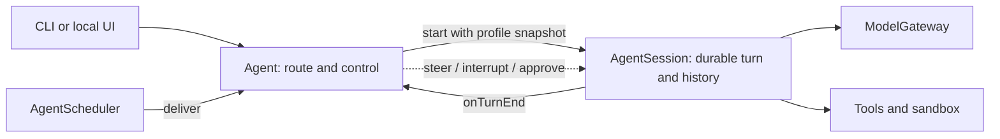

# Restate durable agent reference

A teaching implementation of a durable agent on Restate. Start with an
`agentId` and follow a message through a responsive controller, a recoverable
model/tool loop, and an append-only conversation log.

This branch is a **local, trusted operator demo**. It has no user accounts,
login, browser sessions, account ownership checks, or stored OAuth credentials.
Run the UI and Restate ingress privately. Use fresh Restate state for this
branch; the former standalone application's state is not migrated.

## Run it

You need Node.js 22+, pnpm, Restate Server/CLI, and an OpenAI API key.

```sh
pnpm install
```

Start Restate in a separate terminal, with the SDK features used by this example:

```sh
RESTATE_EXPERIMENTAL_ENABLE_PROTOCOL_V7=true \
RESTATE_EXPERIMENTAL_ENABLE_VQUEUES=true \
restate-server
```

Start the core endpoint (port 9080):

```sh
export OPENAI_API_KEY=your-api-key
pnpm dev:service
```

Register it, then start the optional conversation UI:

```sh
restate deployments register http://localhost:9080
pnpm dev:ui
```

Open `http://127.0.0.1:3000/?agent=demo`. Enter any agent ID to open another
conversation. The first message starts it; no registration step is required.
The UI server uses `http://localhost:8080` for Restate ingress by default.
See [the UI environment example](packages/apps/web/env.example) for overrides.

You can also call the agent directly:

```sh
curl localhost:8080/Agent/demo/ask \
  --json '{"message":"What is the weather in Berlin?"}'
curl localhost:8080/AgentSession/demo/history \
  --json '{"fromSequence":1,"limit":100}'
```

Void-input handlers need an empty body and no JSON content type:

```sh
curl -X POST localhost:8080/Agent/demo/profile
```

## Follow one request



`Agent` and `AgentSession` have the same key and separate responsibilities.
The controller remains responsive while a long-running `doTurn` invocation
waits for models, tools, or human input. That invocation ID is the `turnId`.

| Component | Owns |
| --- | --- |
| `Agent` | Active turn, queued input, instructions, memories, tool grants, approvals, child directory |
| `AgentSession` | Conversation log, compaction checkpoint, durable model/tool loop |
| `AgentNotifications` | Per-agent invalidation revisions for history, profile, approvals, schedules |
| `AgentScheduler` | Delayed messages and recurrence for the same agent |
| `Sandbox` | Agent-scoped workspace lifecycle, local or Modal |
| `ModelGateway` | Model admission, retries, and cancellation |
| `Evals` | Isolated black-box trials against the public protocol |

The public conversation log contains messages and semantic events. Raw tool
payloads and execution details belong in working context and Restate traces.

## Explore the examples

- **Control:** `ask` starts when idle and queues when busy; `steer` adds input
  to the active turn; `interrupt` stops unfinished work and optionally queues
  a replacement request. Steering preserves current work.
- **Durable execution:** parallel tools, cross-step pending operations,
  selective cancellation, bounded model-output recovery, and non-destructive
  conversation compaction.
- **Policy:** guardrails gate concrete proposals; durable approval waits resume
  through turn-scoped signals.
- **Memory:** up to 32 semantic memories per agent, included in the next turn's
  profile snapshot. They are editable in the UI.
- **Delegation:** persistent children with separate conversations and sandboxes,
  a creation-time copy of memories and policy, narrower tools, durable results,
  follow-ups, and exact-turn cancellation. Children cannot nest or schedule work.
- **Scheduling:** a timer sends a message back to the same conversation. The
  schedule chooses `queue`, `steer`, or `interrupt` when the agent is busy.
- **Tools:** built-ins, annotated Restate handlers, configured MCP servers,
  turn-local tool search, and programmatic tool calling (PTC) with QuickJS.

Read [architecture](docs/architecture.md), [protocol](docs/protocol.md), then
[turn runtime](docs/turn-runtime.md). [The documentation index](docs/README.md)
and [source map](PROJECT.md) give the longer reading path.

## MCP configuration

The operator configures servers on the **core process**. No connector account
or token-entry UI is involved:

```sh
export MCP_SERVERS_JSON='[{"id":"example","type":"http","url":"https://mcp.example.com/mcp","protocol":"stateful","tokenEnv":"EXAMPLE_MCP_TOKEN"}]'
export EXAMPLE_MCP_TOKEN=your-server-token
```

Omit `tokenEnv` for a public endpoint; when set, it must name a variable
ending in `_MCP_TOKEN`. Use `stateless` for the handshake-free
2026-07-28 protocol or `stateful` for the supported 2025-era handshake.
Configuration is snapshotted per turn; the token is resolved only inside the
external HTTP operation. Tokens are never supplied as durable configuration,
handler inputs, or journaled credential results. Remote response content is
still recorded, so configure trusted endpoints. See
[MCP configuration](docs/mcp-configuration.md) for rotation and failure behavior.

## Development

```sh
pnpm lint
pnpm build
pnpm --filter @restate-agents/core test:ptc
pnpm --filter @restate-agents/web test
pnpm bundle
```

The deterministic tests use fixtures and local fake providers. Live `Evals`
require a running Restate deployment and model credentials; see
[development](docs/development.md) and [evals](docs/evals.md).

The Dockerfiles remain runnable packaging examples. The separate web image
publishing workflow has been removed. This branch intentionally does not
provide a public multi-user application or an account migration.
