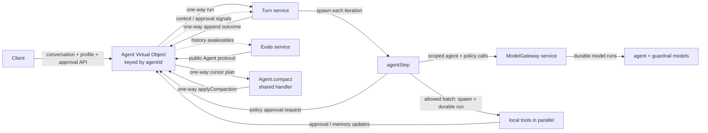

# Restate durable agent reference

A small, end-to-end reference implementation of a modern agent runtime on
Restate. The interesting part is not another prompt-and-tools loop: it is
making that loop durable, steerable, interruptible, policy-gated, observable,
bounded, and evaluable without hiding the control flow behind a framework.

The project is intentionally compact enough to read from ingress to model call
and back. It demonstrates production-oriented execution semantics around a
simple weather agent, while keeping the model and tool domain deliberately
unimportant.

## State-of-the-art capabilities

| Capability | What this implementation does |
| --- | --- |
| Durable agent turns | A Turn is a Restate invocation. Model calls, timers, signals, tool results, and control decisions survive process crashes and replay deterministically. |
| Per-agent serialization | Each `Agent` virtual object is keyed by `agentId`; exclusive handlers serialize conversation control without a separate lock or database transaction protocol. |
| Mid-turn steering | Steering is a durable FIFO signal protocol. It never cancels the current model/tool step: completed work is committed first, pending operations continue, and the update enters the next model round. |
| Graceful interruption | Interruption stops and joins unfinished work, preserves completed results, and makes one tool-free final model call that explains what was achieved relative to the original request. |
| Parallel tool batches | Independent tool calls from one model response are spawned together and joined as a batch. Restate journals the concurrency while preserving deterministic recovery. |
| Long-running operations | Tools such as `sleep` and `humanApproval` can return a pending acknowledgement and continue across later agent steps. The Turn owns their stable IDs and lifecycle. |
| Selective cancellation | The model can cancel one pending operation by ID without killing the Turn or unrelated operations. Completion-versus-cancellation races are represented honestly. |
| Runtime guardrails | A separate, cheaper policy model gates the exact proposed text or complete tool batch before anything is published or executed. Decisions are `allow`, `deny`, or `require_approval`. |
| Durable human approval | Policy gates and the explicit approval tool register requests on the Agent and resume through Turn-scoped signals. A rejected runtime policy cannot reopen approval for the same request; steering invalidates approvals for changed work. |
| Immutable transcript | Conversation history is an append-only, sequenced event log. User messages, steering, interruption, dispatch, progress, memory metadata, and terminal outcomes retain their natural observation order. |
| Push-style history updates | Restate callers register their own awakeable at a history cursor. Registration closes the empty-read race, while the actual transcript remains available through the cursor API. |
| Persistent agent profile | User instructions, model-managed keyed memories, and user-defined guardrails are durable per Agent and snapshotted at Turn start. |
| Non-destructive compaction | Older finished conversation prefixes are summarized asynchronously for model context, but the canonical transcript is never rewritten or replaced. Recent entries remain exact. |
| Semantic progress | `thinking`, `tools`, `waiting`, and `finalizing` milestones are part of the ordered transcript; raw provider reasoning and low-level tool traffic stay in Restate observability. |
| Model admission control | Agent and policy calls go through a scoped gateway with provider-, model-, and agent-level concurrency keys, bounded retries, and cancellation propagation. |
| Restate-native evals | Durable eval invocations drive fresh Agents through the same public protocol, synchronize on history awakeables, inject control events, and return structured assertions plus the observed transcript. |

These features compose rather than live as isolated demos. For example, a Turn
can run ten weather calls as one parallel batch, keep a durable timer alive
across later rounds, accept steering without losing either, request fresh
approval for newly protected work, and still produce one ordered,
cursor-consumable transcript after recovery.

## Control semantics at a glance

| Action | When idle | While a Turn is active |
| --- | --- | --- |
| `ask(message)` | Appends the user message and starts a Turn. | Appends the message immediately and queues it for the next Turn. |
| `steer(message)` | Returns `false`. | Moves queued messages plus the new instruction into the active Turn. Current tools are not cancelled. |
| `interrupt(reason, message?)` | Returns `false`. | Cancels and joins unfinished work, finalizes the current Turn, and optionally queues a replacement message for a new Turn. |
| `cancelOperation(id)` | Not a controller action. | A model tool selectively stops one pending operation while the Turn continues. |
| External invocation cancellation | Nothing to cancel. | Stops the invocation, cleans up owned work, records the boundary, and rethrows cancellation to Restate. |

The distinction is deliberate: queueing changes *when* a request runs,
steering changes *the active request without discarding work*, interruption
ends the active request gracefully, and selective cancellation targets only
one long-running operation.

## Deliberate scope

This is a reference runtime, not a complete agent product. The weather tool is
synthetic so execution semantics stay visible. Sandbox provisioning,
token-by-token output streaming, pub/sub fan-out, authentication, and
multi-tenant policy administration are not implemented. History awakeables
provide durable point-to-point change notification, not a replacement for a
broadcast event bus.

Natural-language guardrail classification and answer quality remain
probabilistic model behavior; the runtime deterministically enforces the
decision it receives. The current evals exercise the live stack and protocol
semantics but do not yet include a suite coordinator, repeated statistical
runs, a scripted model, or an independent semantic judge.

## Architecture



## Why this structure

- `Agent` is the durable controller. Its exclusive handlers serialize changes
  to the active turn, pending messages, and conversation history for one
  `agentId`. It coordinates four independent components: `agent-turn.ts` owns
  turn state and signal lifecycle, `agent-history.ts` owns the durable
  transcript, `agent-profile.ts` owns instructions, memories, and guardrails,
  and `agent-approval.ts` owns pending human approvals.
  Each component exports a handler-scoped capability namespace: its operations
  use Restate's current handler context and hold no process-local state.
- `Turn` has no service state, but one durable invocation owns the transient
  state machine for an agent turn: model messages, budgets, steering, pending
  operations, and graceful finalization. It repeatedly spawns one bounded
  `agentStep`, applies the returned data, and reports one structured
  `completed | interrupted | failed` result.
- `turn-step.ts` owns the functional execution seam and the small supervisor
  that settles each spawned step against interruption. A step receives a
  message snapshot and remaining tool budget, performs one agent-model call,
  gates that proposed response against the guardrail snapshot, runs an allowed
  foreground tool batch in parallel, and owns no work after returning.
  `turn-steering.ts` drains durable steering signals into a Turn-scoped inbox,
  while `turn-pending.ts` owns tasks that survive across steps.
- `agent-tools.ts` owns the concrete tools. Each definition keeps its model
  description, input schema, validation, local durable behavior, and result
  projection together. It exposes each step a single concrete tool collection.
- `model.ts` owns provider-specific inference and the shared model contracts. It
  reconstructs AI SDK tool definitions from serializable manifests while
  deliberately receiving no executors.
- The shared `Agent.compact` handler asynchronously maintains a rolling summary
  of older finished turns without blocking exclusive conversation handlers.
  The model operation stays in `conversation-compactor.ts`; the exact
  transcript remains on the Agent and messages after the checkpoint remain
  verbatim.
- `model-gateway.ts` is the Restate boundary for full agent inference and cheap
  guardrail evaluation. It owns scoped admission, model-specific limit keys,
  retries, and cancellation propagation before delegating provider calls to
  `model.ts`.
- `eval.ts` contains durable black-box protocol evaluations. One suite
  invocation concurrently drives fresh Agents through public handlers and
  waits for transcript milestones through caller-owned awakeables instead of
  polling.

The controller stores the canonical transcript: user and assistant messages,
explicit lifecycle boundaries, and semantic progress events. Tool calls and
intermediate model steps stay in Restate's invocation journal and observability
tools. A turn reports exactly one structured outcome: `completed`,
`interrupted`, or `failed`. A graceful interruption can include a final
assistant response based on completed tool results; raw tool activity still
stays out of the transcript.

Every handler on `Agent`, `Turn`, `ModelGateway`, and `Evals` is
ingress-public in this reference implementation. This keeps the complete
protocol inspectable and easy to invoke while experimenting. Public visibility
does not make every handler a user API: normal clients should use `ask`,
`history`, `steer`, `interrupt`, `profile`, `setInstructions`,
`setGuardrails`, `approvals`, and `resolveApproval`; the remaining handlers are
coordination paths used by the services themselves.

## Conversation history and compaction

The complete user-facing transcript is a canonical append-only event log and
is never replaced by a model summary. User entries record how they originally
arrived; later steering and dispatch decisions are appended as lifecycle
events instead of rewriting those entries. `agent-history.ts` stores the log in
fixed-size state chunks with stable internal sequence numbers. Its lazy entry
reader hides those chunks and stops loading state as soon as a consumer has
enough entries. The public `history` handler exposes an inclusive cursor over
the same sequence numbers. A Restate caller can create an awakeable and pass
its ID plus the next cursor to `watchHistory`. The Agent atomically resolves it
when that cursor is already readable or stores it until the next relevant
append. The caller waits outside the virtual object, so transcript writers are
never blocked by a waiting exclusive handler.

After a turn finishes, the Agent counts conversation messages since the last
checkpoint. At 32 messages it reserves that entire finished prefix and
self-sends its cursor range to the shared `compact` handler. That handler reads
the relevant summary and history chunks directly from Agent state, including
interruption and failure boundaries, merges them with a cheap model, and
one-way self-sends the derived checkpoint to the exclusive `applyCompaction`
handler. Newer appended entries do not invalidate the checkpoint, and a failed
compaction leaves the prior summary untouched.

Each `TurnRequest` carries a stable snapshot of the Agent's instructions,
memories, guardrails, rolling summary, and exact uncompacted transcript. The
Turn projects steering metadata and interruption, queued-message dispatch, or
failure entries as explicit model-visible boundaries. Compaction happens only
between turns: profile state, live model messages, tool calls, tool results,
pending operations, and steering inside an active Turn are never summarized.

## Instructions, memories, and guardrails

Each Agent owns one durable profile. User-set instructions are appended to the
application's system instructions and apply to every model call in a Turn,
including graceful interruption finalization. Memories are a separate keyed
collection of contextual data: they are injected before conversation history
and explicitly marked as facts rather than instructions. Current user messages
and newer tool results take precedence over stale memory.

The model manages memory through one atomic `manageMemory` tool. A batch can set
or delete keys, and the Agent accepts it only from its active,
non-interrupting Turn. Memory is limited only by entry count: at most 32 entries
per Agent. A successful update is durable even if later work in that Turn
fails, and its keys are recorded as a metadata-only transcript event. Memory
events are omitted from model context and compaction because the current
profile snapshot is authoritative.

Guardrails are user-configured natural-language policies with stable IDs. A
cheap policy model evaluates every proposed assistant response or complete tool
batch before text is published or any tool in that batch starts. It returns
`allow`, `deny`, or `require_approval`. A denial is returned to the agent model
as runtime feedback so it gets one chance to refuse or choose a compliant
alternative. If the same policy blocks the next proposal, Turn completes with
a deterministic tool-free refusal instead of spending its remaining step
budget in a policy loop. An approval requirement creates a durable request on
the Agent and waits for a human decision before executing the exact proposal.

Guardrails are not included in the main agent model's system prompt. This keeps
policy enforcement in one place: the agent proposes the actual work, and the
runtime independently gates it. The explicit `humanApproval` tool remains
available for approvals the agent decides it needs for reasons unrelated to a
runtime guardrail.

Approval applies to the current request and matching policy; later steps do not
ask again. Rejection blocks the proposal and prevents another approval loop for
that request. Steering changes the request, so Turn invalidates both decisions
and evaluates the updated work again. Graceful interruption cannot open a new
approval while ending the Turn: its final text is checked and withheld if the
policy model does not allow it. The evaluator is deliberately model-based and
therefore probabilistic; the runtime deterministically enforces the decision it
returns. Instructions and guardrail changes affect the next Turn.

## Agent handlers

| Handler | Input | Behavior |
| --- | --- | --- |
| `ask` | `{ message: string }` | Starts a turn when idle or queues the message when busy. Returns the `start` or `queue` decision, affected turn invocation ID, and pending-message count. |
| `history` | `{ fromSequence?: number, limit?: number }` | Returns up to `limit` sequenced transcript entries starting at the inclusive cursor, plus the cursor for the next read. Defaults to sequence 1 and 50 entries; the maximum page size is 100. |
| `watchHistory` | `{ fromSequence, awakeableId }` | Atomically resolves a caller-owned awakeable now or when the requested cursor becomes readable. |
| `profile` | void | Returns this Agent's instructions, model-managed memories, and natural-language guardrails. |
| `setInstructions` | `{ instructions: string \| null }` | Replaces the persistent user instructions; `null` clears them. Running Turns keep their snapshot. |
| `setGuardrails` | `{ guardrails: [{ id, rule }] }` | Replaces the persistent policy list. IDs must be unique; running Turns keep their snapshot. |
| `interrupt` | `{ reason, message? }` | Records an interruption event and signals the active Turn to cancel unfinished work and produce a final response. An optional replacement message is appended immediately and queued for the next Turn. |
| `steer` | instruction string | Sends queued messages and the new instruction to the active turn, then appends a steering lifecycle event without rewriting their transcript entries. |
| `approvals` | void | Returns the human approvals currently waiting on this agent. |
| `resolveApproval` | `{ approvalId, decision, reason? }` | Removes a pending approval and signals its waiting tool or policy gate with `approved` or `rejected`. |
| `reportProgress` | `{ turnId, phase, message }` | One-way path used by the active Turn; appends an ordered transcript event only for the current invocation. |
| `requestApproval` | `{ approvalId, turnId, question, guardrailId? }` | Registers a tool or policy approval request only while its Turn remains active and is not interrupting. |
| `cancelApproval` | `{ approvalId, turnId }` | Idempotently removes an abandoned approval request. |
| `updateMemory` | `{ turnId, changes }` | Coordination path used by `manageMemory`; atomically applies a bounded memory batch only for the active Turn. |
| `append` | structured turn outcome | Accepts the active Turn's one terminal result, reconciles unconsumed steering, appends user-facing history, considers compaction, and dispatches queued work. Stale or duplicate Turn IDs are ignored. |
| `compact` | reserved history cursor range | Shared handler that reads and summarizes one finished transcript prefix, then sends the result to `applyCompaction`. |
| `applyCompaction` | structured compaction result | Exclusively validates and installs the current summary checkpoint, or clears a failed reservation. |

`history`, `profile`, `approvals`, and `compact` are shared handlers; the other
Agent handlers are exclusive. Lazy state allows shared readers and the
compactor to load only the state keys and history chunks they need.

The remaining services expose these public handlers:

- `Turn/run` accepts the Agent's profile snapshot, rolling summary, and exact
  uncompacted transcript, runs one transient state machine made of bounded
  agent steps, and one-way reports a structured outcome to `Agent/append`.
- `ModelGateway/complete` accepts instructions, model messages, and serializable
  tool manifests. `ModelGateway/evaluateGuardrails` separately accepts the
  policy snapshot and exact proposed action. `agentStep` invokes both through
  the `openai` scope so model-specific concurrency limits apply.
- `Evals/all` accepts optional isolation settings, concurrently drives every
  scenario against a fresh Agent, and returns one aggregate of structured
  assertions and complete observed transcripts.

A successful interruption is visible immediately as
`{ role: "event", type: "interrupt", turnId, reason }`. The active Turn then
cancels and joins unfinished tools, retains completed results, and makes one
tool-free model call that answers as far as those results allow. That response
is appended as an assistant entry with status `interrupted`. A later turn sees
both the boundary and final response. External invocation cancellation still
creates a boundary without attempting graceful finalization.

`ask` deliberately makes no model decision: it starts work when idle and
queues when busy. Clients choose `steer` or `interrupt` explicitly when a
message should affect the active turn. The interrupt reason is only a control
instruction for finalizing the old Turn. A distinct optional `message` is
recorded as a user request and queued for the next Turn.

The controller flow is therefore:

- An idle `ask` records its message and starts a Turn with the resulting
  transcript.
- An `ask` received while a Turn is active is recorded immediately at its
  natural transcript position; the pending FIFO controls only when it runs.
- `steer` drains that queue into one structured steering signal, then appends
  the steering request and a lifecycle event recording its target Turn and
  queued-message count.
- `interrupt` leaves the queue intact. When it carries a replacement message,
  the Agent appends and queues that user request before recording the
  interruption event. The old Turn appends its graceful final response, then a
  dispatch event activates all queued entries and starts one new Turn with the
  complete transcript.

Repeated resolutions of the `steering` signal form a durable queue. Each
`steer` call resolves one structured `{ queued, message }` signal: messages
waiting in the next-turn queue retain their FIFO order as `queued`, while the
explicit instruction remains distinct as `message`. Turn converts that
batch into one structured model update, while conversation history retains the
individual user messages.

The controller tracks each signal's message count, while Turn reports how many
signals it consumed. If normal completion wins the race with a steer, the
original entries remain unchanged and a later dispatch event activates the
unconsumed requests in a new Turn. An explicit interrupt supersedes outstanding
steering. External cancellation does not: steering accepted before cancellation
is recovered into the next turn.

## Progress

Turn one-way sends semantic milestones to `Agent.reportProgress`. The Agent
checks the originating `turnId` and appends each accepted milestone to the
canonical transcript as `{ role: "event", type: "progress", ... }`. It reports
phases such as `thinking`, `tools`, `waiting`, and `finalizing`. Terminal state
is already represented by the turn's assistant outcome, so it is not duplicated
as progress. Raw provider reasoning blocks are never exposed.

Progress events retain their natural order relative to every other event the
Agent observes. They are deliberately omitted from model context and
conversation compaction because they are derived execution status, not user
instructions. Clients consume all transcript activity through one cursor:

```sh
curl localhost:8080/Agent/demo/history \
  -H 'content-type: application/json' \
  -d '{"fromSequence":1,"limit":50}'
```

The cursor is inclusive. The response contains
`{ entries: [{ sequence, entry }], nextSequence }`; pass `nextSequence` as the
next request's `fromSequence`. An empty page leaves the cursor unchanged. This
durable transcript can later be mirrored to pub/sub for live fan-out without
making pub/sub the source of truth.

## Durability and failure behavior

- Starting a turn and reporting its outcome are one-way Restate sends.
- Progress milestones use one-way sends and never block model or tool
  execution on the Agent handler completing.
- Each agent step makes one scoped full-model invocation and, when guardrails
  exist, one or more scoped policy-model invocations. Each contains one durable
  `run` step. Restate owns a bounded four-attempt retry policy; the AI SDK's
  internal retries are disabled.
- Turn carries AI SDK response messages into the next model call. This
  preserves reasoning and tool-call state while OpenAI response storage is
  disabled.
- Before response text is returned or a tool batch starts, the policy model
  checks the complete proposed action. A policy-model error fails closed and
  follows Restate's retry policy.
- If an allowed model step emits several independent tool calls, `agentStep` uses
  Restate's [concurrent task primitives](https://docs.restate.dev/develop/ts/concurrent-tasks)
  to spawn all local tool `run` steps before joining them. Restate journals
  their concurrent execution and preserves deterministic replay.
- A background Turn fiber drains steering signals into a transient FIFO while
  the current model call and foreground tool batch finish. After the step
  settles, Turn commits its results and drains the inbox, so the next agent
  step receives every buffered instruction in FIFO order.
- `sleep` and `humanApproval` return protocol-complete pending acknowledgements
  to the model, while their turn-scoped Restate tasks continue across later
  steps. A pending sleep therefore keeps its timer while steering starts
  unrelated tools. A pending approval gates dependent actions without blocking
  unrelated work; its eventual signal result is injected as a runtime update.
- A guardrail approval is different: it pauses the proposed step before any
  action in it runs. Approval resumes that exact proposal; rejection returns
  policy feedback to the next model step. Interruption cancels the wait and
  cleans up its durable request.
- `cancelOperation` lets the model selectively interrupt and join one pending
  operation by its stable tool-call ID. Pending tasks are held in a turn-local
  keyed registry; completion races are reported honestly, and unrelated
  operations continue running.
- Graceful interruption cancels and joins foreground and pending tasks, records
  their completed or cancelled results in the Turn context, and performs one
  final model call with no tools. Abandoned approval requests are cleaned up
  idempotently.
- Deterministic configuration and OpenAI 4xx request errors fail immediately.
  Transient transport, timeout, rate-limit, conflict, and 5xx errors retry.
- Invocation cancellation aborts model I/O, joins the active step and pending
  tasks, retires the controller's active turn without finalization, and is
  rethrown so Restate records cancellation.
- The complete transcript remains durable. The model sees the rolling summary
  plus each exact entry since its checkpoint, with steering metadata and
  interruption/failure boundaries preserved.
- Turn stops after eight model steps instead of running indefinitely.

## Model flow control

Agent inference and guardrail evaluation use the scoped gateway. `ask` performs
no inference; steering and interruption are explicit controller operations.
Background compaction owns its cheap model call in a shared Agent handler and
cannot consume an agent inference slot.

`ModelGateway` calls use scope `openai` and a two-level limit key:
`<model>/<agent-hash>`. Each invocation therefore draws from three budgets at
once:

- `openai` — all gateway traffic to the provider
- `gpt-5.6-terra` or `gpt-4o-mini` — traffic for that model
- `<agent-hash>` — concurrent inference for one agent

For example:

```sh
restate rules set "openai" --concurrency 100
restate rules set "openai/gpt-5.6-terra" --concurrency 20
restate rules set "openai/gpt-5.6-terra/*" --concurrency 2
restate rules set "openai/gpt-4o-mini" --concurrency 50
restate rules set "openai/gpt-4o-mini/*" --concurrency 4
```

The constant provider scope is intentionally simple and gives this example a
single provider-wide budget. At very high scale, use a higher-cardinality scope
such as tenant or account to avoid concentrating scheduling on one partition.

## Run locally

Requirements: Node.js 22 or newer, pnpm, a local Restate Server and CLI, and an
OpenAI API key. Restate's [quickstart](https://docs.restate.dev/quickstart)
covers installing the server and CLI.

Restate's [scope-based flow control](https://docs.restate.dev/services/flow-control)
is currently opt-in and must be enabled on a fresh cluster:

```sh
RESTATE_EXPERIMENTAL_ENABLE_PROTOCOL_V7=true \
RESTATE_EXPERIMENTAL_ENABLE_VQUEUES=true \
restate-server
```

In another shell, start the service endpoint:

```sh
pnpm install
OPENAI_API_KEY=... pnpm dev
```

With the service endpoint running, register it with Restate:

```sh
restate deployments register http://localhost:9080
```

Then invoke the `Agent` Virtual Object under any `agentId`, such as `demo`:

The `ask` schema defaults a missing `message` to: “What is the weather in the
top 10 European capitals? Also sleep for 4 minutes.”

```sh
curl localhost:8080/Agent/demo/setInstructions \
  --json '{"instructions":"Prefer concise answers and metric units."}'

curl localhost:8080/Agent/demo/setGuardrails \
  --json '{"guardrails":[{"id":"japan-approval","rule":"Ask for human approval before answering questions about Japan."}]}'

curl localhost:8080/Agent/demo/ask \
  --json '{"message":"What is the weather in Berlin?"}'

curl -X POST localhost:8080/Agent/demo/profile

curl localhost:8080/Agent/demo/history \
  --json '{"fromSequence":1,"limit":50}'

curl localhost:8080/Agent/demo/steer \
  --json '"Steer toward a one-sentence answer"'

curl localhost:8080/Agent/demo/interrupt \
  --json '{"reason":"The user changed tasks","message":"What is the weather in Japan?"}'
```

An idle agent returns a response shaped like:

```json
{
  "decision": "start",
  "turnId": "inv_...",
  "stats": {"pendingMessages": 0}
}
```

To keep a turn alive while trying steering, ask the agent to use its durable
sleep tool and redirect it from another shell:

```sh
curl localhost:8080/Agent/demo/ask \
  --json '{"message":"Sleep for 30 seconds, then tell me that you finished"}'

curl localhost:8080/Agent/demo/steer \
  --json '"Do not wait any longer; answer immediately"'
```

The sleep call returns a pending acknowledgement and its Restate timer remains
active. A steering message starts another agent step after foreground tools
finish. For the instruction above, the model can call `cancelOperation` with
the timer's stable operation ID; that timer is interrupted while unrelated work
continues. The turn publishes its final answer only after its remaining pending
operations finish.

To try a runtime guardrail approval, ask a question covered by the policy:

```sh
curl localhost:8080/Agent/demo/ask \
  --json '{"message":"What is the weather in Tokyo?"}'

curl -X POST localhost:8080/Agent/demo/approvals

curl localhost:8080/Agent/demo/resolveApproval \
  --json '{"approvalId":"<approvalId>","decision":"approved","reason":"Looks good"}'
```

`approvals` returns the `approvalId`, originating Turn invocation ID, policy
ID, and the evaluator's question. Approval wakes the gated step and lets its
exact proposed action run. Rejection blocks it and gives the agent model a
chance to refuse or choose a compliant alternative. The explicit
`humanApproval` tool remains available for approvals the agent itself decides
to request.

To exercise model-managed memory, clear the guardrails, ask for a durable
preference, and inspect the Agent profile:

```sh
curl localhost:8080/Agent/demo/setGuardrails \
  --json '{"guardrails":[]}'

curl localhost:8080/Agent/demo/ask \
  --json '{"message":"Remember that I prefer temperatures in Celsius."}'

curl -X POST localhost:8080/Agent/demo/profile
```

### Run a durable eval

The single `Evals/all` handler concurrently drives every scenario against a
fresh Agent entirely through Restate. Each case waits on history awakeables
instead of polling. The aggregate returns `passed | failed` plus every case's
assertions, isolated `agentId`, and complete observed transcript.

```sh
curl localhost:8080/Evals/all \
  --json '{"timeoutSeconds":180}'
```

The handler spawns all seven isolated cases concurrently: a basic turn,
steering, interruption, guardrail approval, denial before protected tools
start, rejection without approval loops, and approval invalidation after
steering. See
[`packages/libs/example/EVALS.md`](packages/libs/example/EVALS.md) for the
protocol and planned extensions.

The Restate UI at `http://localhost:9070` shows the invocation tree, durable
model/tool steps, retries, and signals. See Restate's
[HTTP invocation guide](https://docs.restate.dev/services/invocation/http) for
request-response, one-way send, attach, and cancellation variants.

## Project map

- `packages/libs/example/src/agent.ts` — durable conversation controller
- `packages/libs/example/src/agent-history.ts` — durable user-facing transcript
- `packages/libs/example/src/agent-profile.ts` — instructions, memories, and
  natural-language guardrails
- `packages/libs/example/src/agent-turn.ts` — active-turn state and signal delivery
- `packages/libs/example/src/agent-approval.ts` — pending human approvals and signal delivery
- `packages/libs/example/src/turn.ts` — transient turn state machine and signal supervision
- `packages/libs/example/src/turn-context.ts` — transcript-to-model projection
- `packages/libs/example/src/turn-step.ts` — bounded step execution and supervision
- `packages/libs/example/src/turn-steering.ts` — Turn-scoped steering inbox
- `packages/libs/example/src/turn-pending.ts` — cross-step pending tool tasks
- `packages/libs/example/src/agent-tools.ts` — concrete tools and result projection
- `packages/libs/example/src/conversation-compactor.ts` — compaction model operation
- `packages/libs/example/src/model.ts` — agent and guardrail model protocols and provider calls
- `packages/libs/example/src/model-gateway.ts` — scoped model-call admission and retries
- `packages/libs/example/src/eval.ts` — durable black-box Agent protocol evals
- `packages/libs/example/src/types.ts` — wire schemas and domain types
