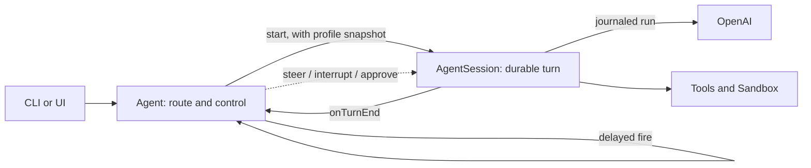

# Durable agents on Restate

A reference implementation of an LLM agent whose every model call, tool call,
wait and message is durable. Kill the process in the middle of a turn and it
resumes where it stopped, without asking the model to repeat a decision it
already made. Send a message while the agent is busy and it is queued, steered
into the running turn, or used to interrupt it.

The code is written to be read. Start with an agent ID, follow one message
through the controller, the durable turn, the model and tools, and back into
the conversation log. Everything else (approvals, sub-agents, schedules,
programmatic tool calls, MCP) builds on that one path.

It is a **local, single-operator demo**: there are no user accounts or login.
See [trust boundary](#trust-boundary) before exposing anything.

## Quickstart

You need Node.js 22+, pnpm, the Restate server and CLI, and an OpenAI API key.

1. Install dependencies:

   ```sh
   pnpm install
   ```

2. Start Restate in its own terminal, with the SDK features this example uses:

   ```sh
   RESTATE_EXPERIMENTAL_ENABLE_PROTOCOL_V7=true restate-server
   ```

3. Start the agent service on port 9080 and register it with Restate:

   ```sh
   export OPENAI_API_KEY=your-api-key
   pnpm dev:service
   restate deployments register http://localhost:9080
   ```

4. Start the conversation UI and open
   [http://127.0.0.1:3000/?agent=demo](http://127.0.0.1:3000/?agent=demo):

   ```sh
   pnpm dev:ui
   ```

Any agent ID works: change `?agent=` to open another conversation. The first
message creates the agent; there is no setup step.

The UI is optional. Everything it does goes through Restate ingress on
port 8080, which you can call directly:

```sh
# Start a turn (or queue the message if one is running)
curl localhost:8080/Agent/demo/ask --json '{"message":"What is the weather in Berlin?"}'

# Redirect the running turn without cancelling its tools
curl localhost:8080/Agent/demo/steer --json '"Use Fahrenheit"'

# Stop it, optionally queueing a replacement request
curl localhost:8080/Agent/demo/interrupt --json '{"reason":"Changed my mind"}'

# Read the conversation log
curl localhost:8080/AgentSession/demo/history --json '{"fromSequence":1,"limit":100}'

# Handlers without input take an empty body and no JSON content type
curl -X POST localhost:8080/Agent/demo/profile
```

## How it works

Each agent is two Restate Virtual Objects with the same key:

- **`Agent`** is the controller. It decides what happens to each incoming
  message and owns the agent's profile: instructions, guardrails, memories,
  tool grants, pending approvals and child agents. Its handlers are short, so
  it always responds, even while a turn runs for minutes.
- **`AgentSession`** runs the turn. One `doTurn` invocation is one turn, and
  its invocation ID is the `turnId`. It owns the append-only conversation log
  and the model/tool loop.



### One message, end to end

1. `Agent.ask` starts a turn if the agent is idle, or queues the message if a
   turn is running (`agent/turns.ts`).
2. Starting a turn snapshots the profile and sends `AgentSession.doTurn` one
   way. The controller records the invocation ID and returns immediately.
3. `doTurn` appends the new messages to the log and builds model context from
   the latest summary plus the rest of the conversation (`session/service.ts`).
4. Each step asks the model for a proposal, checks it against the guardrails,
   then runs the allowed tool calls in parallel or publishes the reply
   (`session/step.ts`). Every model response and tool result is journaled.
5. The turn reports its outcome to `Agent.onTurnEnd`, which retires it and
   starts the next turn if messages were queued meanwhile.

`steer`, `interrupt` and approval decisions reach the running turn as durable
signals addressed to its invocation ID, so they cannot land in the wrong turn.

### What Restate provides

- **Keyed, serialized state.** Each Virtual Object key has one owner that
  processes its exclusive handlers one at a time, so controller decisions
  never race.
- **A turn is a durable invocation.** Recovery replays the journal: recorded
  model responses and tool results are reused instead of recomputed.
- **Waiting is durable.** Signals carry steering, interrupts and approvals;
  timers drive sleeps and schedules. A turn can wait for a human for days.
- **Concurrency has an owner.** Parallel tools are spawned and joined inside
  the turn, and completion order is journaled, so even promise races in
  generated programs replay deterministically.
- **Ordinary code.** Tools, the sandbox lifecycle and model calls are plain
  code and journaled runs inside the turn. There are only two services, both
  keyed by agent ID: Agent and AgentSession.

Replay does not make external side effects exactly-once: a crash between an
MCP call completing and its result being recorded can repeat that call.

## What to explore

| Feature | Try it | Start reading |
| --- | --- | --- |
| Queue, steer, interrupt | Send messages while a long turn runs ("sleep for 4 minutes") | `agent/active-turn.ts` |
| Crash recovery | Kill `pnpm dev:service` mid-turn and restart it | `session/service.ts`, `session/step.ts` |
| Guardrails and approvals | Add a guardrail in the UI; ask for something it blocks | `session/guardrails.ts`, `agent/approvals.ts` |
| Memory | Ask the agent to remember a preference; up to 32 per agent | `agent/profile.ts` |
| Sub-agents | Ask it to delegate research to a helper | `agent/sub-agents.ts`, `createSubAgent` in `session/tools.ts` |
| Schedules | "Remind me in 2 minutes to check the weather" | `agent/schedules.ts` |
| Programmatic tool calls | Ask for work that needs many tool calls; the model writes a QuickJS program | `ptc/runtime.ts` |
| Tool search | MCP and dynamic tools load on demand through `searchTools` | `session/tool-search.ts` |
| Sandbox | Ask it to write and run a script | `sandbox/turn.ts` |
| Compaction | Long conversations are summarized without rewriting the log | `session/history.ts`, `model/compactor.ts` |

Paths are relative to `packages/libs/core/src`.

The built-in tools are weather (a demo stub), web search, sleep, human
approval, cancelling a pending operation, memory, sub-agents, schedules,
sandbox files and commands, tool search, and `executeProgram`. Any Restate
handler published with the `restate.dev/agent: <tool-name>` metadata becomes
a tool too (`session/dynamic-tools.ts`).

## Configuration

The agent service (`packages/libs/core`):

| Variable | Purpose |
| --- | --- |
| `OPENAI_API_KEY` | Required for model calls |
| `MCP_SERVERS_JSON` | MCP servers the agents may use; see below |
| `SANDBOX_PROVIDER` | `local` (default) or `modal`, which also needs `MODAL_TOKEN_ID` and `MODAL_TOKEN_SECRET` |
| `AGENT_PTC_ENABLED` | Set to `false` to hide `executeProgram` |
| `AGENT_MODEL_MAX_OUTPUT_TOKENS` | Output budget per model call, 1024–64000 (default 32000) |
| `RESTATE_ADMIN_URL`, `RESTATE_ADMIN_TOKEN` | Admin API used to discover dynamic tools |

The UI (`packages/apps/web`, see [`env.example`](packages/apps/web/env.example)):

| Variable | Purpose |
| --- | --- |
| `RESTATE_INGRESS_URL` | Restate ingress for the UI server (default `http://localhost:8080`) |
| `RESTATE_AUTH_TOKEN` | Bearer token for an authenticated ingress |
| `APP_PUBLIC_URL` | Browser origin when the UI sits behind a proxy |

### MCP servers

MCP servers are configured by the operator on the agent service, not by
agents or the UI. The UI can only switch configured servers on or off per
agent.

```sh
export MCP_SERVERS_JSON='[{"id":"example","type":"http","url":"https://mcp.example.com/mcp","protocol":"stateful","tokenEnv":"EXAMPLE_MCP_TOKEN"}]'
export EXAMPLE_MCP_TOKEN=your-server-token
```

- `protocol` is `stateless` for 2026-07-28 servers or `stateful` for
  2025-era Streamable HTTP servers.
- `tokenEnv` names the environment variable holding a bearer token and must
  end in `_MCP_TOKEN`. Omit it for public servers.
- The token is read only inside the HTTP call. It never enters handler
  inputs, state or the journal. The URL and variable name are not secret.
- Tool results are recorded and shown to the model, so only configure
  servers you trust.

[MCP configuration](docs/mcp-configuration.md) covers rotation and failures.

## Trust boundary

Anyone who can reach Restate ingress (port 8080) is fully trusted. Ingress
exposes every handler, including internal ones. For example, the parent
check on `Agent.retire` compares against a parent ID the caller supplies, and
`Agent.deliver` and `Agent.createSchedule` accept any message or schedule
for any agent. These checks keep the model and the UI within their rules;
they do not authenticate anyone.

The UI (port 3000) has no authentication. It accepts only a loopback Host
and same-origin writes, which stops other websites but not other programs on
the machine.

Keep both ports on the local machine or a network you trust. When running
the UI container, publish it on loopback only:
`docker run -p 127.0.0.1:3000:3000 …`.

## Development

```sh
pnpm lint                                  # oxlint + oxfmt check
pnpm build                                 # TypeScript 7 type-check and build, incl. Next.js
pnpm --filter @restate-agents/core test:ptc
pnpm --filter @restate-agents/web test
pnpm bundle                                # single-file core bundle
```

The tests run real handlers against recorded journals and fakes; they need no
Restate server or API key. See [development](docs/development.md) for
debugging. `docker/` holds runnable Dockerfiles for the service and the UI.

## Repository layout

| Path | Contents |
| --- | --- |
| `packages/libs/core` | The durable runtime: agent, session, scheduler, sandbox, model calls |
| `packages/libs/types` | Zod wire schemas and Restate service contracts |
| `packages/libs/client` | Typed ingress client for one agent |
| `packages/apps/web` | Optional Next.js conversation UI and its thin server adapter |
| `docs` | Design documentation |

[PROJECT.md](PROJECT.md) gives a file-by-file reading order.

## Further reading

1. [Architecture](docs/architecture.md): state owners, one request, notifications
2. [Protocol](docs/protocol.md): every handler, ordering rules, clients
3. [Turn runtime](docs/turn-runtime.md): steps, guardrails, pending work, recovery
4. [Tools](docs/tools.md): built-ins, programmatic tool calls, dynamic tools, MCP
5. [Schedules](docs/schedules.md) and [sandboxes](docs/sandboxes.md)
6. [Agent guide](docs/agent-guide.md): read before changing runtime semantics

[The documentation index](docs/README.md) has the full list.
