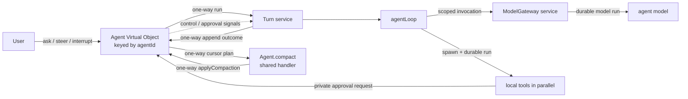

# Restate durable agent reference

A deliberately small reference implementation of an agentic application on
Restate. It separates durable conversation control, turn supervision, model
access, and the concrete agent loop without hiding them behind a framework.



## Why this structure

- `Agent` is the durable controller. Its exclusive handlers serialize changes
  to the active turn, pending messages, and conversation history for one
  `agentId`. It coordinates three independent components: `agent-turn.ts` owns
  turn state and signal lifecycle, `agent-history.ts` owns the durable
  transcript, and `agent-approval.ts` owns pending human approvals.
  Each component exports a handler-scoped capability namespace: its operations
  use Restate's current handler context and hold no process-local state.
- `Turn` is stateless. One invocation supervises one agent turn and passes its
  durable interrupt signal into the loop. The loop consumes steering and
  interruption at model/tool boundaries so it can retain completed work.
- `agentLoop` owns only orchestration policy and the live state for model
  rounds, steering, parallel tool batches, pending tasks, and graceful
  finalization. It returns a structured `completed | interrupted | failed`
  result.
- `agent-tools.ts` owns the concrete tools. Each definition keeps its model
  description, input schema, validation, local durable behavior, and result
  projection together. It exposes the loop a single concrete tool collection.
- `model.ts` owns provider-specific inference and the shared model contracts. It
  reconstructs AI SDK tool definitions from serializable manifests while
  deliberately receiving no executors.
- The shared `Agent.compact` handler asynchronously maintains a rolling summary
  of older finished turns without blocking exclusive conversation handlers.
  The model operation stays in `conversation-compactor.ts`; the exact
  transcript remains on the Agent and messages after the checkpoint remain
  verbatim.
- `model-gateway.ts` is the Restate boundary for full agent inference. It owns
  scoped admission, limit keys, retries, and cancellation propagation before
  delegating the provider call to `model.ts`.

The controller stores the canonical transcript: user and assistant messages,
explicit lifecycle boundaries, and semantic progress events. Tool calls and
intermediate model steps stay in Restate's invocation journal and observability
tools. A turn reports exactly one structured outcome: `completed`,
`interrupted`, or `failed`. A graceful interruption can include a final
assistant response based on completed tool results; raw tool activity still
stays out of the transcript.

## Conversation history and compaction

The complete user-facing transcript is canonical and is never replaced by a
model summary. `agent-history.ts` stores it in fixed-size state chunks with
stable internal sequence numbers. Lazy state lets normal handlers load only
the metadata and chunks they need. The public `history` handler exposes an
inclusive cursor over those sequence numbers and reads only enough chunks to
return the requested page.

After a turn finishes, the Agent counts conversation messages since the last
checkpoint. At 32 messages it reserves that entire finished prefix and
self-sends its cursor range to the shared `compact` handler. That handler reads
the relevant summary and history chunks directly from Agent state, including
interruption and failure boundaries, merges them with a cheap model, and
one-way self-sends the derived checkpoint to the exclusive `applyCompaction`
handler. Newer appended entries do not invalidate the checkpoint, and a failed
compaction leaves the prior summary untouched.

Each `TurnRequest` carries the rolling summary and exact uncompacted transcript
through the lifecycle event that dispatched it. The Turn projects steering
metadata and interruption, queued-message dispatch, or failure entries as
explicit model-visible boundaries. Compaction happens only between turns: live
model messages, tool calls, tool results, pending operations, and steering
inside `agentLoop` are never summarized mid-turn.

## Controller handlers

| Handler | Input | Behavior |
| --- | --- | --- |
| `ask` | `{ message: string }` | Starts a turn when idle or queues the message when busy. Returns the `start` or `queue` decision, affected turn invocation ID, and pending-message count. |
| `history` | `{ fromSequence?: number, limit?: number }` | Returns up to `limit` sequenced transcript entries starting at the inclusive cursor, plus the cursor for the next read. Defaults to sequence 1 and 50 entries; the maximum page size is 100. |
| `append` | turn outcome | Ingress-private completion path used by `Turn`; ignores stale or duplicate turn IDs. |
| `reportProgress` | progress report | Ingress-private one-way path used by the active loop; appends an ordered transcript event and ignores stale Turn IDs. |
| `interrupt` | reason string | Records an interruption event and signals the active loop to cancel unfinished work and produce a final response. Returns immediately. |
| `steer` | instruction string | Promotes queued messages into the active turn, then sends the new instruction after them. |
| `approvals` | void | Returns the human approvals currently waiting on this agent. |
| `resolveApproval` | `{ approvalId, decision, reason? }` | Removes a pending approval and signals its waiting tool with `approved` or `rejected`. |

A successful interruption is visible immediately as
`{ role: "event", type: "interrupt", turnId, reason }`. The active loop then
cancels and joins unfinished tools, retains completed results, and makes one
tool-free model call that answers as far as those results allow. That response
is appended as an assistant entry with status `interrupted`. A later turn sees
both the boundary and final response. External invocation cancellation still
creates a boundary without attempting graceful finalization.

`ask` deliberately makes no model decision: it starts work when idle and
queues when busy. Clients choose `steer` or `interrupt` explicitly when a
message should affect the active turn. The interrupt reason is a control
instruction for finalization; it does not create another user request or Turn.

The controller flow is therefore:

- An idle `ask` records its message and starts a Turn with the resulting
  transcript.
- An `ask` received while a Turn is active is recorded immediately at its
  natural transcript position; the pending FIFO controls only when it runs.
- `steer` promotes that queue without moving its transcript entries, appends
  the new steering message, and sends one structured steering signal.
- `interrupt` leaves the queue intact and appends its event after every message
  the Agent had already observed. The old Turn appends its graceful final
  response, then a dispatch event activates queued entries and starts one new
  Turn with the complete transcript.

Repeated resolutions of the `steering` signal form a durable queue. Each
`steer` call resolves one structured `{ queued, message }` signal: messages
waiting in the next-turn queue retain their FIFO order as `queued`, while the
explicit instruction remains distinct as `message`. The loop converts that
batch into one structured model update, while conversation history retains the
individual user messages.

The controller tracks each signal's message count, while the loop reports how
many signals it consumed. If normal completion wins the race with a steer, the
unconsumed entries are reclassified as queued without changing their transcript
positions, and a later dispatch event activates them. An explicit interrupt
supersedes outstanding steering. External cancellation does not: steering
accepted before cancellation is recovered into the next turn.

## Progress

The loop one-way sends semantic milestones to `Agent.reportProgress`. The Agent
checks the originating `turnId` and appends each accepted milestone to the
canonical transcript as `{ role: "event", type: "progress", ... }`. It reports
phases such as `thinking`, `tools`, `waiting`, and `finalizing`. Terminal state
is already represented by the turn's assistant outcome, so it is not duplicated
as progress. Raw provider reasoning blocks are never exposed.

Progress events retain their natural order relative to every other event the
Agent observes. They are deliberately omitted from model context and
conversation compaction because they are derived execution status, not user
instructions. Clients consume all transcript activity through one cursor:

```sh
curl localhost:8080/Agent/demo/history \
  -H 'content-type: application/json' \
  -d '{"fromSequence":1,"limit":50}'
```

The cursor is inclusive. The response contains
`{ entries: [{ sequence, entry }], nextSequence }`; pass `nextSequence` as the
next request's `fromSequence`. An empty page leaves the cursor unchanged. This
durable transcript can later be mirrored to pub/sub for live fan-out without
making pub/sub the source of truth.

## Durability and failure behavior

- Starting a turn and reporting its outcome are one-way Restate sends.
- Progress milestones use private one-way sends and never block model or tool
  execution on the Agent handler completing.
- Each full model round is a scoped `ModelGateway` invocation containing one
  durable `run` step. Restate owns a bounded four-attempt retry policy; the
  AI SDK's internal retries are disabled.
- The loop carries AI SDK response messages into the next model call. This
  preserves reasoning and tool-call state while OpenAI response storage is
  disabled.
- If a model round emits several independent tool calls, `agentLoop` uses
  Restate's [concurrent task primitives](https://docs.restate.dev/develop/ts/concurrent-tasks)
  to spawn all local tool `run` steps before joining them. Restate journals
  their concurrent execution and preserves deterministic replay.
- Steering is buffered while the current model call and foreground tool batch
  finish. Their results remain in context, and the next model round receives
  every buffered instruction in FIFO order.
- `sleep` and `humanApproval` return protocol-complete pending acknowledgements
  to the model, while their turn-scoped Restate tasks continue across later
  model rounds. A pending sleep therefore keeps its timer while steering starts
  unrelated tools. A pending approval gates dependent actions without blocking
  unrelated work; its eventual signal result is injected as a runtime update.
- `cancelOperation` lets the model selectively interrupt and join one pending
  operation by its stable ID. Completion races are reported honestly, and
  unrelated operations continue running.
- Graceful interruption cancels and joins foreground and pending tasks, records
  their completed or cancelled results in the loop context, and performs one
  final model call with no tools. Abandoned approval requests are cleaned up
  idempotently.
- Deterministic configuration and OpenAI 4xx request errors fail immediately.
  Transient transport, timeout, rate-limit, conflict, and 5xx errors retry.
- Invocation cancellation aborts model I/O, joins the spawned loop, retires the
  controller's active turn without finalization, and is rethrown so Restate
  records cancellation.
- The complete transcript remains durable. The model sees the rolling summary
  plus each exact entry since its checkpoint, with steering metadata and
  interruption/failure boundaries preserved.
- The loop stops after eight model rounds instead of running indefinitely.

## Model flow control

Only full agent inference uses the scoped gateway. `ask` performs no inference;
steering and interruption are explicit controller operations. Background
compaction owns its cheap model call in a shared Agent handler and cannot
consume an agent-loop inference slot.

`ModelGateway` calls use scope `openai` and a two-level limit key:
`gpt-5.6-terra/<agent-hash>`. Each invocation therefore draws from three
budgets at once:

- `openai` — all agent-model traffic to the provider
- `gpt-5.6-terra` — traffic for that model
- `<agent-hash>` — concurrent inference for one agent

For example:

```sh
restate rules set "openai" --concurrency 100
restate rules set "openai/gpt-5.6-terra" --concurrency 20
restate rules set "openai/gpt-5.6-terra/*" --concurrency 2
```

The constant provider scope is intentionally simple and gives this example a
single provider-wide budget. At very high scale, use a higher-cardinality scope
such as tenant or account to avoid concentrating scheduling on one partition.

## Run locally

Requirements: Node.js 22 or newer, pnpm, a local Restate Server and CLI, and an
OpenAI API key. Restate's [quickstart](https://docs.restate.dev/quickstart)
covers installing the server and CLI.

Restate's [scope-based flow control](https://docs.restate.dev/services/flow-control)
is currently opt-in and must be enabled on a fresh cluster:

```sh
RESTATE_EXPERIMENTAL_ENABLE_PROTOCOL_V7=true \
RESTATE_EXPERIMENTAL_ENABLE_VQUEUES=true \
restate-server
```

In another shell, start the service endpoint:

```sh
pnpm install
OPENAI_API_KEY=... pnpm dev
```

With the service endpoint running, register it with Restate:

```sh
restate deployments register http://localhost:9080
```

Then invoke the `Agent` Virtual Object under any `agentId`, such as `demo`:

The `ask` schema defaults a missing `message` to: “What is the weather in the
top 10 European capitals? Also sleep for 4 minutes.”

```sh
curl localhost:8080/Agent/demo/ask \
  --json '{"message":"What is the weather in Berlin?"}'

curl localhost:8080/Agent/demo/history \
  --json '{"fromSequence":1,"limit":50}'

curl localhost:8080/Agent/demo/steer \
  --json '"Steer toward a one-sentence answer"'

curl localhost:8080/Agent/demo/interrupt \
  --json '"Stop; the user changed their mind"'
```

An idle agent returns a response shaped like:

```json
{
  "decision": "start",
  "turnId": "inv_...",
  "stats": {"pendingMessages": 0}
}
```

To keep a turn alive while trying steering, ask the agent to use its durable
sleep tool and redirect it from another shell:

```sh
curl localhost:8080/Agent/demo/ask \
  --json '{"message":"Sleep for 30 seconds, then tell me that you finished"}'

curl localhost:8080/Agent/demo/steer \
  --json '"Do not wait any longer; answer immediately"'
```

The sleep call returns a pending acknowledgement and its Restate timer remains
active. A steering message starts another model round after foreground tools
finish. For the instruction above, the model can call `cancelOperation` with
the timer's stable operation ID; that timer is interrupted while unrelated work
continues. The turn publishes its final answer only after its remaining pending
operations finish.

To try human approval, explicitly ask the model to use the approval tool:

```sh
curl localhost:8080/Agent/demo/ask \
  --json '{"message":"Before answering, use humanApproval to ask whether you may continue."}'

curl -X POST localhost:8080/Agent/demo/approvals

curl localhost:8080/Agent/demo/resolveApproval \
  --json '{"approvalId":"<approvalId>","decision":"approved","reason":"Looks good"}'
```

`approvals` returns the `approvalId`, originating Turn invocation ID, and the
model's question. The initial tool result reports the pending request; approval
or rejection later wakes the loop as a runtime update, allowing the model to
perform approved work, explain a rejection, or choose a different action.

The Restate UI at `http://localhost:9070` shows the invocation tree, durable
model/tool steps, retries, and signals. See Restate's
[HTTP invocation guide](https://docs.restate.dev/services/invocation/http) for
request-response, one-way send, attach, and cancellation variants.

## Project map

- `packages/libs/example/src/agent.ts` — durable conversation controller
- `packages/libs/example/src/agent-history.ts` — durable user-facing transcript
- `packages/libs/example/src/agent-turn.ts` — active-turn state and signal delivery
- `packages/libs/example/src/agent-approval.ts` — pending human approvals and signal delivery
- `packages/libs/example/src/turn.ts` — turn lifecycle and signal supervision
- `packages/libs/example/src/agent-loop.ts` — bounded model/tool orchestration
- `packages/libs/example/src/agent-tools.ts` — concrete tools and result projection
- `packages/libs/example/src/conversation-compactor.ts` — compaction model operation
- `packages/libs/example/src/model.ts` — model protocol and provider calls
- `packages/libs/example/src/model-gateway.ts` — scoped model-call admission and retries
- `packages/libs/example/src/types.ts` — wire schemas and domain types
