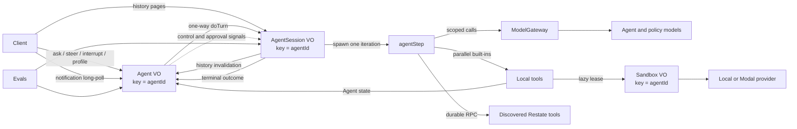

# Restate durable agent reference

An end-to-end reference implementation of a **durable, single-agent harness and
runtime** on Restate. It combines a model-directed tool-use loop with durable
conversation state, context engineering, policy enforcement, human
intervention, resource lifecycle, observability, and evaluation.

The model and harness together form the operational agent: the model selects
tools, acts on observations, revises its approach, and decides when work is
complete, while Restate makes the surrounding execution recoverable,
steerable, interruptible, concurrent, and bounded.

The weather domain is intentionally simple so the production-oriented agent
semantics remain easy to inspect from ingress to model call and back.

## Documentation

Start with [`docs/README.md`](docs/README.md) for the maintainer guide. It links
the architecture and state flow, Agent protocol, turn runtime, tool contracts,
sandbox providers, development workflow, and evaluation harness.

For Codex, Claude Code, or another coding agent, point it first to
[`docs/agent-guide.md`](docs/agent-guide.md). That guide records the
source-of-truth order, ownership boundaries, invariants, and change-routing
map.

## System vocabulary

| Term | Meaning in this repository |
| --- | --- |
| Agent | The model and harness operating together for one `agentId` |
| `Agent` Virtual Object | The deterministic controller for active work, queued input, profile, approvals, schedules, and notifications |
| `AgentSession` Virtual Object | The transcript owner and durable turn executor for the same `agentId` |
| Agent run | One `AgentSession.doTurn` invocation; its invocation ID is the `turnId` |
| Agent loop | The repeated model-action-observation cycle inside that run |
| Loop iteration | One `agentStep`: model proposal, policy evaluation, and optional tool batch |
| Agent harness/runtime | The context, tools, control, durability, policies, and resources that enable the model to act |
| Evaluation harness | The `Evals` service that runs and grades black-box tasks |

The public history is a **conversation event log**, not the complete agent
trajectory. Raw tool I/O, private model reasoning, retries, and child
invocation details remain in working context and Restate observability.

This vocabulary follows current distinctions between
[workflows and agents](https://www.anthropic.com/engineering/building-effective-agents),
an [agent harness and an evaluation harness](https://www.anthropic.com/engineering/demystifying-evals-for-ai-agents),
and prompt construction versus
[context engineering](https://www.anthropic.com/engineering/effective-context-engineering-for-ai-agents).
The loop is related to the
[ReAct](https://arxiv.org/abs/2210.03629) pattern without persisting private
chain-of-thought.

## Capabilities

| Capability | What this implementation does |
| --- | --- |
| Durable agent runs | Each `AgentSession.doTurn` invocation journals model calls, signals, timers, tool observations, and control decisions for recovery and replay. |
| Responsive controller | `Agent/{agentId}` serializes routing and current-state mutations without blocking on the long-running turn. |
| Session-owned conversation | `AgentSession/{agentId}` stores the append-only transcript and summary checkpoint beside the exclusive turn handler. |
| Queue, steer, and interrupt | Busy `ask` queues; steering preserves current tool work and enters the next iteration; interruption stops unfinished work and makes one tool-free finalization call. |
| Parallel tool batches | Independent calls from one model response are spawned together and joined as a batch. |
| Cross-step pending operations | `sleep` and `humanApproval` can acknowledge pending work and complete in later iterations. |
| Selective cancellation | The model can cancel one pending operation by stable ID without stopping unrelated work. |
| Runtime guardrails | A separate policy pass gates the exact proposed text or complete tool batch before it runs. Non-allow decisions receive an independent confirmation pass. |
| Human-in-the-loop approval | Policy gates and the explicit approval tool register durable Agent state and resume through turn-scoped signals. |
| Persistent profile | User instructions, model-managed semantic memory, and user-defined guardrails are durable per Agent and snapshotted at turn start. |
| General change notifications | Revisioned `history`, `profile`, `approvals`, and `schedules` watermarks wake clients, which then re-read authoritative state. |
| Non-destructive compaction | Older conversation prefixes are summarized for model context without rewriting or deleting transcript entries. |
| Active-run context reduction | Large settled model/tool prefixes inside one turn are reduced without changing canonical history. |
| Semantic activity | Progress, concise model-authored activity, and structured tool lifecycle make multi-step runs readable without exposing chain-of-thought or raw tool data. |
| Agent-owned schedules | Durable one-shot and fixed-interval messages route as `queue`, `steer`, or `interrupt` when busy. |
| Inference admission control | Model calls use a Restate scope with provider-, model-, and agent-level concurrency keys, bounded retries, and cancellation propagation. |
| Agent-scoped sandbox | A `Sandbox` Virtual Object lazily provisions/resumes a local or Modal workspace, lends it to one turn, and suspends it after idle release. |
| Restate-native dynamic tools | A deployed JSON handler can opt in through `restate.dev/agent` metadata; one journaled catalog snapshot drives both inference and execution. |
| Durable evaluation harness | Concurrent isolated trials drive the public protocol and return code-based assertions plus the observed transcript. |

## Architecture



### `Agent`: control plane

Agent owns only the state that must remain responsive while a run is active:

- active `doTurn` invocation ID and accepted interrupt reason;
- pending user/event entries and steering reconciliation batches;
- instructions, memories, and guardrails;
- pending approvals;
- schedules and delayed invocation IDs; and
- notification revisions, topic watermarks, and subscriptions.

An idle `ask` snapshots the profile and one-way sends
`AgentSession.doTurn({entries, ...profile})`. A busy `ask` stores a queued user
entry in Agent state. `steer` drains that queue into one durable signal;
`interrupt` signals the active invocation and optionally stores a replacement
request for the next turn. `onTurnEnd` retires exactly the matching invocation,
recovers missed steering, clears abandoned approvals, and dispatches queued
work.

### `AgentSession`: conversation and execution plane

AgentSession is keyed by the same `agentId`. It owns transcript chunks,
sequence allocation, compaction reservation, and the current summary.
`history` and `compact` are shared handlers; `applyCompaction` and `doTurn` are
exclusive.

At the start of `doTurn`, `history.openTurn()` loads the summary, uncompacted
entries, sequence cursor, and tail chunk once. The handler appends its activated
input, builds model context, and then writes new entries through an
invocation-local transcript writer. It does not repeatedly read/modify/write
the whole conversation.

The running invocation owns working messages, step/tool budgets, guardrail
decisions, the steering inbox, pending operations, discovered tool snapshot,
sandbox lease context, and context-reduction bookkeeping. Each iteration
spawns one bounded `agentStep`, applies its returned delta, and decides whether
to iterate, wait, finalize, or finish.

## Control semantics

| Action | When idle | While a turn is active |
| --- | --- | --- |
| `ask(message)` | Starts `doTurn` and returns its invocation ID. | Stores the message for the next turn and returns the active ID plus queue size. |
| `steer(message)` | Returns `false`. | Moves pending entries plus the new instruction into the active turn after the current step settles. Running tools are not cancelled. |
| `interrupt(reason, message?)` | Returns `false`. | Stops and joins unfinished work, finalizes completed work, and optionally queues a replacement request. |
| `cancelOperation(id)` | Not a controller action. | A model tool stops one pending operation while the rest of the run continues. |
| Scheduled message | Starts a turn. | Uses its `queue`, `steer`, or `interrupt` policy; an already-interrupting turn always falls back to queue. |
| External cancellation | Nothing to cancel. | Records cancellation, releases owned resources, reconciles Agent, and rethrows to Restate without model finalization. |

Queueing changes *when* input runs. Steering changes the active request without
discarding work. Interruption ends the active request gracefully. Selective
cancellation targets one pending operation.

## Conversation history and notifications

The canonical log is append-only and stored in fixed-size AgentSession state
chunks with stable positive sequence numbers. User messages retain their
delivery metadata; later `dispatch` and `steer` events explain activation.

A busy `ask` is held in Agent state until activation. On normal completion,
Agent can enqueue a successor `doTurn`, but the same-key exclusive handler
cannot begin until the current `doTurn` appends its terminal entries and
returns. This preserves the old turn's terminal boundary before the queued
entries and successor dispatch.

Clients read the log through `AgentSession.history` using an inclusive cursor.
For changes, Agent exposes:

```ts
type AgentNotificationSnapshot = {
  revision: number;
  versions: {
    history: number;
    profile: number;
    approvals: number;
    schedules: number;
  };
};
```

`watchNotifications` parks on a caller-owned awakeable until any version
changes or its bounded wait expires. The notification contains no domain data.
Clients drain history and re-read profile, approvals, or schedules when their
watermark advances. The internal registration re-check closes the read/watch
race, and timeout/cancellation withdraws abandoned subscriptions.

History contains user/assistant messages, control boundaries, resolved
approvals, progress, concise activity, tool lifecycle, memory metadata,
approval lifecycle, and scheduled delivery. Raw provider reasoning, tool
arguments, and tool results stay out of the public log.

## Compaction and context engineering

After a terminal outcome, AgentSession counts non-event messages since the
current checkpoint. At 32 it reserves the visible prefix and one-way starts
shared `AgentSession.compact`. The handler reads that exact range, calls a cheap
model, and sends the result to exclusive `applyCompaction`. Only a matching
reservation is installed; transcript chunks remain intact.

A later turn receives the summary plus exact model-relevant entries after its
checkpoint. Derived status events are filtered by the exhaustive
`isDerivedConversationEvent` classifier.

Within one long turn, settled model/tool messages can grow much faster than
conversation history. Once the current-turn portion exceeds 32,000 serialized
characters, no operation is pending, and a prefix has already been observed by
the model, a scoped reducer may replace that working prefix with a lossless
record. The mutation is invocation-local and never affects later turns.

## Tools

Built-in tools are self-contained definitions in `session/tools.ts`. Each keeps
its name, description, Zod schema, input validation, durable execution, pending
completion, transcript summary, and model result projection together.

Current built-ins:

| Tool | Kind | Purpose |
| --- | --- | --- |
| `getWeather` | foreground | Synthetic lookup for parallel-call examples |
| `sleep` | pending | Durable timer |
| `humanApproval` | pending | Explicit signal-backed human decision |
| `cancelOperation` | foreground control | Stop one pending task by operation ID |
| `manageMemory` | foreground Agent RPC | Set or delete persistent memory entries |
| `scheduleMessage` / `cancelSchedule` / `listSchedules` | foreground Agent RPC | Manage durable scheduled input |
| `listFiles` / `readFile` / `writeFile` / `executeCommand` | foreground sandbox | Work in the Agent-scoped workspace |

All allowed foreground calls in one model response are spawned together and
joined. Pending tools acknowledge immediately and start completion tasks that
survive across later iterations. `toolCallId` is their stable operation ID.

### Dynamic Restate tools

A deployed JSON handler opts in with metadata:

```text
restate.dev/agent: query_grafana
```

`session/dynamic-tools.ts` reads an endpoint-local, coalescing Admin API cache.
A successful catalog refresh is reused for five minutes; failure with a prior
snapshot uses last-known-good data and retries after 30 seconds. The selected
catalog is returned through `restate.run`, so the turn journals one stable
snapshot for inference and execution.

The handler's documentation becomes the model description, and its JSON input
schema is nested under `input`. Virtual Objects and Workflows also require a
model-supplied `key`. Selected handlers run as foreground generic
`restate.call` children. Built-in names win collisions. Treat the annotation as
a trusted cluster capability boundary.

Configure discovery with:

```text
RESTATE_ADMIN_URL=http://localhost:9070
RESTATE_ADMIN_TOKEN=<optional bearer token>
```

See [`docs/tools.md`](docs/tools.md) for the definition and discovery contracts.

## Guardrails and human approval

Guardrails are user-managed `{id, rule}` policies in the Agent profile. The
main agent model does not receive the list. After it proposes text or a complete
tool batch, the policy model returns `allow`, `deny`, or `require_approval`.
Every non-allow candidate is checked by a second independent policy review;
unconfirmed candidates become `allow`.

`deny` prevents publication/execution and returns policy feedback to the next
model iteration. Repeating the same block produces a deterministic refusal.
`require_approval` registers Agent state and waits on a signal before the exact
proposal can proceed. Later proposals are evaluated again; approval is reusable
only when materially within the recorded scope. Steering resets request-scoped
decisions.

The explicit `humanApproval` tool is separate: the agent model chooses it when
the task itself needs a human decision. Both forms expose pending state through
`Agent.approvals`, accept decisions through `resolveApproval`, and append the
delivered decision to AgentSession history.

Natural-language policies are probabilistic classification and do not replace
authentication, authorization, capability scoping, deterministic validation,
or sandbox isolation. Once the model returns a policy decision, the runtime
enforces it deterministically.

## Sandbox lifecycle

`Sandbox/{agentId}` owns one persistent workspace across turns. The first
sandbox tool lazily borrows it; parallel calls share one in-flight borrow and
later steps reuse the lease. Release schedules a delayed suspension; a later
borrow cancels that exact timer. The opaque reference records its provider, so
changing `SANDBOX_PROVIDER` does not migrate existing state.

The default local provider uses
`/tmp/restate-agent-sandboxes/<encoded-agentId>`. It demonstrates lifecycle and
path containment but is not a security boundary. The Modal provider uses
disposable remote compute mounted over one persistent Volume per Agent.

Sandbox commands are one-shot foreground calls returning exit code, stdout,
and stderr. Hidden background processes are not treated as durable pending
operations.

See [`docs/sandboxes.md`](docs/sandboxes.md) for provider contracts and Modal
configuration.

## Durable evaluation harness

`Evals/all` spawns all selected trials concurrently. Every trial gets a fresh
`agentId`, drives Agent and AgentSession through their public handlers, waits on
notification revisions, and returns code-based assertions over transcript
structure, ordering, IDs, profile state, and terminal outcomes.

The current suite covers basic completion, steering, interruption, external
cancellation, interruption with replacement input, execution limits, active
context reduction, memory, schedules, and six guardrail/approval flows.

```sh
curl localhost:8080/Evals/all \
  --json '{"timeoutSeconds":180}'

curl localhost:8080/Evals/all \
  --json '{"cases":["steering","interruption"],"timeoutSeconds":180}'
```

The live model makes language behavior probabilistic; graders target durable
protocol structure rather than exact prose. See [`docs/evals.md`](docs/evals.md).

## Run locally

Requirements:

- Node.js 22 or newer;
- pnpm;
- Restate Server and CLI;
- `OPENAI_API_KEY`; and
- optionally Modal credentials.

Scope-based model flow control currently needs the experimental Restate
protocol features enabled on a fresh local server:

```sh
RESTATE_EXPERIMENTAL_ENABLE_PROTOCOL_V7=true \
RESTATE_EXPERIMENTAL_ENABLE_VQUEUES=true \
restate-server
```

In another shell:

```sh
pnpm install
OPENAI_API_KEY=... pnpm dev:service
restate deployments register http://localhost:9080
```

Restate ingress defaults to `http://localhost:8080`; the Admin API and Restate
UI use `http://localhost:9070`.

To use Modal:

```sh
OPENAI_API_KEY=... \
SANDBOX_PROVIDER=modal \
MODAL_TOKEN_ID=... \
MODAL_TOKEN_SECRET=... \
pnpm dev:service
```

For a production build and core service process, use `pnpm start:service`.

## Try the protocol

```sh
curl localhost:8080/Agent/demo/setInstructions \
  --json '{"instructions":"Prefer concise answers and metric units."}'

curl localhost:8080/Agent/demo/ask \
  --json '{"message":"What is the weather in Berlin?"}'

curl localhost:8080/AgentSession/demo/history \
  --json '{"fromSequence":1,"limit":100}'

curl -X POST localhost:8080/Agent/demo/notifications
```

Void-input handlers require an empty body with no JSON content type. `steer`
accepts a JSON string, not an object:

```sh
curl localhost:8080/Agent/demo/ask \
  --json '{"message":"Sleep for 30 seconds, then tell me you finished."}'

curl localhost:8080/Agent/demo/steer \
  --json '"Also include the weather in Paris."'

curl localhost:8080/Agent/demo/interrupt \
  --json '{"reason":"The user changed tasks","message":"What is the weather in Tokyo?"}'
```

Configure and resolve a runtime approval:

```sh
curl localhost:8080/Agent/demo/setGuardrails \
  --json '{"guardrails":[{"id":"japan-approval","rule":"Require human approval before providing weather about Japan."}]}'

curl localhost:8080/Agent/demo/ask \
  --json '{"message":"What is the weather in Tokyo?"}'

curl -X POST localhost:8080/Agent/demo/approvals

curl localhost:8080/Agent/demo/resolveApproval \
  --json '{"approvalId":"<approvalId>","decision":"approved","reason":"Looks good"}'
```

## Model flow control

Agent, guardrail, policy-review, and active-context calls go through the
`openai` scope. Limit keys have the form `<model>/<agent-hash>`, so each call
draws from provider-wide, model-wide, and per-Agent budgets:

```sh
restate rules set "openai" --concurrency 100
restate rules set "openai/gpt-5.6-terra" --concurrency 20
restate rules set "openai/gpt-5.6-terra/*" --concurrency 2
restate rules set "openai/gpt-4o-mini" --concurrency 50
restate rules set "openai/gpt-4o-mini/*" --concurrency 4
```

The AI SDK's provider retries are disabled. Restate owns a bounded four-attempt
retry policy and cancellation of abandoned scoped child invocations.

## Deliberate scope

This is a reference runtime rather than a complete agent product. The local
sandbox is not secure isolation. Token-by-token output streaming, broadcast
pub/sub, authentication, multi-tenant policy administration, scripted model
testing, repeated statistical evals, and independent semantic judges are not
implemented. Schedules support relative one-shot and fixed-delay recurrence,
not cron expressions, timezones, or catch-up calendars.

Operator-killing an invocation before `Agent.onTurnEnd` may leave Agent pointing
at a vanished turn, and killing a compactor can leave its reservation active.
Production systems should add deadline-based reconciliation.

## Package map

- `packages/libs/types/` — public wire schemas, service descriptors, and
  ingress target definitions
- `packages/libs/client/` — typed Agent client built on
  `@restatedev/restate-sdk-clients`
- `packages/libs/core/src/agent/` — controller service, active invocation,
  profile, approvals, schedules, and notification subscriptions
- `packages/libs/core/src/session/` — transcript owner, turn state machine,
  model-context projection, tools, steering, and pending operations
- `packages/libs/core/src/gateway/` — AI SDK provider integration, model
  contracts, scoped inference admission, and model-backed compaction
- `packages/libs/core/src/sandbox/` — durable workspace lifecycle, provider
  contract, and Modal adapter
- `packages/libs/core/src/eval.ts` — black-box evaluation harness
- `packages/libs/core/src/app.ts` — executable Restate endpoint
