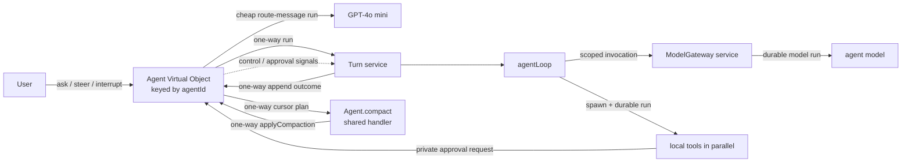

# Restate durable agent reference

A deliberately small reference implementation of an agentic application on
Restate. It separates durable conversation control, turn supervision, model
access, and the concrete agent loop without hiding them behind a framework.



## Why this structure

- `Agent` is the durable controller. Its exclusive handlers serialize changes
  to the active turn, pending messages, and conversation history for one
  `agentId`. It coordinates three independent components: `agent-turn.ts` owns
  turn state and signal lifecycle, `agent-history.ts` owns the durable
  transcript, and `agent-approval.ts` owns pending human approvals.
- `Turn` is stateless. One invocation supervises one agent turn and races the
  agent loop against hard interruption. The loop consumes steering itself at
  model/tool boundaries so it can retain its working context without
  cancelling current work.
- `agentLoop` has one small boundary: `{ agentId, turnId, messages }` in and a
  `completed | failed` result out. It owns only orchestration policy and the
  live state for model rounds, steering, parallel tool batches, and pending
  tasks.
- `agent-tools.ts` owns the concrete tools. Each definition keeps its model
  description, input schema, validation, local durable behavior, and result
  projection together. It exposes the loop a single concrete tool collection.
- `model.ts` owns provider-specific inference and the shared model contracts. It
  reconstructs AI SDK tool definitions from serializable manifests while
  deliberately receiving no executors.
- `message-router.ts` owns the cheap model decision for messages that arrive
  during an active turn.
- The shared `Agent.compact` handler asynchronously maintains a rolling summary
  of older finished turns without blocking exclusive conversation handlers.
  The model operation stays in `conversation-compactor.ts`; the exact
  transcript remains on the Agent and messages after the checkpoint remain
  verbatim.
- `model-gateway.ts` is the Restate boundary for full agent inference. It owns
  scoped admission, limit keys, retries, and cancellation propagation before
  delegating the provider call to `model.ts`.

The controller stores only user-facing history. Tool calls and intermediate
model steps stay in Restate's invocation journal and observability tools. A
turn appends exactly one structured outcome: `completed`, `interrupted`, or
`failed`.

## Conversation history and compaction

The complete user-facing transcript is canonical and is never replaced by a
model summary. `agent-history.ts` stores it in fixed-size state chunks with
stable internal sequence numbers. Lazy state lets normal handlers load only
the metadata and recent chunks they need; the public `history` handler still
assembles the complete transcript.

After a turn finishes, the Agent counts model-visible messages since the last
checkpoint. At 32 messages it reserves that entire finished prefix and
self-sends its cursor range to the shared `compact` handler. That handler reads
the relevant summary and history chunks directly from Agent state, merges them
with a cheap model, and one-way self-sends the derived checkpoint to the
exclusive `applyCompaction` handler. Newer appended entries do not invalidate
the checkpoint, and a failed compaction leaves the prior summary untouched.

Each turn receives the rolling summary followed by every exact model-visible
entry since that checkpoint. Compaction happens only between turns: live model
messages, tool calls, tool results, pending operations, and steering inside
`agentLoop` are never summarized mid-turn.

## Controller handlers

| Handler | Input | Behavior |
| --- | --- | --- |
| `ask` | `{ message: string }` | Returns the `start`, `steer`, `interrupt`, or `queue` decision, affected turn invocation ID, and queue/steering stats. A routed interrupt stops the current turn and queues the message for the next one. |
| `history` | void | Returns the complete durable transcript plus messages waiting for the next turn. Entries distinguish user messages, interruption events, and terminal turn summaries. |
| `append` | turn outcome | Ingress-private completion path used by `Turn`; ignores stale or duplicate turn IDs. |
| `interrupt` | reason string | Records an interruption event, resolves the active turn's interrupt signal, and returns immediately. |
| `steer` | instruction string | Appends the instruction and resolves the active turn's steering signal. |
| `approvals` | void | Returns the human approvals currently waiting on this agent. |
| `resolveApproval` | `{ approvalId, decision, reason? }` | Removes a pending approval and signals its waiting tool with `approved` or `rejected`. |

A successful interruption is visible immediately as
`{ role: "event", type: "interrupt", turnId, reason }`. The later turn outcome
records whether the turn actually ended as interrupted or won a completion
race.

An interruption selected by `ask` also preserves that conversational message
in the pending queue, so a new turn processes it after the interrupted
invocation retires. The explicit `interrupt` handler is control-only: it stops
the active turn without creating another user request.

Repeated resolutions of the `steering` signal form a durable queue. Each
successive `signal("steering")` consumes the next instruction in order.
The controller tracks how many signals it sent, while the loop reports how many
it consumed. If normal completion wins the race with a steer, the
unconsumed instruction moves behind that outcome and runs through the normal
queued-turn path instead of being stranded in history. An explicit interrupt
supersedes outstanding steering. External cancellation does not: steering
accepted before cancellation is recovered into the next turn.

The classifier uses GPT-4o mini directly from the exclusive `Agent` handler and
falls back to `queue` on failure, so an accepted message is never lost. A real
client with explicit stop and edit controls should call `interrupt` and `steer`
directly and skip intent classification.

While a turn is active, context-dependent additions, corrections, and follow-up
questions route to `steer`; only clearly independent work routes to `queue`.
The classifier also sees messages already waiting in the pending queue, so a
follow-up to queued work stays with that next turn instead of steering the
unrelated active turn.

## Durability and failure behavior

- Starting a turn and reporting its outcome are one-way Restate sends.
- Each full model round is a scoped `ModelGateway` invocation containing one
  durable `run` step. Restate owns a bounded four-attempt retry policy; the
  AI SDK's internal retries are disabled.
- The loop carries AI SDK response messages into the next model call. This
  preserves reasoning and tool-call state while OpenAI response storage is
  disabled.
- If a model round emits several independent tool calls, `agentLoop` uses
  Restate's [concurrent task primitives](https://docs.restate.dev/develop/ts/concurrent-tasks)
  to spawn all local tool `run` steps before joining them. Restate journals
  their concurrent execution and preserves deterministic replay.
- Steering is buffered while the current model call and foreground tool batch
  finish. Their results remain in context, and the next model round receives
  every buffered instruction in FIFO order.
- `sleep` and `humanApproval` return protocol-complete pending acknowledgements
  to the model, while their turn-scoped Restate tasks continue across later
  model rounds. A pending sleep therefore keeps its timer while steering starts
  unrelated tools. A pending approval gates dependent actions without blocking
  unrelated work; its eventual signal result is injected as a runtime update.
- `cancelOperation` lets the model selectively interrupt and join one pending
  operation by its stable ID. Completion races are reported honestly, and
  unrelated operations continue running.
- Hard interruption still cascades through the loop and all pending tasks.
  Abandoned approval requests are cleaned up idempotently.
- Deterministic configuration and OpenAI 4xx request errors fail immediately.
  Transient transport, timeout, rate-limit, conflict, and 5xx errors retry.
- Invocation cancellation aborts model I/O, joins the spawned loop, retires the
  controller's active turn, and is rethrown so Restate records cancellation.
- The complete transcript remains durable. The model sees the rolling summary
  plus every exact usable message since its checkpoint. Interrupted and failed
  outcome text is not misrepresented as an assistant answer.
- The loop stops after eight model rounds instead of running indefinitely.

## Model flow control

Only full agent inference uses the scoped gateway. Routing stays directly in
the controller because it is a small, latency-sensitive decision rather than
part of the agent loop. Background compaction similarly owns its cheap model
call in a shared Agent handler and cannot consume an agent-loop inference slot.

`ModelGateway` calls use scope `openai` and a two-level limit key:
`gpt-5.6-terra/<agent-hash>`. Each invocation therefore draws from three
budgets at once:

- `openai` — all agent-model traffic to the provider
- `gpt-5.6-terra` — traffic for that model
- `<agent-hash>` — concurrent inference for one agent

For example:

```sh
restate rules set "openai" --concurrency 100
restate rules set "openai/gpt-5.6-terra" --concurrency 20
restate rules set "openai/gpt-5.6-terra/*" --concurrency 2
```

The constant provider scope is intentionally simple and gives this example a
single provider-wide budget. At very high scale, use a higher-cardinality scope
such as tenant or account to avoid concentrating scheduling on one partition.

## Run locally

Requirements: Node.js 22 or newer, pnpm, a local Restate Server and CLI, and an
OpenAI API key. Restate's [quickstart](https://docs.restate.dev/quickstart)
covers installing the server and CLI.

Restate's [scope-based flow control](https://docs.restate.dev/services/flow-control)
is currently opt-in and must be enabled on a fresh cluster:

```sh
RESTATE_EXPERIMENTAL_ENABLE_PROTOCOL_V7=true \
RESTATE_EXPERIMENTAL_ENABLE_VQUEUES=true \
restate-server
```

In another shell, start the service endpoint:

```sh
pnpm install
OPENAI_API_KEY=... pnpm dev
```

With the service endpoint running, register it with Restate:

```sh
restate deployments register http://localhost:9080
```

Then invoke the `Agent` Virtual Object under any `agentId`, such as `demo`:

The `ask` schema defaults a missing `message` to: “What is the weather in the
top 10 European capitals? Also sleep for 4 minutes.”

```sh
curl localhost:8080/Agent/demo/ask \
  --json '{"message":"What is the weather in Berlin?"}'

curl -X POST localhost:8080/Agent/demo/history

curl localhost:8080/Agent/demo/steer \
  --json '"Steer toward a one-sentence answer"'

curl localhost:8080/Agent/demo/interrupt \
  --json '"Stop; the user changed their mind"'
```

An idle agent returns a response shaped like:

```json
{
  "decision": "start",
  "turnId": "inv_...",
  "stats": {"pendingMessages": 0, "steeringSignals": 0}
}
```

To keep a turn alive while trying steering, ask the agent to use its durable
sleep tool and redirect it from another shell:

```sh
curl localhost:8080/Agent/demo/ask \
  --json '{"message":"Sleep for 30 seconds, then tell me that you finished"}'

curl localhost:8080/Agent/demo/steer \
  --json '"Do not wait any longer; answer immediately"'
```

The sleep call returns a pending acknowledgement and its Restate timer remains
active. A steering message starts another model round after foreground tools
finish. For the instruction above, the model can call `cancelOperation` with
the timer's stable operation ID; that timer is interrupted while unrelated work
continues. The turn publishes its final answer only after its remaining pending
operations finish.

To try human approval, explicitly ask the model to use the approval tool:

```sh
curl localhost:8080/Agent/demo/ask \
  --json '{"message":"Before answering, use humanApproval to ask whether you may continue."}'

curl -X POST localhost:8080/Agent/demo/approvals

curl localhost:8080/Agent/demo/resolveApproval \
  --json '{"approvalId":"<approvalId>","decision":"approved","reason":"Looks good"}'
```

`approvals` returns the `approvalId`, originating Turn invocation ID, and the
model's question. The initial tool result reports the pending request; approval
or rejection later wakes the loop as a runtime update, allowing the model to
perform approved work, explain a rejection, or choose a different action.

The Restate UI at `http://localhost:9070` shows the invocation tree, durable
model/tool steps, retries, and signals. See Restate's
[HTTP invocation guide](https://docs.restate.dev/services/invocation/http) for
request-response, one-way send, attach, and cancellation variants.

## Project map

- `packages/libs/example/src/agent.ts` — durable conversation controller
- `packages/libs/example/src/agent-history.ts` — durable user-facing transcript
- `packages/libs/example/src/agent-turn.ts` — active-turn state and signal delivery
- `packages/libs/example/src/agent-approval.ts` — pending human approvals and signal delivery
- `packages/libs/example/src/turn.ts` — turn lifecycle and signal supervision
- `packages/libs/example/src/agent-loop.ts` — bounded model/tool orchestration
- `packages/libs/example/src/agent-tools.ts` — concrete tools and result projection
- `packages/libs/example/src/message-router.ts` — active-turn message classification
- `packages/libs/example/src/conversation-compactor.ts` — compaction model operation
- `packages/libs/example/src/model.ts` — model protocol and provider calls
- `packages/libs/example/src/model-gateway.ts` — scoped model-call admission and retries
- `packages/libs/example/src/types.ts` — wire schemas and domain types
