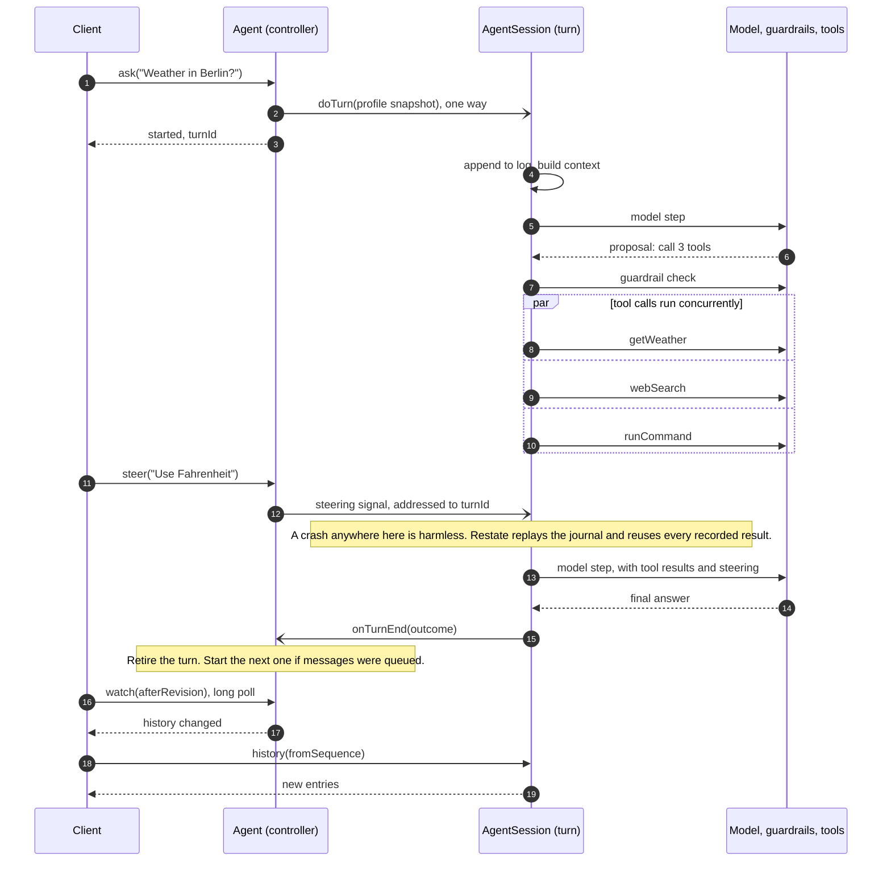

# Durable agents on Restate

**An LLM agent that survives crashes, deploys and days-long waits, without a
database, queue or scheduler of its own.**

This is a reference implementation of a modern agent harness on
[Restate](https://restate.dev): context compaction, parallel and programmatic
tool calls, steering, guardrails, human approval, memory, sub-agents and
schedules. Every model call, tool call, wait and message is journaled, so a
turn that is interrupted halfway resumes where it stopped. The code is written
to be read.

[Quickstart](#quickstart) · [How a turn works](#how-a-turn-works) ·
[Features](#features) · [Documentation](docs/README.md)


## Why durable

- **Crash-proof turns.** After a crash or deploy, Restate replays the turn's
  journal. Recorded model responses and tool results are reused, so the model
  is never asked to repeat a decision and completed tool calls are not re-run.
- **Waiting is free.** A turn can wait hours or days for an approval, a timer
  or a sub-agent. While it waits it holds no process, only stored state.
- **Always responsive.** `ask`, `steer` and `interrupt` return right away,
  even while a turn runs for minutes.
- **Nothing else to operate.** State, messages, timers and notifications all
  live in Restate. Each agent's state has a single owner, so there are no
  locks. The service is stateless: it scales out, or builds into a single
  bundle for serverless.

## Quickstart

You need Node.js 22+, pnpm, the Restate server and CLI, and an OpenAI API key.

```sh
pnpm install

# Terminal 1: Restate, with the SDK features this example uses
RESTATE_EXPERIMENTAL_ENABLE_PROTOCOL_V7=true restate-server

# Terminal 2: the agent service on port 9080, registered with Restate
export OPENAI_API_KEY=your-api-key
pnpm dev:service
restate deployments register http://localhost:9080
```

Talk to an agent through Restate ingress on port 8080. Any agent ID works;
the first message creates the agent.

```sh
# Start a turn (or queue the message if one is running)
curl localhost:8080/Agent/demo/ask --json '{"message":"What is the weather in Berlin?"}'

# Redirect the running turn without cancelling its tools
curl localhost:8080/Agent/demo/steer --json '{"message":"Use Fahrenheit"}'

# Stop it, optionally queueing a replacement request
curl localhost:8080/Agent/demo/interrupt --json '{"reason":"Changed my mind"}'

# Read the conversation log
curl localhost:8080/AgentSession/demo/history --json '{"fromSequence":1,"limit":100}'
```

Or chat in the reference UI: run `pnpm dev:ui` and open
[http://127.0.0.1:3000/?agent=demo](http://127.0.0.1:3000/?agent=demo).

**Try this:** ask it to sleep for four minutes, then kill `pnpm dev:service`
and start it again. The turn picks up where it was, and the Restate UI
(`http://localhost:9070`) shows every model call and tool result in the
turn's journal.

## How a turn works

Each agent is two Restate Virtual Objects with the same key:

- **`Agent`**, the controller. It decides what happens to each incoming
  message and owns the profile: instructions, guardrails, memories, tool
  grants, approvals, schedules and child agents. Its handlers are short, so
  it always answers.
- **`AgentSession`**, the turn. One `doTurn` invocation is one turn, and its
  invocation ID is the `turnId`. It owns the append-only conversation log and
  runs the model/tool loop.



Because the controller only ever sends one-way messages to the turn, it
never waits for it. `steer`, `interrupt` and approval decisions reach the turn
as durable signals addressed to its invocation ID, so they cannot land in the
wrong turn. Every agent feature is ordinary code on top of these two objects.

`doTurn` runs the model calls and tools itself, as in-process function calls,
not by hopping between services or queues. Each result is appended to the
turn's journal over one open, low-latency stream to Restate. That append is
the only persistence a step needs.


## Features

Paths are relative to `packages/libs/core/src`.

### Steer or interrupt a running turn

A message sent to a busy agent is queued for the next turn, steered into the
running one, or used to interrupt it. The controller answers each of them at
once. Steering reaches the next model step without cancelling tools in
flight; an interrupt cancels unfinished work and ends with a summary.


A closer look at steering: when a steer arrives while tools run, quick tools
finish and a long-running program moves to the background, so the new input
reaches the next model step without waiting for it. A steer that arrives
while the model is writing its answer makes that answer stale, and a new
model step over every steer replaces it. Messages queued in the meantime go
along with the steer.


Read `agent/active-turn.ts` and `session/step.ts`.

### Wait for a person, for days

A policy model checks each answer and tool batch against the agent's
guardrails. A guardrail can require a person's approval. The turn then waits
durably: it holds no process, survives redeploys, and resumes exactly where
it stopped.


Read `session/guardrails.ts` and `agent/approvals.ts`.

### Delegate to sub-agents

The agent creates sub-agents with their own history, sandbox and memory, and
hands them tasks in parallel. The parent turn waits durably without holding
its controller, so the agent keeps answering meanwhile.


Read `agent/sub-agents.ts` and `tools/sub-agents.ts`.

### Programmatic tool calls

For work that needs many calls, the model writes a small JavaScript program
instead of asking for one tool at a time. It runs in a sandboxed QuickJS
guest, every call it makes passes the same guardrails and is journaled, and
only its compact result goes back into the model's context.


Read `ptc/runtime.ts`.

### Compaction

Long conversations are summarized in the background, after a turn, into a
checkpoint that later turns build on. The most recent exchanges stay out of
the summary, so the model always sees them verbatim, and the log itself is
never rewritten.


Compaction never blocks a turn. The ending turn reserves the older messages
and sends `compact()` one way. That is a shared handler, so the summary is
written next to the next turn rather than before it. The result is applied
between turns, and only if the reserved range still matches.


Read `session/history.ts`, `session/service.ts` and `model/compactor.ts`.

### Schedules

A schedule delivers a message to the agent later, once or on a recurrence.
Its timers live in Restate, so there is no cron and no separate scheduler,
and a firing that comes due during a deploy is delivered afterwards.


Read `agent/schedules.ts`.

### And the rest

| Feature | What it does | Read |
| --- | --- | --- |
| **Parallel tool calls** | All tool calls in one model response run concurrently. A failing call is reported to the model without discarding the others. | `session/step.ts` |
| **Background operations** | Timers, approvals, sub-agent tasks and long programs keep running across model steps. The model can wait for them, carry on, or cancel one. | `session/pending.ts` |
| **Tool search** | Built-ins are always visible. MCP and discovered tools load on demand through `searchTools`, so large catalogs do not fill the context. | `session/tool-search.ts` |
| **Memory** | An index of short descriptions the model searches, reads from and writes to, so context does not grow with the number of memories. A simple illustration, not a full memory system. | `agent/memories.ts` |
| **Sandbox** | A local directory or [Modal](https://modal.com) sandbox for files and shell commands, suspended between turns. | `sandbox/turn.ts` |
| **Extensible tools** | MCP servers, plus any Restate handler published with `restate.dev/agent: <tool-name>` metadata. | `session/dynamic-tools.ts` |
| **Output recovery** | A truncated model response gets one retry with a larger output budget instead of failing the turn. | `model/inference.ts` |

**What replay does not do:** make external side effects exactly-once. A crash
between an MCP call completing and its result being recorded can repeat that
call.

## Configuration

What the agent is — its models, base instructions and built-in tools — is
set in code, in `packages/libs/core/src/agent-config.ts`. Each tool is one
module in `src/tools/`, written with `defineAgentTool` from `src/tools-api.ts`;
adding one is a new module and a line in that config. A tool carries its own
prompt guidance (`instructions`), which reaches the model only in turns where
the tool is offered. See [tools](docs/tools.md#built-in-tools).

The agent service reads these environment variables:

| Variable | Purpose |
| --- | --- |
| `OPENAI_API_KEY` | Required for model calls |
| `MCP_SERVERS_JSON` | MCP servers the agents may use; see below |
| `SANDBOX_PROVIDER` | `local` (default) or `modal`, which also needs `MODAL_TOKEN_ID` and `MODAL_TOKEN_SECRET` |
| `MODAL_APP_NAME`, `MODAL_SANDBOX_NAMESPACE`, `MODAL_SANDBOX_IMAGE`, `MODAL_SANDBOX_TIMEOUT_MS` | Optional Modal settings; see [sandboxes](docs/sandboxes.md) |
| `AGENT_MODEL_MAX_OUTPUT_TOKENS` | Output budget per model call, 1024–64000 (default 32000) |
| `RESTATE_ADMIN_URL`, `RESTATE_ADMIN_TOKEN` | Admin API used to discover dynamic tools |

<details>
<summary><strong>MCP servers</strong></summary>

MCP servers are configured by the operator on the agent service, not by
agents or clients. Clients can only switch configured servers on or off per
agent.

```sh
export MCP_SERVERS_JSON='[{"id":"example","type":"http","url":"https://mcp.example.com/mcp","protocol":"stateful","tokenEnv":"EXAMPLE_MCP_TOKEN"}]'
export EXAMPLE_MCP_TOKEN=your-server-token
```

- `protocol` is `stateless` for 2026-07-28 servers or `stateful` for
  2025-era Streamable HTTP servers.
- `tokenEnv` names the environment variable holding a bearer token and must
  end in `_MCP_TOKEN`. Omit it for public servers.
- The token is read only inside the HTTP call. It never enters handler
  inputs, state or the journal. The URL and variable name are not secret.
- Tool results are recorded and shown to the model, so only configure
  servers you trust.

[MCP configuration](docs/mcp-configuration.md) covers rotation and failures.

</details>

<details>
<summary><strong>Reference UI</strong></summary>

`packages/apps/web`, see [`env.example`](packages/apps/web/env.example):

| Variable | Purpose |
| --- | --- |
| `RESTATE_INGRESS_URL` | Restate ingress for the UI server (default `http://localhost:8080`) |
| `RESTATE_AUTH_TOKEN` | Bearer token for an authenticated ingress |
| `APP_PUBLIC_URL` | Browser origin when the UI sits behind a proxy; its host becomes the only accepted Host |
| `APP_ALLOWED_HOSTS` | Comma-separated extra Host values to accept, for proxies that rewrite Host |

</details>

## Development

```sh
pnpm lint                                  # oxlint + oxfmt check
pnpm build                                 # TypeScript 7 type-check and build, incl. Next.js
pnpm test                                  # core and web test suites
pnpm bundle                                # single-file core bundle
```

The tests run real handlers against recorded journals and fakes; they need no
Restate server or API key. See [development](docs/development.md) for
debugging. `docker/` holds runnable Dockerfiles for the service and the UI.

| Path | Contents |
| --- | --- |
| `packages/libs/core` | The durable runtime: agent, session, scheduler, sandbox, model calls |
| `packages/libs/types` | Zod wire schemas and Restate service contracts |
| `packages/libs/client` | Typed ingress client for one agent |
| `packages/apps/web` | Reference conversation UI (Next.js), an example client |
| `docs` | Design documentation |

[PROJECT.md](PROJECT.md) gives a file-by-file reading order.

## Further reading

1. [Architecture](docs/architecture.md): state owners, one request, notifications
2. [Protocol](docs/protocol.md): every handler, ordering rules, clients
3. [Turn runtime](docs/turn-runtime.md): steps, guardrails, pending work, recovery
4. [Tools](docs/tools.md): built-ins, programmatic tool calls, dynamic tools, MCP
5. [Schedules](docs/schedules.md) and [sandboxes](docs/sandboxes.md)
6. [Agent guide](docs/agent-guide.md): read before changing runtime semantics

[The documentation index](docs/README.md) has the full list.
