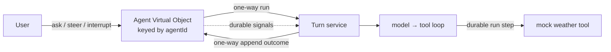

# Restate durable agent reference

A deliberately small reference implementation of an agentic application on
Restate. It separates durable conversation control from one turn of agent work
while keeping the concrete model and tool loop easy to read in one place.



## Why this structure

- `Agent` is the durable controller. Its exclusive handlers serialize changes
  to the active turn, pending messages, and conversation history for one
  `agentId`.
- `Turn` is stateless. One invocation supervises one agent turn and races the
  agent loop against interrupt and steering signals.
- `agentLoop` owns the model protocol, bounded round budget, durable model
  calls, tool selection, and in-handler tool execution.

The controller stores only user-facing history. Tool calls and intermediate
model steps stay in Restate's invocation journal and observability tools. A
turn appends exactly one structured outcome: `completed`, `interrupted`, or
`failed`.

## Controller handlers

| Handler | Input | Behavior |
| --- | --- | --- |
| `ask` | string | Appends and starts a turn when idle. While busy, a deliberately naive substring check chooses interrupt, steer, or queue. |
| `history` | void | Returns the complete durable transcript plus messages waiting for the next turn. |
| `append` | turn outcome | Ingress-private completion path used by `Turn`; ignores stale or duplicate turn IDs. |
| `interrupt` | reason string | Resolves the active turn's interrupt signal and returns immediately. |
| `steer` | instruction string | Appends the instruction and resolves the active turn's steering signal. |

Repeated resolutions of the `steering` signal form a durable queue. Each
successive `signal("steering")` consumes the next instruction in order.

`ask`'s substring routing is intentionally the simplest possible UI stand-in.
A real client should call `interrupt` and `steer` explicitly.

## Durability and failure behavior

- Starting a turn and reporting its outcome are one-way Restate sends.
- Every model round is one `run` step. Restate owns a bounded four-attempt retry
  policy; the OpenAI client's internal retries are disabled.
- Deterministic configuration and OpenAI 4xx request errors fail immediately.
  Transient transport, timeout, rate-limit, conflict, and 5xx errors retry.
- Invocation cancellation aborts model I/O, joins the spawned loop, retires the
  controller's active turn, and is rethrown so Restate records cancellation.
- The complete transcript remains durable, while the model sees only the 40
  most recent usable messages. Interrupted and failed outcome text is not
  misrepresented as an assistant answer.
- The loop stops after eight model rounds instead of running indefinitely.

## Run locally

Requirements: Node.js 20 or newer, pnpm, a local Restate Server and CLI, and an
OpenAI API key. Restate's [quickstart](https://docs.restate.dev/quickstart)
covers installing and starting the server and CLI.

```sh
pnpm install
OPENAI_API_KEY=... pnpm app-dev
```

With the service endpoint running, register it with Restate:

```sh
restate deployments register http://localhost:9080
```

Then invoke the `Agent` Virtual Object under any `agentId`, such as `demo`:

```sh
curl localhost:8080/Agent/demo/ask \
  --json '"What is the weather in Berlin?"'

curl -X POST localhost:8080/Agent/demo/history

curl localhost:8080/Agent/demo/steer \
  --json '"Steer toward a one-sentence answer"'

curl localhost:8080/Agent/demo/interrupt \
  --json '"Stop; the user changed their mind"'
```

The Restate UI at `http://localhost:9070` shows the invocation tree, durable
model/tool steps, retries, and signals. See Restate's
[HTTP invocation guide](https://docs.restate.dev/services/invocation/http) for
request-response, one-way send, attach, and cancellation variants.

## Project map

- `packages/libs/example/src/agent.ts` — durable conversation controller
- `packages/libs/example/src/turn.ts` — turn lifecycle and signal supervision
- `packages/libs/example/src/agent-loop.ts` — model/tool loop
- `packages/libs/example/src/types.ts` — wire schemas and domain types
