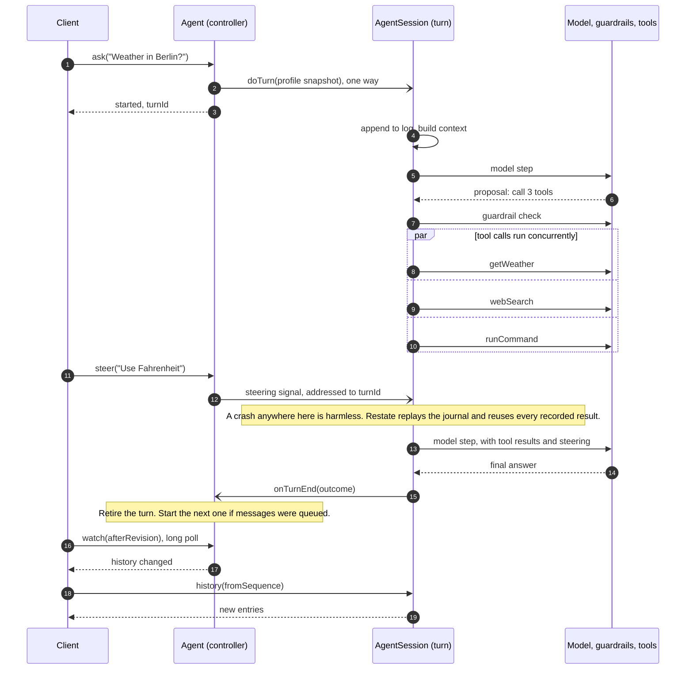

# A reference agent architecture

This repository demonstrates how to build a modern agent on
[Restate](https://restate.dev):

- [Parallel tool calls](#parallel-tool-calls)
- [Background operations](#background-operations-you-can-cancel) the model
  can wait for or cancel
- [Sub-agents](#delegate-to-sub-agents)
- [Schedules](#schedules)
- [Steering and interrupts](#steer-or-interrupt-a-running-turn) for a turn
  that is already running
- [Context compaction](#compaction-in-the-background) that never blocks a turn
- [Guardrails](#guardrails) and [human approval](#human-approval)
- [Programmatic tool calls](#programmatic-tool-calls) in a sandboxed
  JavaScript guest
- [Memory, tool search and sandboxes](#and-the-rest)

[Features](#features) · [Durable by construction](#durable-by-construction) ·
[How a turn works](#how-a-turn-works) · [Quickstart](#quickstart) ·
[Documentation](docs/README.md)


## Features

Paths are relative to `packages/libs/core/src`.

### Parallel tool calls

Every tool call in a model response runs at once. Restate retries transient
failures; a call that still fails goes back to the model as an error, and the
other results are kept.


Read `session/step.ts`.

### Background operations you can cancel

Timers, approval requests and long programs keep running while the model
keeps working. The model can wait for them, carry on, or cancel one.


Read `session/pending.ts` and `tools/operations.ts`.

### Delegate to sub-agents

Hand tasks to sub-agents, each with its own history, sandbox and memory.
They work in parallel, and the agent keeps answering while it waits.


Read `agent/sub-agents.ts` and `tools/sub-agents.ts`.

### Schedules

Send the agent a message later, once or on a recurrence. No cron and no
scheduler to run, and a firing that comes due during a deploy still arrives.


Read `agent/schedules.ts` and `tools/schedules.ts`.

### Steer or interrupt a running turn

A new message can wait for the next turn, steer the running one, or
interrupt it. The controller routes it and answers at once. A steer reaches the next model step
without cancelling tools in flight. An interrupt stops the turn and ends it
with a summary.


Read `agent/active-turn.ts`, `session/steering.ts` and `session/step.ts`.

### Compaction in the background

Long conversations are summarized between turns, without holding up the next
one. Recent exchanges stay verbatim, and the log is never rewritten.


Read `session/history.ts`, `session/service.ts` and `model/compactor.ts`.

### Guardrails

Rules in plain language, such as "never send email without asking". A policy
model checks every answer and tool call against them, then allows it, blocks
it, or asks a person.

Read `session/guardrails.ts`.

### Human approval

A guardrail, or the model itself, can ask a person to approve. The turn
waits, for days if needed, without holding a process, and resumes where it
stopped.


Read `session/approvals.ts`, `agent/approvals.ts` and `tools/approval.ts`.

### Programmatic tool calls

Instead of calling tools one at a time, the model writes a small JavaScript
program. It runs in a sandboxed QuickJS guest, every call passes the
guardrails, and only the result enters the context.


Read `ptc/runtime.ts`.

### And the rest

| Feature | What it does | Read |
| --- | --- | --- |
| **Turn compaction** | A single turn that nears the model's window swaps its older steps for a handoff note; recent steps stay verbatim. | `session/turn-compaction.ts` |
| **Memory** | A searchable index of memories, so context does not grow with them. A simple illustration, not a full memory system. | `agent/memories.ts` |
| **Tool search** | MCP and discovered tools load on demand, so large catalogs stay out of the context. | `session/tool-search.ts` |
| **Sandbox** | A local directory or [Modal](https://modal.com) sandbox for files and commands. | `sandbox/turn.ts` |
| **Extensible tools** | One module per tool, plus MCP servers and Restate handlers. | `tools-api.ts` |
| **Output recovery** | A truncated response gets one retry with a bigger output budget. | `model/inference.ts` |

## Durable by construction

Agents run for minutes, wait for people for days, and get redeployed in the
middle of both. Here that is handled underneath every feature above rather
than by each of them: every model call, tool result, wait and message is
recorded in Restate as the turn runs.


- **Crashes and deploys resume the turn.** Restate replays the turn's
  journal. Recorded model responses and tool results are reused, so the model
  is never asked to repeat a decision and completed tool calls are not re-run.
- **Waiting is free.** A turn can wait hours or days for an approval, a timer
  or a sub-agent. While it waits it holds no process, only stored state.
- **Always responsive.** `ask`, `steer` and `interrupt` return right away,
  even while a turn runs for minutes.
- **Nothing else to operate.** State, messages, timers and notifications all
  live in Restate: no database, queue or scheduler of the agent's own. Each
  agent's state has a single owner, so there are no locks. The service is
  stateless: it scales out, or builds into a single bundle for serverless.

**What replay does not do:** make external side effects exactly-once. A crash
between an MCP call completing and its result being recorded can repeat that
call.

## How a turn works

Each agent is two Restate Virtual Objects with the same key:

- **`Agent`**, the controller. It decides what happens to each incoming
  message and owns the profile: instructions, guardrails, memories, tool
  grants, approvals, schedules and child agents. Its handlers are short, so
  it always answers.
- **`AgentSession`**, the turn. One `doTurn` invocation is one turn. It owns
  the append-only conversation log and runs the model/tool loop.



The controller keeps track of the currently executing turn. `steer`,
`interrupt` and approval decisions reach the turn as durable signals
addressed to its invocation ID, the `turnId`, so they never land in the
wrong turn.

`doTurn` runs the model calls and tools itself, as in-process function calls.
Each result is appended to the turn's journal over one open, low-latency
stream to Restate. That append is the only persistence a step needs.


## Further reading

1. [Architecture](docs/architecture.md): state owners, one request, notifications
2. [Protocol](docs/protocol.md): every handler, ordering rules, clients
3. [Turn runtime](docs/turn-runtime.md): steps, guardrails, pending work, recovery
4. [Tools](docs/tools.md): built-ins, programmatic tool calls, dynamic tools, MCP
5. [Schedules](docs/schedules.md) and [sandboxes](docs/sandboxes.md)
6. [Configuration](docs/configuration.md): models, tools, environment
   variables, MCP servers and the reference UI
7. [Development](docs/development.md): tests, debugging, packaging and the
   repository layout; [PROJECT.md](PROJECT.md) gives a file-by-file reading
   order
8. [Agent guide](docs/agent-guide.md): read before changing runtime semantics

[The documentation index](docs/README.md) has the full list.

## Quickstart

You need Node.js 22+, pnpm, the Restate server and CLI, and an OpenAI API key.

```sh
pnpm install

# Terminal 1: Restate, with the SDK features this example uses
RESTATE_EXPERIMENTAL_ENABLE_PROTOCOL_V7=true restate-server

# Terminal 2: the agent service on port 9080, registered with Restate
export OPENAI_API_KEY=your-api-key
pnpm dev:service
restate deployments register http://localhost:9080
```

Talk to an agent through Restate ingress on port 8080. Any agent ID works;
the first message creates the agent.

```sh
# Start a turn (or queue the message if one is running)
curl localhost:8080/Agent/demo/ask --json '{"message":"What is the weather in Berlin?"}'

# Redirect the running turn without cancelling its tools
curl localhost:8080/Agent/demo/steer --json '{"message":"Use Fahrenheit"}'

# Stop it, optionally queueing a replacement request
curl localhost:8080/Agent/demo/interrupt --json '{"reason":"Changed my mind"}'

# Read the conversation log
curl localhost:8080/AgentSession/demo/history --json '{"fromSequence":1,"limit":100}'
```

Or chat in the reference UI: run `pnpm dev:ui` and open
[http://127.0.0.1:3000/?agent=demo](http://127.0.0.1:3000/?agent=demo).

**Try this:** ask it to sleep for four minutes, then kill `pnpm dev:service`
and start it again. The turn picks up where it was, and the Restate UI
(`http://localhost:9070`) shows every model call and tool result in the
turn's journal.
