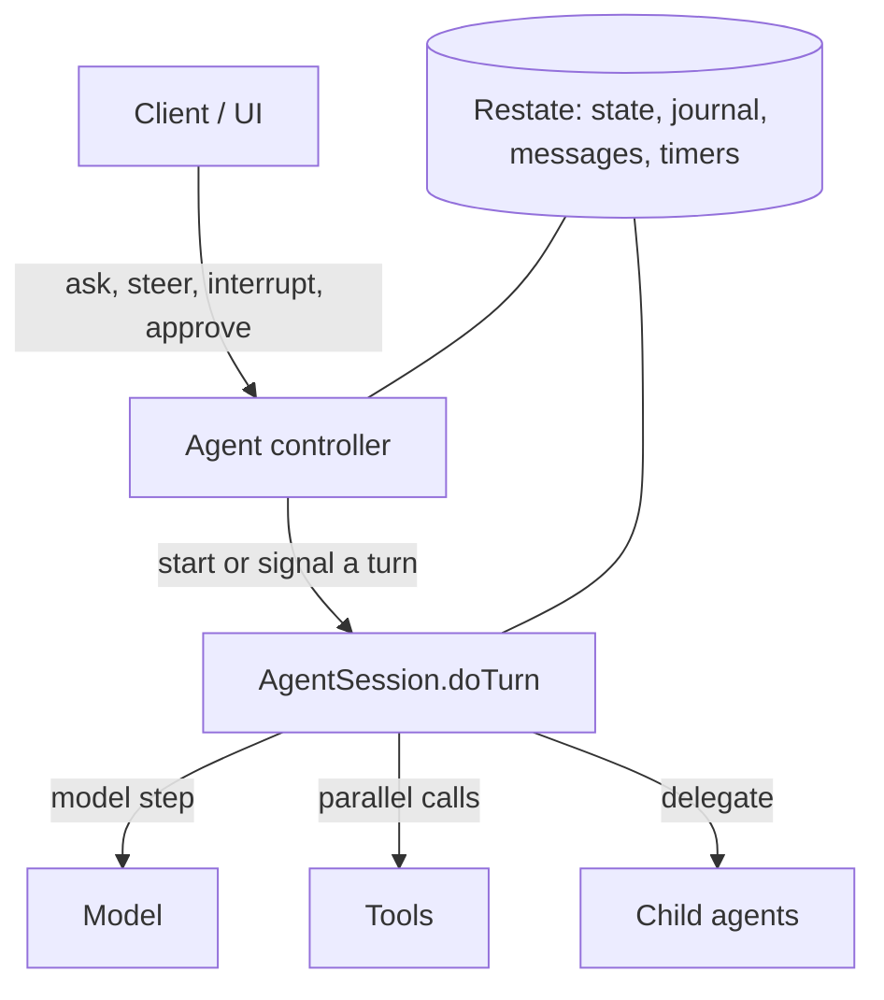
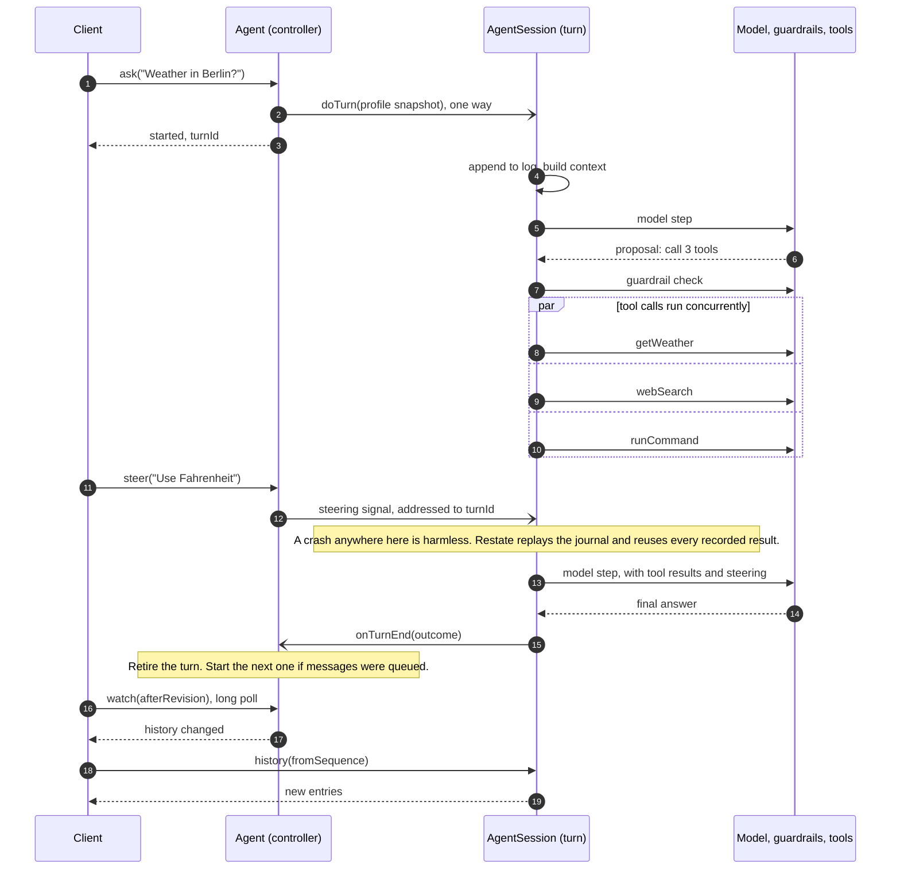

# A reference architecture for durable agents

Build agents that stay responsive while tools run, wait durably for people,
and recover after process restarts.

This runnable TypeScript reference shows how to build that with
[Restate](https://restate.dev). Run its stateless service on your container
platform or serverless provider. Restate keeps the journal, per-agent state,
messages, and timers, so the agent needs no separate database, queue, or
scheduler.

[Key ideas](#most-important-bits) · [Features](#full-list-of-features) ·
[Architecture](#how-it-fits-together) · [Quickstart](#quickstart) ·
[Documentation](docs/README.md)

## Most important bits

- **A durable turn and a stable handle.** Each `AgentSession.doTurn` invocation
  has a `turnId` that survives process restarts. Restate reuses recorded model
  and tool results on replay, then continues unfinished work.
- **Responsive control.** The `Agent` controller routes steering, interruption,
  and approvals to the active turn. Interrupting a parent also stops its active
  delegated child work. A turn can wait for a person without holding a process.
- **State owned by each agent.** `Agent` stores the profile and memories;
  `AgentSession` stores an append-only transcript and summary checkpoint. A
  turn builds model context from a profile snapshot and conversation history.
- **Concurrent tools and sub-agents.** Tool calls in one model response run in
  parallel within the turn. Sub-agents run as separate conversations with
  their own state and sandboxes.

## Full list of features

<table>
<tr>
<td width="50%"><strong><a href="docs/turn-runtime.md#agent-loop-iterations">Parallel tool calls</a></strong><br>Every call in a model response runs at once; a failure goes back to the model.</td>
<td width="50%"><strong><a href="docs/tools.md#pending-tools">Background operations</a></strong><br>Timers and approvals run on while the model works. It can wait or cancel.</td>
</tr>
<tr>
<td><strong><a href="docs/turn-runtime.md#steering">Steering and interrupts</a></strong><br>Redirect or stop a turn while it runs, without losing finished work.</td>
<td><strong><a href="docs/tools.md#sub-agents">Sub-agents</a></strong><br>Delegate tasks to agents with their own history, sandbox and memory.</td>
</tr>
<tr>
<td><strong><a href="docs/turn-runtime.md#guardrails">Guardrails</a></strong><br>Plain-language rules. A policy model allows, blocks or asks a person.</td>
<td><strong><a href="docs/protocol.md#context-and-approvals">Human approval</a></strong><br>A turn can wait days for a decision, holding no process.</td>
</tr>
<tr>
<td><strong><a href="docs/tools.md#programmatic-tool-calling-ptc">Programmatic tool calls</a></strong><br>The model writes a small program; only its result enters the context.</td>
<td><strong><a href="docs/architecture.md#control-and-history">Compaction</a></strong><br>Conversation history compacts in the background; a long turn can compact its working context.</td>
</tr>
<tr>
<td><strong><a href="docs/schedules.md">Schedules</a></strong><br>Messages to the agent later, once or on a recurrence. No cron.</td>
<td><strong><a href="docs/architecture.md#context-and-delegation">Memory</a></strong><br>A searchable index, so context does not grow with the memories.</td>
</tr>
<tr>
<td><strong><a href="docs/tools.md#turn-local-tool-search">Tool search</a></strong><br>MCP and discovered tools load on demand, keeping large catalogs out of context.</td>
<td><strong><a href="docs/sandboxes.md">Sandboxes</a></strong><br>A local directory or <a href="https://modal.com">Modal</a> sandbox for files and commands.</td>
</tr>
<tr>
<td><strong><a href="docs/tools.md#dynamically-discovered-restate-tools">Extensible tools</a></strong><br>One module per tool, plus MCP servers and Restate handlers.</td>
<td><strong><a href="docs/turn-runtime.md#model-output-budgets-and-recovery">Output recovery</a></strong><br>A truncated response gets one retry with a bigger output budget.</td>
</tr>
<tr>
<td><strong><a href="docs/protocol.md#history-and-notifications">UI updates</a></strong><br>The UI long-polls for changes, then reads history from a sequence cursor.</td>
<td><strong><a href="docs/architecture.md#external-effects-and-credentials">Crash recovery</a></strong><br>Replay reuses recorded results and continues unfinished work.</td>
</tr>
</table>

## How it fits together



`Agent` handles incoming messages without waiting for the turn. `AgentSession`
runs one turn at a time for the same agent ID; child agents have their own IDs,
conversations, and sandboxes.

## Four execution scenarios

These examples show separate paths through the same architecture: parallel
work, live control, approval waits, and crash recovery.

### 1. It calls tools in parallel

The model asks for three tools, the guardrails check them once, and they
run together. Each result is recorded as it lands, and a call that fails
goes back to the model as an error.


### 2. You steer it while it works

A new message does not have to wait for the turn to end. A steer reaches the
next model step without cancelling tools in flight, and an interrupt stops
the turn with a summary of what it did.


### 3. It waits a day for your approval

When a guardrail needs a person, the turn suspends: no process, only stored
state. It can wait a day, through new versions of the service, and resumes
where it stopped.


### 4. It survives a crash

Recorded model responses and tool results stay in the turn's journal. If the
process dies, Restate replays those results and continues unfinished work.


## Durability and deployment

Replay reuses results only after they have been recorded. If an external call
completes but its result has not reached the journal when the service fails,
that call may run again. Use idempotency keys for external writes.

Restate keeps a running turn on the service version where it started; new
turns use the new version. Keep the old endpoint available until its turns
finish. A turn waiting on approval, a timer, or a sub-agent holds stored state
instead of a process.

## How a turn works

Each agent is two Restate Virtual Objects with the same key:

- **`Agent`**, the controller. It decides what happens to each incoming
  message and owns the profile: instructions, guardrails, memories, tool
  grants, approvals, schedules and child agents. Its handlers are short, so
  it always answers.
- **`AgentSession`**, the turn. One `doTurn` invocation is one turn. It owns
  the append-only conversation log and runs the model/tool loop.



The controller keeps track of the currently executing turn. `steer`,
`interrupt` and approval decisions reach the turn as durable signals
addressed to its invocation ID, the `turnId`, so they never land in the
wrong turn.

`doTurn` runs the model calls and tools itself, as in-process function calls.
Each result is appended to the turn's journal over one open, low-latency
stream to Restate. That append is the only persistence a step needs.

## Further reading

1. [Architecture](docs/architecture.md): state owners, one request, notifications
2. [Protocol](docs/protocol.md): every handler, ordering rules, clients
3. [Turn runtime](docs/turn-runtime.md): steps, guardrails, pending work, recovery
4. [Tools](docs/tools.md): built-ins, programmatic tool calls, dynamic tools, MCP
5. [Schedules](docs/schedules.md) and [sandboxes](docs/sandboxes.md)
6. [Configuration](docs/configuration.md): models, tools, environment
   variables, MCP servers and the reference UI
7. [Development](docs/development.md): tests, debugging, packaging and the
   repository layout; [PROJECT.md](PROJECT.md) gives a file-by-file reading
   order
8. [Agent guide](docs/agent-guide.md): read before changing runtime semantics

[The documentation index](docs/README.md) has the full list.

### Skills for coding agents

[`plugins/restate-agent`](plugins/restate-agent) has two skills:
- `restate-agent`: how to extend this agent. It covers tools, handlers,
  configuration and testing, and how to grow the agent into a full
  application with users, sessions and credentials.
- `restate-gen-sdk`: how to write the generator-SDK code the agent is built
  from.

The plugin also connects the Restate docs MCP server. Claude Code offers to
install it when you open this repository. You can also install it by hand:

```sh
# Claude Code
/plugin marketplace add restatedev/agent
/plugin install restate-agent@restate-agent
# Other coding agents
npx skills add restatedev/agent
```

## Quickstart

You need Node.js 22+, pnpm, the Restate server and CLI, and an OpenAI API key.

```sh
pnpm install
```

Start Restate in one terminal:

```sh
RESTATE_EXPERIMENTAL_ENABLE_PROTOCOL_V7=true restate-server
```

Start the agent service in a second terminal:

```sh
export OPENAI_API_KEY=your-api-key
pnpm dev:service
```

Once the service is listening on port 9080, register it from a third terminal:

```sh
restate deployments register http://localhost:9080
```

Talk to an agent through Restate ingress on port 8080. Any agent ID works;
the first message creates the agent.

```sh
# Start a turn (or queue the message if one is running)
curl localhost:8080/Agent/demo/ask --json '{"message":"What is the weather in Berlin?"}'

# Redirect the running turn without cancelling its tools
curl localhost:8080/Agent/demo/steer --json '{"message":"Use Fahrenheit"}'

# Stop it, optionally queueing a replacement request
curl localhost:8080/Agent/demo/interrupt --json '{"reason":"Changed my mind"}'

# Read the conversation log
curl localhost:8080/AgentSession/demo/history --json '{"fromSequence":1,"limit":100}'
```

Or chat in the reference UI: run `pnpm dev:ui` and open
[http://127.0.0.1:3000/?agent=demo](http://127.0.0.1:3000/?agent=demo).

**Try this:** ask it to sleep for four minutes, then kill `pnpm dev:service`
and start it again. The turn picks up where it was, and the Restate UI
(`http://localhost:9070`) shows every model call and tool result in the
turn's journal.
