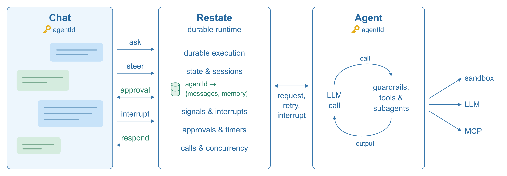
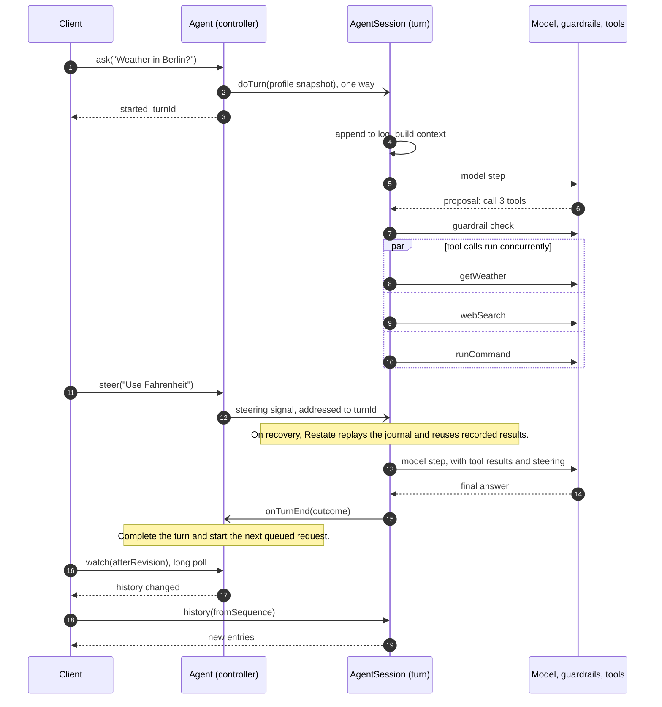

# A reference agent architecture

This reference architecture shows you how you can build **durable, stateful,
steerable, concurrent agents and agentic systems**.

The architecture fully runs on Restate and your favorite container platform or
serverless provider. Restate is a durable runtime for agents that gives you
all the building blocks you need to build advanced, large-scale agentic systems without
managing a large infra stack.

## Core idea

Each agent execution is a durable async process that is:

- **Steerable**: Each execution has a handle that is stable across process
  restarts and can be used to steer it, interrupt it, or approve an action.
  Interrupts automatically propagate through subagents.
- **Stateful**: Execution is isolated per agent session and stateful. Transcripts
  and model context (preferences, instructions) are stored in Restate's
  embedded KV store.
- **Recoverable**: Restate automatically keeps a journal per agent execution,
  to recover it automatically after a failure.
- **Concurrent**: Agents can spawn parallel subagents and tools. Tools execute
  as durable concurrent tasks within the process and can share resources like
  sandbox connections. Subagents run as separate durable invocations with their
  own state and resources.
- **Scalable**: Agents can scale up to thousands of concurrent executions, with
  protection against concurrency issues and race conditions. 
- **Pausable**: When an execution needs to wait, it scales to zero. Restate 
  persists the timers, approval promises, or subagent invocations, and lets 
  the execution resume when the waiting is over.
 
**Implementing these characteristics in a production-grade manner is
challenging and usually requires a lot of infra and coordination logic. In this 
reference architecture, the agent processes rely on Restate to handle this complexity**:

[](docs/images/agent-architecture.svg)


[Features](#features) · [One turn, start to finish](#one-turn-start-to-finish) ·
[How a turn works](#how-a-turn-works) · [Quickstart](#quickstart) ·
[Documentation](docs/README.md)

## Features

The implementation includes the following features. Each links to the docs
that explain how it works and how you can adapt it for your own agents.

| Feature | Description |
| --- | --- |
| **[Parallel tool calls](docs/turn-runtime.md#agent-loop-iterations)** | Execute tools concurrently and pass their results or errors back to the model. |
| **[Background operations](docs/tools.md#pending-tools)** | Let the agent continue working while tools, timers, or approvals are pending. It can wait for or cancel these operations later. |
| **[Steering and interrupts](docs/turn-runtime.md#steering)** | Send new instructions or stop an ongoing execution, while keeping track of completed work. |
| **[Sub-agents](docs/tools.md#sub-agents)** | Delegate work to agents with their own conversation, memory, and sandbox, and send them follow-up tasks. |
| **[Guardrails](docs/turn-runtime.md#guardrails)** | Define rules in natural language. A policy model checks tool calls and allows, blocks, or requests approval for them. |
| **[Human approval](docs/protocol.md#context-and-approvals)** | Suspend an operation until someone approves or rejects it, even if the decision takes days. |
| **[Programmatic tool calls](docs/tools.md#programmatic-tool-calling-ptc)** | Let the model write code that combines tool calls and returns a result, without adding every intermediate result to its context. |
| **[Compaction](docs/architecture.md#control-and-history)** | Summarize older context in long conversations and executions, while keeping recent exchanges verbatim. |
| **[Schedules](docs/schedules.md)** | Schedule a message for later or set up recurring work using Restate's durable timers. |
| **[Memory](docs/architecture.md#context-and-delegation)** | Store memories across turns and retrieve them when needed, without adding all of them to every model request. |
| **[Tool search](docs/tools.md#turn-local-tool-search)** | Discover tools from MCP servers and Restate services, and load their definitions into context when needed. |
| **[Sandboxes](docs/sandboxes.md)** | Give agents a workspace for files and commands, using a local directory or a [Modal](https://modal.com) sandbox. |
| **[Extensible tools](docs/tools.md#dynamically-discovered-restate-tools)** | Add tools as modules in the agent code, connect MCP servers, or expose Restate handlers as tools. |
| **[Output recovery](docs/turn-runtime.md#model-output-budgets-and-recovery)** | Retry a truncated model response once with a larger output budget, up to the configured limit. |

## How it works

A turn is one agent execution: it starts with a request and runs the model and
tools until it produces an answer or is stopped. The examples below show how
it handles parallel work, new input, approvals, and failures.

### 1. Parallel tool calls

The model can request several tools in the same response. The guardrails
check the proposed calls, and the allowed tools run concurrently. Restate
records each result as it completes. If a tool fails, its error goes back
to the model so it can decide how to proceed.


### 2. Steering and interruption

You can send new instructions while the agent is working. A steering message
reaches the next model step without stopping the tools that are already
running. An interrupt stops unfinished work and asks the model to summarize
what it completed. Interrupting does not undo actions that have already taken
effect.


### 3. Waiting for approval

When a tool needs approval, the agent registers the request and waits for a
durable signal. If it has no other work to do, Restate suspends the execution
and releases the process. The approval request survives restarts, and the
execution resumes when the decision arrives. You can still steer or interrupt
it while it waits.


### 4. Recovering after a failure

Restate keeps a journal of the execution, including model responses and tool
results. After a process failure, it automatically recovers the execution by
replaying the journal. Steps with recorded results return those results, and
execution continues from the unfinished work.

An external call can succeed just before a crash, before its result reaches
the journal. That call may run again during recovery. Use idempotency keys or
deduplication for external writes that must not be repeated.


## Why Restate

The agent code uses Restate's building blocks for persistence, communication,
and execution control. This means you can add a tool, an approval step, or a
subagent without implementing its recovery and coordination from scratch.

- **Durable execution**: Restate records the progress of each execution and
  recovers it after a failure, including work inside tools and parallel tasks.
- **State and sessions**: Virtual Objects keep state isolated per agent and
  serialize updates to it. You don't need to implement distributed locking
  for the conversation, profile, or memories.
- **Signals and timers**: Steering, approvals, scheduled messages, and waits
  use durable operations that survive process restarts. Suspended executions
  don't need to keep a process running to track what they are waiting for.
- **Deployment versioning**: With immutable deployments, running executions
  stay on the version they started with, while new executions use the new
  version. Keep the old deployment available until its executions finish.
- **A small infrastructure stack**: Restate stores the state, messages, timers,
  and notifications. The agent processes run on your compute platform without
  a separate database, queue, or scheduler for this coordination.

## How a turn works

An agent needs to keep receiving messages while it works. For example, a user
might add an instruction or approve a tool call during a long-running task.
This architecture separates handling that input from executing the agent loop,
using two Restate Virtual Objects with the same `agentId`:

- **`Agent`** handles incoming messages and tracks the active turn. It stores
  instructions, guardrails, memories, tool grants, approvals, schedules, and
  the list of child agents. Its handlers start or signal work and return
  without waiting for the turn to finish.
- **`AgentSession`** stores the conversation history and runs the model/tool
  loop. Each `doTurn` invocation executes one turn.

When a request arrives, `Agent` starts a turn or queues the message if one is
already running. Starting a turn is a durable one-way call to `AgentSession`:
the controller stores the invocation ID and returns it as the `turnId`.
Steering, interrupts, and approval decisions use this ID to reach the right
execution, including after a restart.



The model calls and built-in tools execute inside `doTurn` as in-process
function calls. They share the working context and resources such as sandbox
connections. Restate journals their results over an open connection; tools
don't need to be separate services to get durable execution.

When the turn finishes, it reports back to the controller, which starts the
next queued request if there is one. The client follows updates through
HTTP long-polling and reads new transcript entries from its last offset, so
it can reconnect and catch up with the same conversation.

## Quickstart

To run the reference locally, you need Node.js 22+, pnpm, the Restate server
and CLI, and an OpenAI API key.

Install the dependencies:

```sh
pnpm install
```

Start Restate in one terminal, with the experimental protocol features used
by this implementation enabled:

```sh
RESTATE_EXPERIMENTAL_ENABLE_PROTOCOL_V7=true restate-server
```

Start the agent service in another terminal:

```sh
export OPENAI_API_KEY=your-api-key
pnpm dev:service
```

Once the service is listening on port 9080, register it with Restate from a
third terminal:

```sh
restate deployments register http://localhost:9080
```

You can now send requests through Restate's ingress on port 8080. Choose an
agent ID, such as `demo`; the first request creates the agent.

```sh
# Start a turn, or queue the message if one is already running
curl localhost:8080/Agent/demo/ask --json '{"message":"What is the weather in Berlin?"}'

# Send a new instruction without stopping the running tools
curl localhost:8080/Agent/demo/steer --json '{"message":"Use Fahrenheit"}'

# Interrupt the current turn
curl localhost:8080/Agent/demo/interrupt --json '{"reason":"Changed my mind"}'

# Read the conversation history
curl localhost:8080/AgentSession/demo/history --json '{"fromSequence":1,"limit":100}'
```

The weather tool returns synthetic data. To use the conversation UI, run
`pnpm dev:ui` and open
[localhost:3000/?agent=demo](http://127.0.0.1:3000/?agent=demo).

To try failure recovery, ask the agent to sleep for four minutes, stop the
agent service, and start it again. Restate recovers the execution and resumes
the wait. Open the [Restate UI](http://localhost:9070) to inspect the invocation
and its journal.

## Further reading

The [documentation index](docs/README.md) lists the implementation guides.
Depending on what you want to build or change, start with:

- [Architecture](docs/architecture.md) for how the controller, session, state,
  and notifications fit together.
- [Protocol](docs/protocol.md) for the API handlers and how clients interact
  with an agent.
- [Turn runtime](docs/turn-runtime.md) for the agent loop, steering, guardrails,
  background operations, and recovery.
- [Tools](docs/tools.md) for adding tools, programmatic tool calling, and tool
  discovery. [MCP configuration](docs/mcp-configuration.md) covers connecting
  MCP servers.
- [Schedules](docs/schedules.md) and [sandboxes](docs/sandboxes.md) for scheduled
  work and managing the agent's workspace.
- [Configuration](docs/configuration.md) for models, environment variables,
  tools, and the reference UI.
- [Development](docs/development.md) for building, testing, and debugging.
  [PROJECT.md](PROJECT.md) gives a reading order through the source code.
- [Agent guide](docs/agent-guide.md) for the conventions to follow when changing
  execution behavior.

These blog posts explain some of the design choices behind the architecture:

- [A Durable Coding Agent — with Modal and Restate](https://restate.dev/blog/durable-coding-agent-with-restate-and-modal): building a coding agent with durable execution, session state, and sandboxes.
- [Agent checkpointing is far from production-grade resiliency](https://restate.dev/blog/why-checkpointing-is-not-production-grade-durable-execution): what agents need beyond saving and restoring checkpoints.
- [Updating AI Agents safely in production](https://restate.dev/blog/dealing-with-versioning-in-long-running-agents): keeping ongoing executions on the code version they started with.

### Skills for coding agents

The [`restate-agent` plugin](plugins/restate-agent) includes two skills to help
coding agents work with this repository:

- `restate-agent` explains how to add tools and handlers, configure and test
  the agent, and extend it into an application with users, sessions, and
  credentials.
- `restate-gen-sdk` explains the generator-based Restate SDK used by this
  implementation.

The plugin also connects the Restate docs MCP server. To install it in
Claude Code:

```sh
/plugin marketplace add restatedev/agent
/plugin install restate-agent@restate-agent
```

For other coding agents, install the skills with:

```sh
npx skills add restatedev/agent
```
