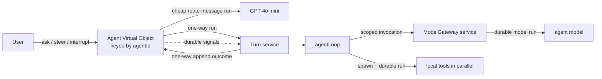

# Restate durable agent reference

A deliberately small reference implementation of an agentic application on
Restate. It separates durable conversation control, turn supervision, model
access, and the concrete agent loop without hiding them behind a framework.



## Why this structure

- `Agent` is the durable controller. Its exclusive handlers serialize changes
  to the active turn, pending messages, and conversation history for one
  `agentId`.
- `Turn` is stateless. One invocation supervises one agent turn and races the
  agent loop against interrupt and steering signals.
- `agentLoop` has one small boundary: `{ agentId, messages }` in and a
  `completed | failed` result out. It owns the bounded model/tool policy and
  keeps tools as local durable `run` and `sleep` operations.
- `model.ts` owns model definitions and access. AI SDK provides typed tools,
  structured output, and provider-neutral messages, while deliberately not
  executing tools. A cheap model routes messages that arrive mid-turn. Full
  agent inference uses OpenAI's Responses API and goes through `ModelGateway`,
  where Restate can admit work according to scope and limit-key concurrency
  rules.

The controller stores only user-facing history. Tool calls and intermediate
model steps stay in Restate's invocation journal and observability tools. A
turn appends exactly one structured outcome: `completed`, `interrupted`, or
`failed`.

## Controller handlers

| Handler | Input | Behavior |
| --- | --- | --- |
| `ask` | string | Appends and starts a turn when idle. While busy, a fast classifier chooses interrupt, steer, or queue. |
| `history` | void | Returns the complete durable transcript plus messages waiting for the next turn. User entries identify whether they started, steered, queued, or interrupted work. |
| `append` | turn outcome | Ingress-private completion path used by `Turn`; ignores stale or duplicate turn IDs. |
| `interrupt` | reason string | Resolves the active turn's interrupt signal and returns immediately. |
| `steer` | instruction string | Appends the instruction and resolves the active turn's steering signal. |

Repeated resolutions of the `steering` signal form a durable queue. Each
successive `signal("steering")` consumes the next instruction in order.

The classifier uses GPT-4o mini directly from the exclusive `Agent` handler and
falls back to `queue` on failure, so an accepted message is never lost. A real
client with explicit stop and edit controls should call `interrupt` and `steer`
directly and skip intent classification.

## Durability and failure behavior

- Starting a turn and reporting its outcome are one-way Restate sends.
- Each full model round is a scoped `ModelGateway` invocation containing one
  durable `run` step. Restate owns a bounded four-attempt retry policy; the
  AI SDK's internal retries are disabled.
- The loop carries AI SDK response messages into the next model call. This
  preserves reasoning and tool-call state while OpenAI response storage is
  disabled.
- If a model round emits several independent tool calls, `agentLoop` uses
  Restate's [concurrent task primitives](https://docs.restate.dev/develop/ts/concurrent-tasks)
  to spawn all local tool `run` steps before joining them. Restate journals
  their concurrent execution and preserves deterministic replay.
- Deterministic configuration and OpenAI 4xx request errors fail immediately.
  Transient transport, timeout, rate-limit, conflict, and 5xx errors retry.
- Invocation cancellation aborts model I/O, joins the spawned loop, retires the
  controller's active turn, and is rethrown so Restate records cancellation.
- The complete transcript remains durable, while the model sees only the 40
  most recent usable messages. Interrupted and failed outcome text is not
  misrepresented as an assistant answer.
- The loop stops after eight model rounds instead of running indefinitely.

## Model flow control

Only full agent inference uses the scoped gateway. Routing stays directly in
the controller because it is a small, latency-sensitive decision rather than
part of the agent loop.

`ModelGateway` calls use scope `openai` and a two-level limit key:
`gpt-5.6-terra/<agent-hash>`. Each invocation therefore draws from three
budgets at once:

- `openai` — all agent-model traffic to the provider
- `gpt-5.6-terra` — traffic for that model
- `<agent-hash>` — concurrent inference for one agent

For example:

```sh
restate rules set "openai" --concurrency 100
restate rules set "openai/gpt-5.6-terra" --concurrency 20
restate rules set "openai/gpt-5.6-terra/*" --concurrency 2
```

The constant provider scope is intentionally simple and gives this example a
single provider-wide budget. At very high scale, use a higher-cardinality scope
such as tenant or account to avoid concentrating scheduling on one partition.

## Run locally

Requirements: Node.js 22 or newer, pnpm, a local Restate Server and CLI, and an
OpenAI API key. Restate's [quickstart](https://docs.restate.dev/quickstart)
covers installing the server and CLI.

Restate's [scope-based flow control](https://docs.restate.dev/services/flow-control)
is currently opt-in and must be enabled on a fresh cluster:

```sh
RESTATE_EXPERIMENTAL_ENABLE_PROTOCOL_V7=true \
RESTATE_EXPERIMENTAL_ENABLE_VQUEUES=true \
restate-server
```

In another shell, start the service endpoint:

```sh
pnpm install
OPENAI_API_KEY=... pnpm app-dev
```

With the service endpoint running, register it with Restate:

```sh
restate deployments register http://localhost:9080
```

Then invoke the `Agent` Virtual Object under any `agentId`, such as `demo`:

```sh
curl localhost:8080/Agent/demo/ask \
  --json '"What is the weather in Berlin?"'

curl -X POST localhost:8080/Agent/demo/history

curl localhost:8080/Agent/demo/steer \
  --json '"Steer toward a one-sentence answer"'

curl localhost:8080/Agent/demo/interrupt \
  --json '"Stop; the user changed their mind"'
```

To keep a turn alive while trying steering, ask the agent to use its durable
sleep tool and redirect it from another shell:

```sh
curl localhost:8080/Agent/demo/ask \
  --json '"Sleep for 30 seconds, then tell me that you finished"'

curl localhost:8080/Agent/demo/steer \
  --json '"Do not wait any longer; answer immediately"'
```

The steering signal interrupts the pending Restate timer and restarts the agent
loop with the new instruction in its context.

The Restate UI at `http://localhost:9070` shows the invocation tree, durable
model/tool steps, retries, and signals. See Restate's
[HTTP invocation guide](https://docs.restate.dev/services/invocation/http) for
request-response, one-way send, attach, and cancellation variants.

## Project map

- `packages/libs/example/src/agent.ts` — durable conversation controller
- `packages/libs/example/src/turn.ts` — turn lifecycle and signal supervision
- `packages/libs/example/src/agent-loop.ts` — bounded model/tool loop and local tools
- `packages/libs/example/src/model.ts` — model protocol, router, and scoped gateway
- `packages/libs/example/src/types.ts` — wire schemas and domain types
