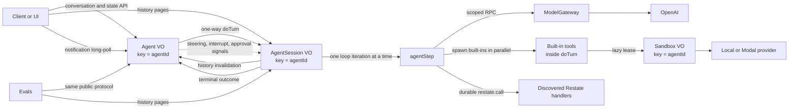

# Restate agent reference: documentation

This directory is the technical guide to the project. It is written for both
engineers and coding agents that need an explicit map of ownership, contracts,
and invariants before changing the runtime.

If you are pointing Codex, Claude Code, or another coding agent at the
repository, start with:

> Read `docs/agent-guide.md` and `docs/README.md`, then read the guide for the
> subsystem you will change. Confirm the current implementation before editing.

## What this project is

This is a reference implementation of a **durable, single-agent harness and
runtime** on Restate. The model and harness together form the operational
agent. The implementation keeps the important control flow visible:

- one durable controller and one durable session object per `agentId`;
- one `AgentSession.doTurn` invocation per agent run;
- an append-only, cursor-consumable conversation event log;
- model inference behind scoped admission and retry control;
- parallel foreground tool batches and cross-step pending tools;
- explicit queue, steer, interrupt, and selective-cancellation semantics;
- user instructions, model-managed memory, runtime guardrails, and approvals;
- non-destructive conversation and active-turn context reduction;
- agent-owned schedules and an agent-scoped sandbox;
- annotation-driven discovery of Restate handlers as model tools; and
- a durable black-box evaluation harness.

The seams are durable ownership boundaries, not framework extension points.

## System in one diagram

## The five Restate services

| Service | Shape | Identity | Responsibility |
| --- | --- | --- | --- |
| `Agent` | Virtual Object | `agentId` | Serialized routing, active invocation, queued input, profile, approvals, schedules, and notification subscriptions |
| `AgentSession` | Virtual Object | same `agentId` | Authoritative transcript, summary checkpoint, and one exclusive `doTurn` agent-run state machine at a time |
| `ModelGateway` | scoped Service | scope `openai` + limit key | Admission control, retries, cancellation propagation, and provider-call boundary |
| `Sandbox` | Virtual Object | same `agentId` | Serialized lifecycle and one-turn lease for the agent's external workspace |
| `Evals` | Service | suite invocation | Concurrent black-box trials against fresh agent instances |

`Agent`, `AgentSession`, and `Sandbox` own Virtual Object state.
`ModelGateway` and `Evals` are stateless services. The invocation ID of
`AgentSession.doTurn` is the stable `turnId` and signal target.

## Documentation map

Read in this order when learning the entire project:

1. [Coding-agent guide](agent-guide.md) — source-of-truth rules, invariants,
   common traps, and change routing.
2. [Architecture and data flow](architecture.md) — service boundaries, state
   ownership, execution sequences, context, and failure behavior.
3. [Agent protocol](protocol.md) — Agent and AgentSession handlers, request and
   response shapes, notifications, and event-log entries.
4. [Turn runtime](turn-runtime.md) — the `doTurn` state machine, steering,
   interruption, guardrails, pending operations, and finalization.
5. [Tools](tools.md) — built-in tools, foreground versus pending behavior, and
   dynamic Restate handler discovery.
6. [Sandboxes](sandboxes.md) — lifecycle, provider contract, local and Modal
   adapters, and adding another provider.
7. [Development and verification](development.md) — setup, local operation,
   evals, validation, and troubleshooting.
8. [Evals](evals.md) — suite protocol, isolation, current tasks, and gaps.

The root [README](../README.md) is the feature overview and runnable demo guide.
[PROJECT.md](../PROJECT.md) is the short source map.

## Canonical source files

Documentation explains the implementation; executable contracts win when they
differ. Use this order:

1. public Zod schemas in
   [`@restate-agents/types`](../packages/libs/types/src/index.ts), service
   descriptors in [`services.ts`](../packages/libs/types/src/services.ts), and
   provider schemas in [`model.ts`](../packages/libs/core/src/model.ts);
2. handler control flow in
   [`agent.ts`](../packages/libs/core/src/agent.ts),
   [`agent-session.ts`](../packages/libs/core/src/agent-session.ts), and
   [`sandbox.ts`](../packages/libs/core/src/sandbox.ts);
3. focused component modules such as `agent-history.ts`, `agent-turn.ts`,
   `turn-step.ts`, `turn-pending.ts`, and `agent-tools.ts`;
4. these documents.

When behavior changes, update the schema, implementation, relevant eval, and
documentation together.

## The shortest useful mental model

`Agent` decides **when input runs** and owns controller state.
`AgentSession` decides **how the active input is fulfilled** and owns the
conversation log. `AgentSession.doTurn` is one durable agent run; `agentStep`
is one model → guardrail → optional tool-batch iteration. `agentTools` owns tool
schemas and mechanics. `ModelGateway` owns inference admission and retry
behavior. `Sandbox` owns the external execution environment lifecycle.

History reads and turn execution share the same `AgentSession/{agentId}` state.
The `Agent` is only the invalidation broker for that history; profile,
approvals, and schedules remain authoritative Agent state. A client therefore
drains `AgentSession.history`, then parks on `Agent.watchNotifications`, and
re-reads whichever area has a newer version.

## Supported extension surfaces

There are three intended ways to add capability:

1. Add a built-in tool in `agent-tools.ts` when it needs active-turn context,
   pending-operation support, Agent state, or the shared sandbox lease.
2. Annotate a separately deployed Restate JSON handler with
   `restate.dev/agent: <tool-name>` when it should remain an independent
   service.
3. Add a `SandboxProvider` when the file/command contract stays fixed but the
   compute vendor changes.

Adding another service, Virtual Object, abstraction, or state store is not the
default. First identify which current durable owner cannot enforce the new
responsibility safely.
