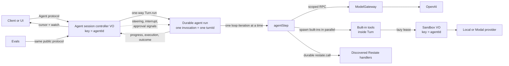

# Restate agent reference: documentation

This directory is the technical guide to the project. It is written for two
audiences:

- engineers who want to understand, run, extend, or evaluate the example; and
- coding agents that need an explicit map of ownership, contracts, and
  invariants before modifying it.

If you are pointing Codex, Claude Code, or another coding agent at the
repository, start with this instruction:

> Read `docs/agent-guide.md` and `docs/README.md`, then read the guide for the
> subsystem you will change. Confirm the current implementation before editing.

## What this project is

This is a reference implementation of a **durable, single-agent harness and
runtime** on Restate. The model and harness together form the operational
agent. Designed as an inspectable reference architecture, it keeps the
important control flow visible:

- one durable controller per `agentId`;
- one durable agent-run invocation per conversation turn;
- model inference behind scoped admission and retry control;
- parallel foreground tool batches;
- pending tools that survive across loop iterations;
- explicit queue, steer, interrupt, and selective-cancellation semantics;
- user instructions, model-managed persistent semantic memory, runtime
  guardrails, and human approvals;
- an immutable, cursor-consumable conversation event log;
- non-destructive conversation and active-Turn context reduction;
- agent-owned schedules;
- an agent-scoped sandbox with local and Modal providers;
- annotation-driven discovery of Restate handlers as model tools; and
- a durable black-box evaluation harness and protocol suite.

The implementation deliberately uses concrete modules rather than a framework
layer. The seams in this repository are ownership boundaries, not extension
points invented in advance.

## System in one diagram

## The five Restate services

| Service | Shape | Identity | Responsibility |
| --- | --- | --- | --- |
| `Agent` | Virtual Object | `agentId` | Deterministic durable session controller, conversation event log, active run, queue, profile, approvals, schedules, compaction coordination |
| `Turn` | Service | invocation ID is `turnId` | One durable agent run: tool-use loop, working context, steering, interruption, budgets, and pending tools |
| `ModelGateway` | Service called through scope `openai` | scoped invocation + limit key | Admission control, cancellation propagation, durable retries, and provider-call boundary |
| `Sandbox` | Virtual Object | same `agentId` | Serialized lifecycle and one-Turn lease for an Agent-owned external sandbox |
| `Evals` | Service | suite invocation | Evaluation harness running concurrent protocol tasks against fresh agent instances |

Only `Agent` and `Sandbox` own Virtual Object state. `Turn` owns durable
invocation-local variables through Restate's journal, not a database or object
state. `ModelGateway` and `Evals` are stateless services.

## Documentation map

Read in this order when learning the entire project:

1. [Coding-agent guide](agent-guide.md) — source-of-truth rules, invariants,
   common traps, and a change-routing map.
2. [Architecture and data flow](architecture.md) — service boundaries, state
   ownership, agent runs, sequences, context, profile, compaction, and failure
   behavior.
3. [Agent protocol](protocol.md) — supported external handlers, internal
   coordination handlers, request/response shapes, cursor consumption, and
   conversation event-log entry contract.
4. [Turn runtime](turn-runtime.md) — the detailed state machine, steering,
   interruption, guardrails, pending operations, and finalization semantics.
5. [Tools](tools.md) — the built-in tool contract, adding a tool, foreground
   versus pending behavior, and dynamic Restate handler discovery.
6. [Sandboxes](sandboxes.md) — lifecycle, provider contract, local adapter,
   Modal adapter, and adding another provider.
7. [Development and verification](development.md) — setup, local operation,
   evals, validation, troubleshooting, and change checklists.
8. [Evals](evals.md) — suite protocol, isolation, current evaluation tasks, and
   extension ideas.

The root [README](../README.md) remains the feature overview and runnable demo
guide. [PROJECT.md](../PROJECT.md) is a short source map. The documents here
are the maintainer reference.

## Canonical source files

Documentation explains the implementation; it does not replace the executable
contracts. When prose and code differ, use this order:

1. Zod handler and signal schemas in
   [`types.ts`](../packages/libs/example/src/types.ts), the schemas adjacent to
   handlers, and [`model.ts`](../packages/libs/example/src/model.ts);
2. handler control flow in
   [`agent.ts`](../packages/libs/example/src/agent.ts),
   [`turn.ts`](../packages/libs/example/src/turn.ts), and
   [`sandbox.ts`](../packages/libs/example/src/sandbox.ts);
3. focused component modules such as `agent-history.ts`, `agent-turn.ts`,
   `turn-step.ts`, `turn-pending.ts`, and `agent-tools.ts`;
4. these documents.

If a change intentionally alters behavior, update the schema, implementation,
eval coverage, and relevant document in the same change.

## The shortest useful mental model

`Agent` is the deterministic session controller and decides **when and where a
user message runs**. `Turn` is one durable agent run and decides **how to
fulfil the active set of messages** through a model-action-observation loop.
`agentStep` performs **one loop iteration: model proposal → guardrail → optional
foreground-tool batch**. `agentTools` owns **tool schemas and execution
mechanics**. `ModelGateway` owns **inference admission and retry behavior**.
`Sandbox` owns **the external tool-execution environment lifecycle**.

The canonical conversation event log belongs to `Agent`; the wire protocol
also calls it history/transcript. Turn working messages are the transient
model-visible trajectory context. A conversation summary and active-Turn
reduction are derived context; neither replaces or rewrites the event log.

## Supported extension surfaces

There are three intended ways to add capability:

1. Add a built-in tool in `agent-tools.ts` when it belongs inside this runtime,
   needs direct access to Turn context, or participates in the pending-operation
   protocol.
2. Annotate a separately deployed Restate JSON handler with
   `restate.dev/agent: <tool-name>` when the capability should remain an
   independent service.
3. Add a `SandboxProvider` when the file/command contract is stable but the
   underlying compute vendor changes.

Adding another service, Virtual Object, abstraction, or state store is not the
default. First identify which existing owner cannot safely own the new
responsibility.
