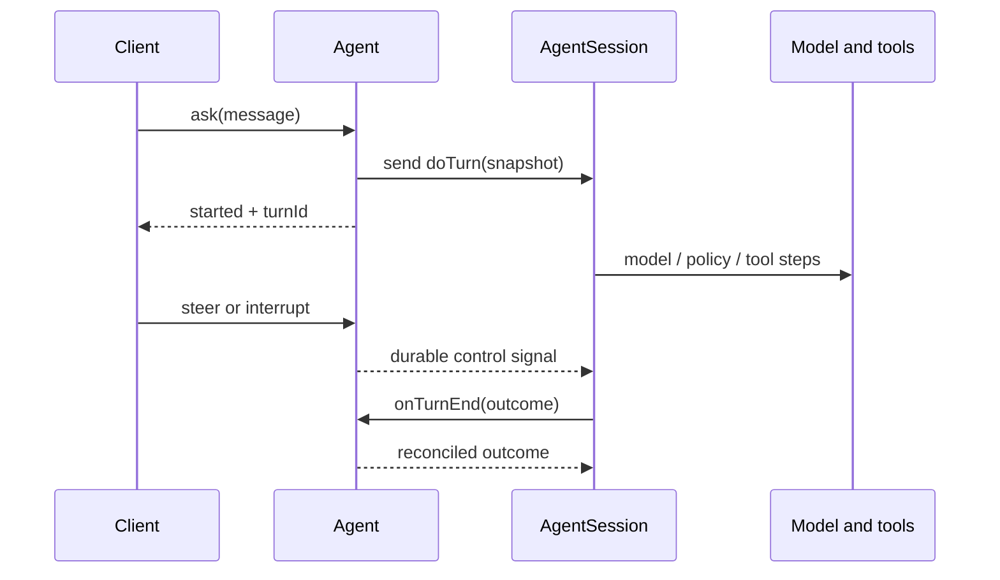

# Architecture

The reference separates a responsive controller from a long-running durable
turn. All conversation-scoped objects use the same `agentId`; a caller can
send `Agent/{agentId}/ask` immediately. No account registration is required.

## State ownership

| Component | Durable state and responsibility |
| --- | --- |
| `Agent` | Active invocation ID, queued input, steering reconciliation, profile, memories, approvals, schedules, notification watermarks, metadata and child directory |
| `AgentSession` | Append-only conversation history, summary checkpoint, sandbox reference, exclusive `doTurn` execution |

A turn is one `AgentSession.doTurn` invocation. Its invocation ID is its
`turnId`. The model plus harness form the operational agent; `Agent` is the
controller, not the model loop.

## One request

1. `Agent.ask` starts a turn while idle or stores a pending user entry while busy.
2. Starting snapshots instructions, guardrails, the memory index, tool grants, web search
   preference and configured MCP server references. It sends `doTurn` one way.
3. `AgentSession` opens history once and appends the activated entries. It builds
   model context from the summary checkpoint and remaining conversation.
4. Each step gets a model proposal, gates it through guardrails, and executes
   an allowed tool batch or publishes text. Foreground tools are joined within
   the step; pending tools can outlive a step.
5. Completion reconciles with `Agent.onTurnEnd`. Only the matching invocation
   can retire the current turn and start queued work.

The controller's exclusive lock is short-lived. It never waits for the whole
turn. A parent controller starts a child turn and returns its invocation ID;
its own session waits for that child's outcome without holding the parent lock.

## Control and history

Busy `ask` queues FIFO. `steer` drains queued input into an ordered signal for
the active turn and preserves current tool work. `interrupt` cancels unfinished
work, joins cleanup, and makes one tool-free finalization call. Its optional
replacement message belongs to a successor turn.

Every terminal outcome carries the consumed steering count so late input can
be recovered exactly. History is append-only. Compaction writes a summary
checkpoint; it does not rewrite the event log. Raw tool I/O and internal
execution traces are distinct from public conversation events.

## Context and delegation

Memories live on each Agent as an index in one state key (`memory/index`:
IDs such as `mem0` with a short description) and one key per memory's
content. Agent uses lazy state, so a handler loads only the keys it touches.
A turn snapshots the whole index and puts it in model context; the model reads
content with `readMemories` and changes memories with `manageMemory`. Changes
land at once, but the injected index refreshes only at the next turn.
Unrelated agent IDs share no memory.

The parent stores its child directory; each child stores its parent ID and
its own profile, history and sandbox. Creation copies the parent's instructions,
guardrails and effective tools, then applies any narrower selection. A child
starts with an empty memory of its own.
The copy does not follow later parent changes. Children cannot create children
or schedules; the parent initiates their tasks and follow-ups. Tool waits attach
to the exact child turn. Cleanup never interrupts an unrelated successor turn.
Retirement stops work, clears the profile, memories and approvals, and releases
resources, while retained history remains.

## Scheduling

Each schedule is a delayed `Agent/{agentId}/fire` invocation that routes its
message like any external delivery. Busy policy is explicit: queue, steer or interrupt. Repeating
schedules rearm a durable timer; obsolete timer invocations are ignored.
This example does not create a fresh agent for each occurrence. See
[schedules](schedules.md) for the contract and cancellation semantics.

## External effects and credentials

Model calls, sandbox operations and MCP HTTP calls execute inside durable
`restate.run` effects. Process-local caches are optimizations, never authority.
Restate journals completed results; an effect interrupted before recording its
result can execute again. Remote idempotency still depends on the provider.

MCP endpoints are operator configuration. Turn snapshots carry endpoint and
credential-reference metadata; environment tokens resolve only inside HTTP
effects. There is no OAuth flow, token store, encryption key or credential
entry UI. [MCP configuration](mcp-configuration.md) explains this boundary.

## Local UI and invalidation

The Next.js UI is an optional local operator interface. It chooses a conversation
by `?agent=`, proxies supported operations, checks the Host of every request
against loopback or `APP_PUBLIC_URL` (DNS rebinding) and checks the Origin of
writes.
It has no authentication or tenant isolation. Its scripts bind to `127.0.0.1`.

The server captures an Agent notification watermark before loading history,
profile, approvals, metadata, children and schedules. It drains history pages,
then long-polls changes and re-reads only changed topics. `profile` invalidates
metadata and children too. Browser
merging deduplicates sequences and never moves its history cursor backward.
Each mounted conversation owns one cancellable poll; switching is navigation.
