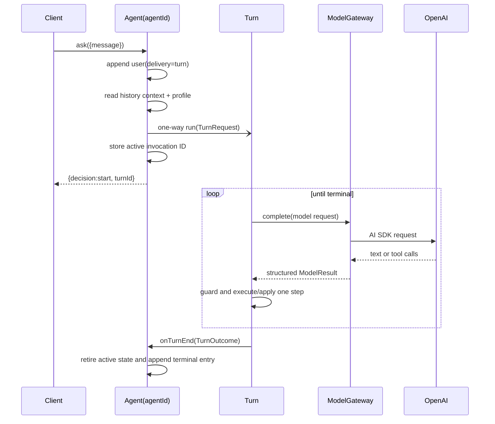
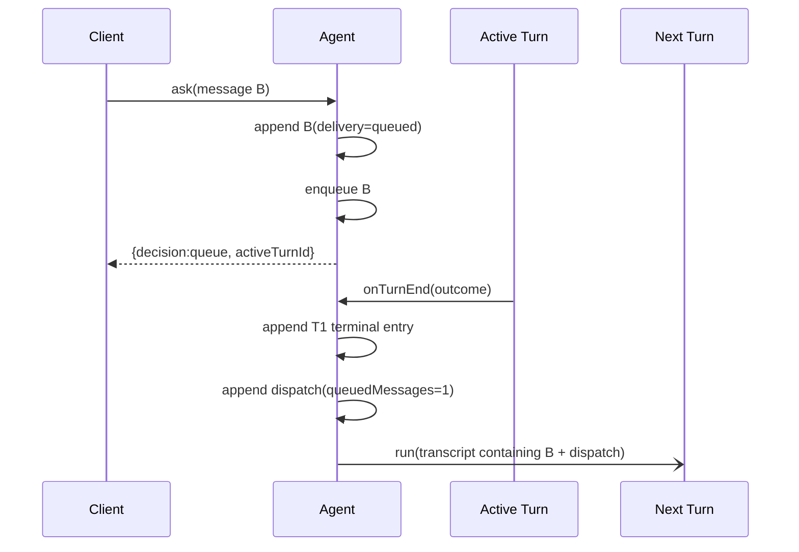
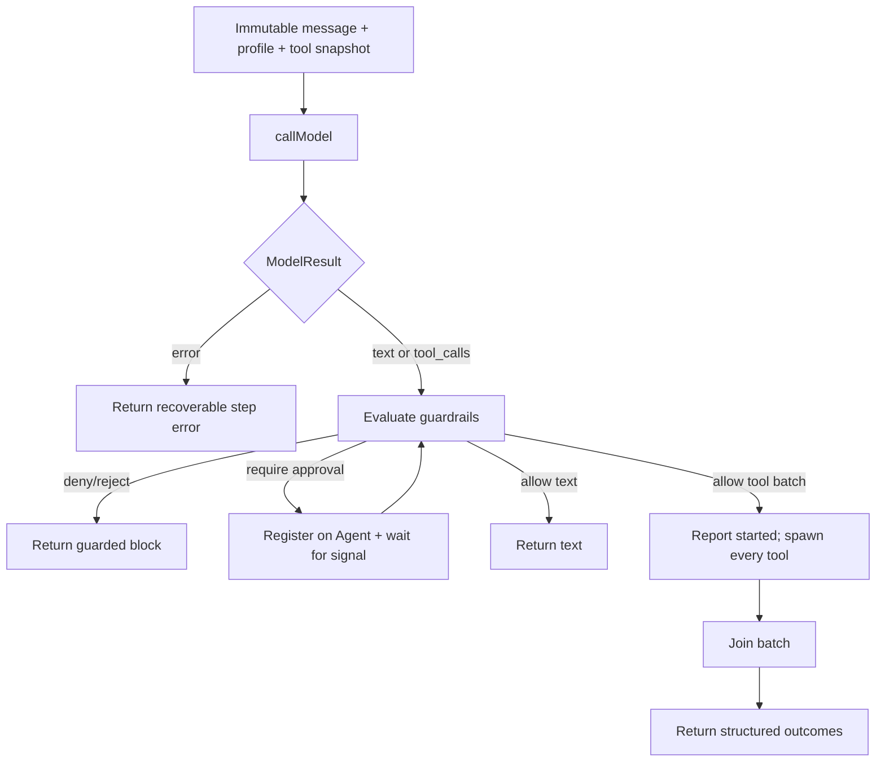

# Architecture and data flow

This guide explains where state and behavior live, how a message moves through
the runtime, and why the boundaries are arranged this way.

## Design principles

The project follows five principles:

1. **Durable ownership is explicit.** The Agent owns conversation state; the
   Sandbox owns external workspace state; one Turn invocation owns transient
   execution state.
2. **The transcript is authoritative.** It is an immutable ordered record of
   what the Agent observed. Summaries and model messages are derived views.
3. **Control is separate from execution.** Agent handlers route messages and
   send signals. Turn executes model steps and tools.
4. **Concurrency stays structured.** Spawned work is owned and joined by a
   step, the pending registry, or the Turn supervisor.
5. **Contracts live beside behavior.** Handler schemas, tool schemas, model
   result unions, and provider interfaces describe the actual seams.

## Service boundary

### Agent Virtual Object

`Agent`, keyed by `agentId`, is the controller and durable conversation owner.
Its exclusive handlers serialize decisions that would otherwise require locks
or transactions:

- whether a Turn is active;
- whether a message starts, queues, steers, or interrupts;
- the pending user-message FIFO;
- append order in canonical history;
- persistent instructions, memories, and guardrails;
- pending approval state;
- active schedules; and
- compaction reservations and checkpoint application.

Agent's exclusive controller path never performs model inference or executes a
tool. It starts `Turn.run` as a one-way child invocation and later accepts
exactly one structured outcome. The shared `compact` maintenance handler is the
deliberate exception: it performs a cheap derived-summary call without blocking
exclusive conversation decisions.

State is split into handler-scoped capability namespaces for readability:

- `agent-turn.ts` — active invocation, pending user queue, and signals;
- `agent-history.ts` — chunks, cursor, watchers, and summary checkpoint;
- `agent-profile.ts` — instructions, memories, and guardrails;
- `agent-approval.ts` — pending approvals and decision signals; and
- `agent-schedules.ts` — active schedule records and delayed invocation IDs.

These objects are not process-level services or dependency containers. They use
the current Restate handler context and hold no local state.

### Turn service

Each `Turn.run` invocation is one durable agent Turn. Its Restate invocation ID
is the `turnId`, signal target, tool correlation root, and terminal-outcome ID.

Turn has no service state. Its generator-local state is made durable by the
invocation journal:

- model messages;
- stable profile snapshot;
- step and tool-call budgets;
- guardrail decisions;
- steering consumption count;
- pending tool tasks;
- discovered dynamic tool snapshot;
- sandbox lease context; and
- transient context-reduction bookkeeping.

Turn repeatedly spawns one `agentStep`, settles it against interruption,
commits the result into working context, and decides whether to iterate, wait,
or finish.

### ModelGateway service

`ModelGateway` is the Restate boundary around provider calls. It exists so
admission happens before a request reaches OpenAI.

It owns:

- the `openai` scope;
- model and hashed-agent limit keys;
- four-attempt Restate retry policy;
- cancellation of abandoned child invocations; and
- one `restate.run` per provider operation.

`model.ts` remains the provider-specific layer: AI SDK requests, models,
prompts, serializable model contracts, and error classification. Tool
executors never cross into `model.ts`; only manifests do.

### Sandbox Virtual Object

`Sandbox`, keyed by the same `agentId`, owns the external workspace lifecycle
across conversation Turns. A Turn borrows it lazily the first time a sandbox
tool runs. The VO serializes:

- initial provisioning;
- an idempotent lease for one Turn;
- release and cancellable delayed suspension;
- resume with an updated opaque provider reference; and
- destruction while not borrowed.

Provider and file/command operations are external effects. They run inside
`restate.run`; the VO stores only the lifecycle state and opaque reference.

### Evals service

`Evals/all` is a black-box protocol driver. It spawns selected scenarios
concurrently, assigns each a fresh Agent key, calls the same public Agent
handlers as a real client, follows history through cursor notifications, and
returns structured assertions with the observed transcript.

## State ownership matrix

| State | Owner | Durable mechanism | Readers |
| --- | --- | --- | --- |
| Active Turn ID, interrupting flag, steering batches | Agent | VO state | Exclusive Agent handlers |
| Pending user messages | Agent | VO state | Exclusive Agent handlers |
| Transcript chunks and next sequence | Agent | Lazy VO state | Exclusive append; shared history/context readers |
| History watchers | Agent | VO state + caller awakeables | `watchHistory` coordination |
| Conversation summary checkpoint | Agent | VO state | Turn start and compactor |
| Instructions, memories, guardrails | Agent | VO state | Shared profile read; snapshotted at Turn start |
| Pending approvals | Agent | VO state | Shared list; exclusive mutation |
| Scheduled messages and timer IDs | Agent | VO state | Shared list; exclusive mutation |
| Working model messages | Turn invocation | Journaled generator locals | Current Turn only |
| Pending tool tasks | Turn invocation | Restate Tasks | Current Turn only |
| Steering FIFO | Turn invocation | Durable signal source + transient queue | Current Turn only |
| Dynamic tool catalog used by a Turn | Turn invocation | Journaled `restate.run` result | Model and executor in that Turn |
| Dynamic catalog refresh cache | Endpoint process | Memory, five-minute TTL | Discovery optimization only |
| Sandbox lease/status/reference | Sandbox | VO state | Sandbox handlers |
| Local files or Modal Volume | Sandbox provider | External store | Sandbox client |
| OpenAI and Modal SDK clients | Endpoint process | Memory | Provider-call optimization only |

Process-local values may disappear at any time. Correctness must not depend on
them.

## Idle `ask` sequence



`startTurn` builds `TurnRequest` only after the user message is in history. The
request contains the profile snapshot, optional rolling summary, and exact
model-relevant entries after the summary checkpoint.

## Busy `ask` and later dispatch

A busy `ask` does not invoke a classifier:

1. append the user entry with `delivery: "queued"`;
2. add its text to the Agent's pending FIFO;
3. return the current active Turn ID and queue length.

When the active Turn finishes, `Agent.onTurnEnd` drains pending messages,
appends a `dispatch` boundary, and starts one new Turn with the complete
transcript. The original user entries stay at the sequence positions where the
Agent observed them.



## Steering sequence

Steering means: finish the current step, keep its durable effects, and let the
next model step see new user direction.

1. Agent drains all currently queued messages.
2. Agent resolves the active Turn's `steering` signal with
   `{queued: string[], message: string}`.
3. Agent records the new user entry with `delivery: "steer"` and a `steer`
   boundary containing the target Turn and queued count.
4. A Turn-local background fiber receives durable steering signal resolutions
   into a FIFO.
5. The current model/tool step settles without steering-induced cancellation.
6. Turn commits tool outcomes first, drains steering, resets current-request
   guardrail decisions, and starts the next step.

If a side-effect-free text or model-error step completed while steering was
buffered, that stale result is discarded. If normal Turn completion won before
the signal was consumed, Agent uses `consumedSteering` and its stored batch
sizes to activate the unconsumed messages in the next Turn.

## Interruption sequence

Interruption means: end this Turn, but summarize completed work honestly.

```mermaid
sequenceDiagram
  participant C as Client
  participant A as Agent
  participant T as Turn
  participant P as Pending tools
  participant M as Final model call

  C->>A: interrupt({reason, message?})
  opt replacement message
    A->>A: append user(delivery=queued)
    A->>A: enqueue replacement
  end
  A->>A: append interrupt boundary
  A-)T: resolve interrupt signal(reason)
  T->>T: interrupt and join current step
  T->>P: stop and join older pending work
  T->>M: tools=[]; summarize retained results
  M-->>T: final text
  T->>A: onTurnEnd(interrupted outcome)
  A->>A: append assistant(status=interrupted)
  opt queued work
    A->>A: append dispatch
    A-)T: start next Turn
  end
```

The optional replacement is recorded before the interrupt event because that
is the order the Agent handler observed the two facts. The reason is not a new
user request; it is finalization guidance for the old Turn.

## External cancellation

Operator or API cancellation rejects the spawned Turn state-machine task with
`CancelledError`. `Turn.run`:

1. stops independently pending tasks;
2. creates an interrupted outcome with reason `Turn cancelled` and no model
   response;
3. awaits Sandbox release;
4. awaits `Agent.onTurnEnd`;
5. rethrows cancellation to Restate.

Agent appends an interrupt boundary when no explicit Agent interrupt had
already done so. It does not fabricate a graceful assistant finalization.

## One agent step

`agentStep` is not a service. It is a bounded generator operation spawned by
Turn:



The step owns foreground tool tasks only until it returns. Pending completion
tasks are created later by Turn's pending registry.

## Foreground and pending tools

A foreground tool returns one of:

- `succeeded` with a string result;
- `failed` with a model-visible error;
- `pending` with stable operation metadata; or
- `cancel_requested` for an older pending operation.

Foreground calls in one batch run concurrently. When Turn applies the batch:

1. completion tasks for new pending outcomes are spawned immediately;
2. cancellation requests resolve against operations that were already pending;
3. new pending operations are registered;
4. the assistant tool-call message and one matching tool-result message are
   appended to working model context; and
5. structured tool status is reported to Agent history.

Pending completion, selective cancellation, steering, and interruption are
settled through Restate task selection. Completion-versus-cancellation races
remain observable rather than being overwritten.

## Transcript architecture

The Agent transcript is a sequence of:

- user messages with immutable delivery metadata;
- assistant terminal outcomes;
- control boundaries;
- profile, memory, approval, and schedule events; and
- semantic progress and execution activity.

`agent-history.ts` stores entries in chunks of 32 with stable positive sequence
numbers. `history({fromSequence, limit})` uses an inclusive cursor and loads
only the chunks needed for the page.

Not every entry is model context. `isDerivedConversationEvent` centrally
classifies profile updates, approval request/cancellation, progress, activity,
tool lifecycle, memory metadata, and schedule metadata as client-facing status.
Control boundaries and resolved approval decisions remain semantic model
context. `turn-context.ts` performs the exact projection.

### History notification

`watchHistory` is a shared long-poll:

1. check shared metadata for a readable cursor;
2. create a caller-owned awakeable;
3. call an exclusive registration handler that re-checks the cursor;
4. wait for the awakeable or the bounded window;
5. remove a timed-out registration; and
6. let the caller re-read the normal cursor.

The exclusive re-check closes the empty-read/registration race. The
notification carries no data; history remains the source of truth.

## Profile and guardrails

Instructions, memories, and guardrails are per Agent:

- instructions are user-managed and appended to model instructions;
- memories are a model-managed, keyed collection of at most 32 entries and are
  injected as context, explicitly not as instructions;
- guardrails are user-managed natural-language policies with stable IDs.

Each Turn receives one snapshot. Profile changes append metadata-only history
events so clients know to re-read the authoritative `profile` handler.

Guardrails are not sent to the main agent model. After the model proposes text
or a complete tool batch, the cheap evaluator returns `allow`, `deny`, or
`require_approval`. A required approval is stored on Agent and resolved by a
Turn-scoped signal. The exact proposal and question are retained for scoped
reuse; steering invalidates current-request decisions.

## Conversation compaction

Compaction is non-destructive:

1. after a terminal outcome, Agent counts non-event conversation messages since
   the prior checkpoint;
2. at 32 messages, it reserves the complete finished prefix then visible;
3. shared `Agent.compact` reads that range and calls a cheap model;
4. the result is one-way sent to exclusive `applyCompaction`;
5. only a matching reservation is installed.

The transcript chunks remain unchanged. A later Turn receives the summary plus
exact model-relevant entries after its `through` cursor.

## Active-Turn context reduction

Long multi-step Turns may accumulate tool protocol far faster than the
conversation transcript. When the JSON size of current-Turn messages exceeds
32,000 characters, there are no pending operations, and a prefix has already
been observed by the agent model, Turn may replace that working prefix with a
cheap-model record intended to preserve every settled fact and outcome.

This mutation is local to the Turn invocation. Failure disables further
reduction for that Turn and keeps the exact context. It never changes Agent
history or the conversation summary.

## Scheduled messages

Schedules belong to Agent, not Turn. Creating one journals a delayed self-send
and returns immediately. A due message re-enters Agent's exclusive routing:

- idle → append and start;
- busy + `queue` → append and queue;
- busy + `steer` → deliver as steering;
- busy + `interrupt` → queue the message and interrupt current work;
- already interrupting → always queue.

One-shot state is removed before delivery. Repeating schedules install their
next fixed-delay timer before routing the current delivery. Recorded invocation
IDs reject stale delayed sends.

## Why these boundaries matter

Moving controller state into Turn would make queueing and client-visible order
race across invocations. Moving Turn working state into Agent would block the
exclusive controller during model and tool work. Turning every built-in tool
into an RPC would obscure local structured concurrency without adding
durability. Letting provider code own sandbox lifecycle would lose the
serialized Agent-scoped lease.

The current layout keeps each consistency decision at the narrowest durable
owner that can enforce it.
