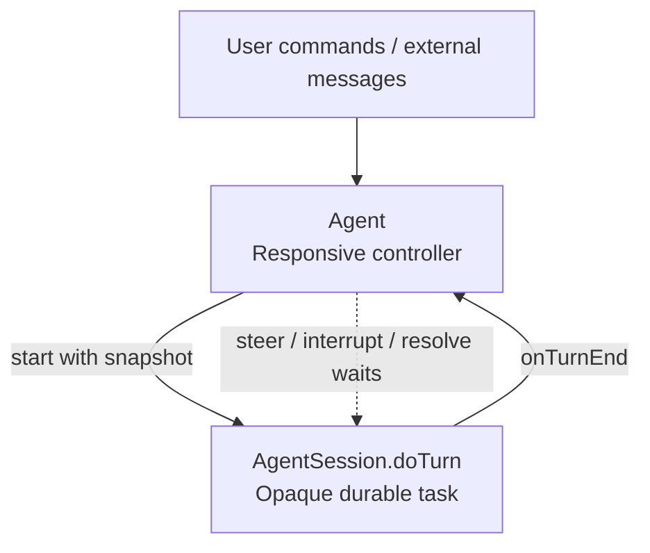
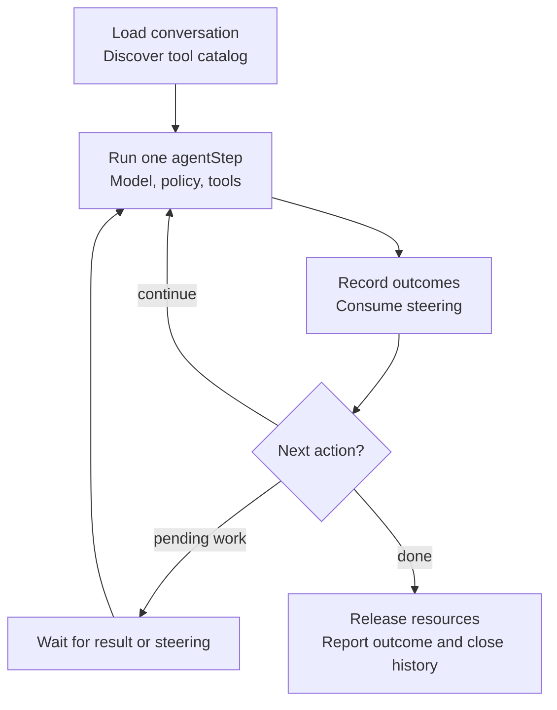
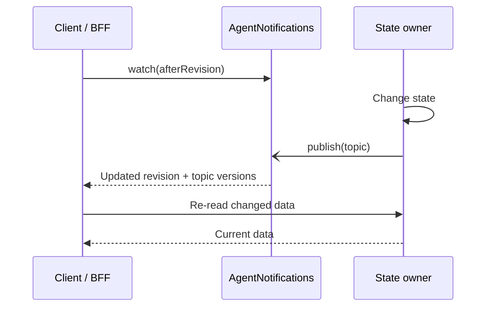
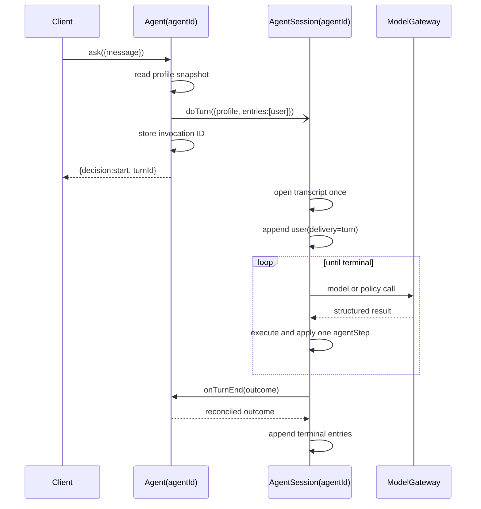
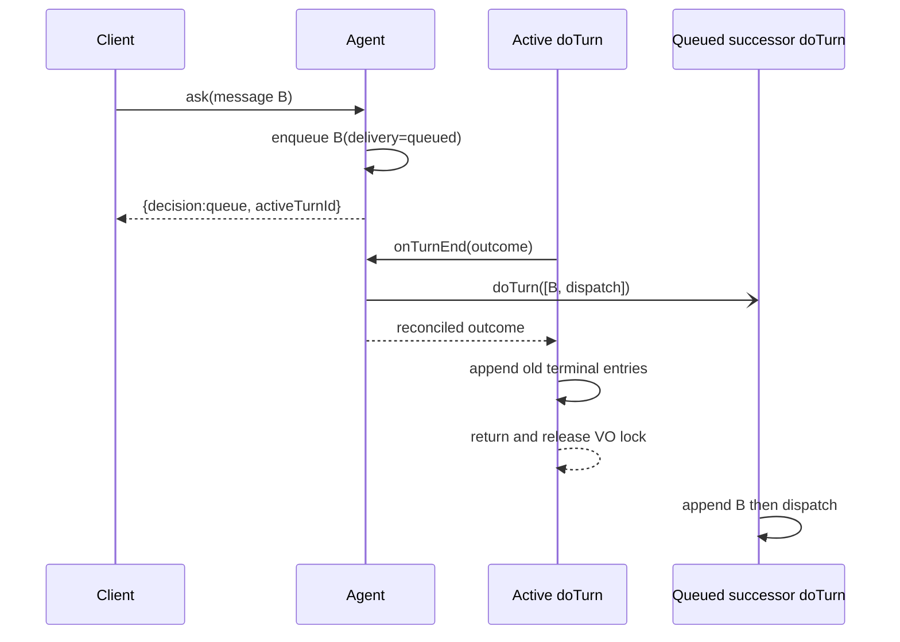
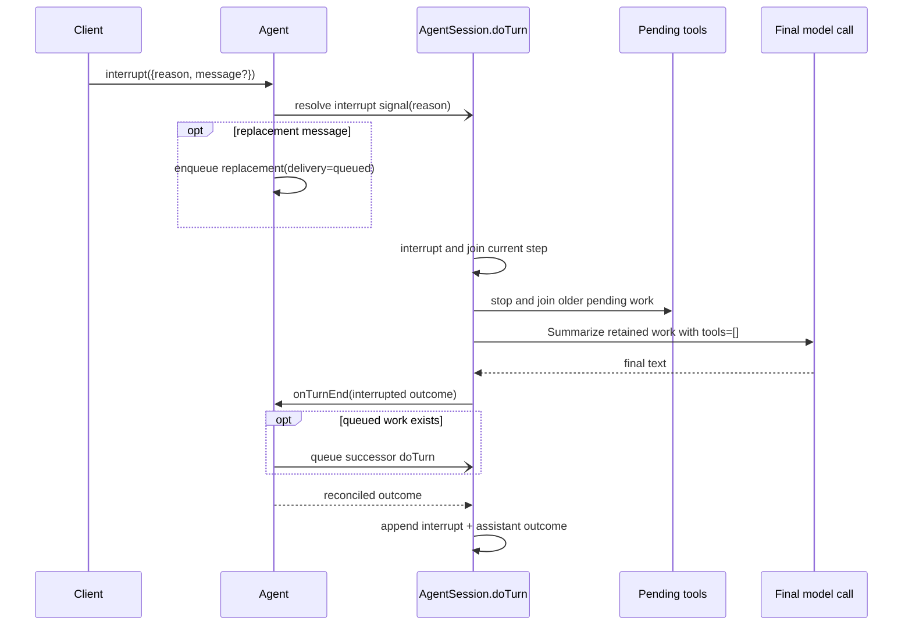
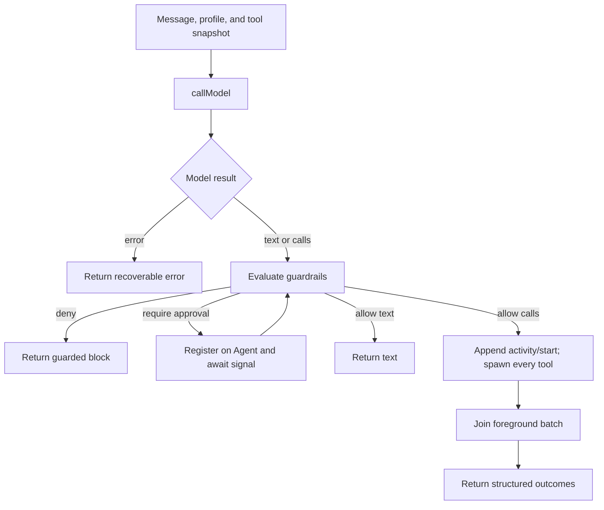

# Architecture and data flow

This guide explains where state and behavior live, how input moves through the
runtime, and why the boundaries are arranged this way.

## System classification

Each `agentId` identifies one **model-directed agent**: the model selects tools,
acts on observations, revises its approach, and decides when work is complete.
The whole repository is a **durable agent harness/runtime**. The Restate service
named `Agent` is only the deterministic controller; the operational agent is
the model plus the runtime around it.

One `AgentSession.doTurn` invocation is an **agent run** for one conversation
turn. `agentStep` is one model-action-observation loop iteration inside that
run.

## Design principles

1. **Durable ownership is explicit.** `Agent` owns control state,
   `AgentSession` owns conversation state and turn execution,
   `AgentNotifications` owns invalidation delivery, `AgentScheduler` owns
   schedules, and `Sandbox` owns external workspace lifecycle.
2. **The conversation event log is authoritative.** Summaries and model
   messages are derived context; they never replace the append-only log.
3. **Control stays responsive.** `Agent` never waits for model inference or
   tool execution. It sends a one-way `doTurn` invocation and remains available
   to queue, steer, interrupt, resolve approvals, and accept external
   deliveries.
4. **Turn execution is colocated with history.** The exclusive `doTurn`
   handler reads the session transcript once, then appends directly to the same
   Virtual Object state throughout the run.
5. **Concurrency stays structured.** Spawned work is owned and joined by one
   step, the pending registry, or the `doTurn` supervisor.
6. **Notifications carry invalidation, not data.** Consumers always re-read
   AgentSession, Agent, or AgentScheduler after an AgentNotifications wake-up.

## Service boundaries

The first three views separate task control, task execution, and client
invalidation. Supporting services follow afterward; they are deliberately
hidden from the controller diagram.

### Agent Virtual Object

Treat `AgentSession.doTurn` as an opaque task here. Agent tracks its invocation
ID and accepts its terminal callback; it does not poll or inspect the internal
model/tool loop.

`Agent`, keyed by `agentId`, is the serialized conversation controller. Its
exclusive handlers own decisions about:

- the active `AgentSession.doTurn` invocation ID;
- the FIFO of input waiting for the next turn;
- steering batches accepted by the active invocation;
- persistent instructions, memories, guardrails, and MCP server definitions;
- private MCP OAuth/bearer credentials, redirect state, and pending
  authorization actions;
- pending human approvals; and
- source-attributed external-message routing.

Agent never performs inference, executes a tool, or stores transcript chunks.
When idle, it snapshots the profile and one-way sends
`AgentSession.doTurn`. When busy, it either queues input or signals that active
invocation. `Agent.onTurnEnd` retires exactly the matching invocation,
reconciles unconsumed steering, clears abandoned approvals and authorization
actions, and dispatches any queued work.

State logic is grouped into handler-scoped namespaces:

- `agent/active-turn.ts` — active invocation, pending input, steering
  bookkeeping, and signal delivery;
- `agent/profile.ts` — instructions, memories, guardrails, and MCP servers;
- `agent/mcp-authorization.ts` — private OAuth/bearer state, redirect state,
  pending actions, and Turn signals;
- `agent/approval.ts` — pending approval records and decision signals.

These modules use the current Restate handler context. They are not process
services or dependency containers.

### AgentSession Virtual Object

Now expand the task, keeping the controller and notification delivery outside
the view. This is the normal execution loop; interruption can stop an active
step or wait and take the cleanup/finalization path described below.

One `agentStep` groups inference, policy checks, and allowed tool execution.
Built-ins, discovered Restate handlers, and MCP tools share its catalog; PTC can
coordinate them within the step. Model admission, sandbox lifecycle, and
scheduling stay behind the corresponding call boundaries. The
[iteration view](#one-agent-loop-iteration) expands only that step.

`AgentSession` is keyed by the same `agentId` and has two responsibilities that
share the same durable state:

1. own the canonical conversation event log and summary checkpoint; and
2. execute one exclusive `doTurn` agent run at a time.

The Restate invocation ID of `doTurn` is the `turnId`, signal target, approval
correlation root, and sandbox borrower ID. The handler begins by opening the
transcript: it loads the summary, uncompacted entries, current tail chunk, and
sequence cursor once. It appends the activated input and builds the initial
model context from that in-memory view. Later appends update the invocation-
local writer and emit state writes without rereading transcript state.

The turn state machine owns:

- model messages and the stable profile snapshot supplied by Agent;
- the 50-step execution bound;
- guardrail approvals, rejections, and block tracking;
- steering consumption count and the signal inbox;
- pending tool tasks;
- the journaled dynamic-tool catalog snapshot;
- sandbox lease context.

`history` and `compact` are shared handlers. `applyCompaction` and `doTurn` are
exclusive. The object uses normal eager state for the main turn because it
needs the conversation context at startup; the history reader still loads only
the chunks needed for a page.

### AgentNotifications Virtual Object

This view is independent of task execution. Once initial data and revision
watermarks have been loaded, clients repeat a watch / wake / re-read cycle:

“State owner” is shorthand for the existing owners, not a separate service:

| Topic | Read from |
| --- | --- |
| `history` | AgentSession |
| `profile`, `approvals`, `mcpAuth` | Agent |
| `schedules` | AgentScheduler |

`AgentNotifications`, keyed by `agentId`, is the invalidation plane. It owns a
global revision, per-topic watermarks, caller awakeables, and subscriptions.
It owns no conversation, profile, approval, authorization, or schedule data.
Producers one-way publish changed topics; consumers wake and re-read the
authoritative owner. The subscription re-check catches changes that happen
before watch registration. See the [client protocol](protocol.md#following-state-correctly)
for initial reads, cursors, and subsequent long-polls.

### AgentScheduler Virtual Object

`AgentScheduler`, keyed by `agentId`, owns the bounded schedule registry,
delayed invocation IDs, replacement, cancellation, and fixed-delay
recurrence. It uses eager state because every operation reads the small
schedule collection. A timer acts only when its invocation ID matches the
stored record, advances state before delivery, and calls generic
`Agent.deliver` with its message and busy-turn policy.

Schedule tools and external clients call AgentScheduler directly. Once an
upsert completes, the schedule is an independent durable side effect rather
than active-turn state.

### ModelGateway service

`ModelGateway` is the Restate boundary around provider calls. It owns the
`openai` scope, model and hashed-agent limit keys, bounded Restate retry policy,
cancellation propagation, and one `restate.run` per provider operation.

`model.ts` remains provider-specific: AI SDK requests, prompts, models,
serializable result contracts, and error classification. Tool executors never
cross the model boundary; only serializable manifests do.

### Sandbox Virtual Object

`Sandbox`, keyed by `agentId`, owns the external workspace across turns. The
first sandbox tool in a turn lazily borrows it. The VO serializes provision,
idempotent borrow, release, delayed suspension, resume, and destroy. Provider
and file/command operations are external effects run inside `restate.run`; the
VO stores only lifecycle state and the opaque provider reference.

### Evals service

`Evals/all` is the evaluation harness. It spawns selected trials concurrently,
uses a fresh `agentId` for every trial, calls the same Agent, AgentSession,
AgentNotifications, and AgentScheduler handlers as a real client, and applies
code-based graders to the resulting conversation event log and state.

## State ownership matrix

| State | Owner | Durable mechanism | Readers |
| --- | --- | --- | --- |
| Active turn ID, interrupt reason, steering batches | Agent | Lazy VO state | Exclusive Agent handlers |
| Pending user/event entries | Agent | Lazy VO state | Exclusive Agent handlers |
| Instructions, memories, guardrails | Agent | Lazy VO state | Shared profile read; snapshotted at turn start |
| Pending approvals | Agent | Lazy VO state | Shared list; exclusive mutation |
| Schedules and timer IDs | AgentScheduler | Eager VO state | Shared list; exclusive mutation/timer delivery |
| Notification revision, topic versions, subscriptions | AgentNotifications | Lazy VO state + caller awakeables | Notification handlers |
| Transcript chunks and next sequence | AgentSession | VO state | Exclusive writer; shared history reader |
| Conversation summary and compaction reservation | AgentSession | VO state | Turn start and compaction handlers |
| Working model context | `doTurn` invocation | Journaled generator locals | Current turn only |
| Pending tool tasks | `doTurn` invocation | Restate Tasks | Current turn only |
| Steering FIFO | `doTurn` invocation | Durable signal source + transient inbox | Current turn only |
| Dynamic tool catalog for a turn | `doTurn` invocation | Journaled `restate.run` result | Model and executor in that turn |
| Dynamic discovery cache | Endpoint process | Bounded memory, five-minute TTL | Credential-free optimization only |
| Sandbox lease/status/reference | Sandbox | VO state | Sandbox handlers |
| Local files or Modal Volume | Provider | External store | Sandbox client |
| OpenAI and Modal SDK clients | Endpoint process | Memory | Optimization only |

Process-local values may disappear at any time. Correctness must not depend on
them.

## Idle `ask`

The one-way invocation lets `ask` return the stable invocation ID without
waiting for the run. `AgentSession`—not Agent—appends the opening and terminal
entries.

## Busy `ask` and later dispatch

A busy `ask` does not invoke a classifier and does not write AgentSession state:

1. create a user entry with `delivery: "queued"`;
2. append it to Agent's pending FIFO; and
3. return the active invocation ID and pending-message count.

When the active turn ends, `Agent.onTurnEnd` drains the FIFO and one-way sends a
successor `doTurn` with those entries followed by one `dispatch` event. Because
both runs target the same AgentSession key and `doTurn` is exclusive, the
successor cannot append until the current invocation has appended its terminal
entries and returned.

Queued input therefore enters the transcript when it is activated, not when
Agent first accepts it. FIFO order is preserved.

## Steering

Steering means: let the current loop iteration settle, retain its durable
effects, and give the next model iteration new direction.

1. Agent drains its pending FIFO.
2. Agent stores the steering batch for completion reconciliation.
3. Agent resolves the active invocation's durable `steering` signal with
   `{queued: ConversationEntry[], message: string}`.
4. A background receiver drains signal resolutions into a turn-local FIFO.
5. The current step settles without steering-induced cancellation.
6. AgentSession commits tool outcomes first, then appends the queued entries,
   the new user entry with `delivery: "steer"`, and a `steer` boundary.
7. The next model iteration sees one structured steering update.

A side-effect-free text or model-error result is stale if steering arrived
during its step and is discarded. Tool outcomes are retained. If completion
wins before the signal is consumed, Agent compares `consumedSteering` with its
stored batches and activates the missed entries in the successor turn.

## Interruption

Interruption means: stop the current turn gracefully and summarize completed
work honestly.

The interruption reason is control input for the old turn. An optional
`message` is a separate user request kept in Agent state and appended by the
successor turn after the old terminal entries.

## External cancellation

Cancelling the `AgentSession.doTurn` invocation rejects a parked operation with
`CancelledError`. The handler:

1. marks pending work cancelled without waiting for already-cancelled tasks;
2. appends an interruption boundary with reason `Turn cancelled`;
3. one-way releases the sandbox lease;
4. one-way reports the interrupted outcome to Agent; and
5. rethrows cancellation so Restate retains the correct invocation status.

It does not fabricate a graceful model summary.

## One agent-loop iteration

`agentStep` is a function inside the `doTurn` handler, not a service:

The step owns foreground tasks only until it returns. Pending completion tasks
are created afterward by the turn's pending registry and can survive across
later iterations.

PTC adds orchestration inside a foreground `executeProgram` call, not another
service or model loop. Its bounded QuickJS/WebAssembly guest calls built-in,
dynamic Restate, and MCP tools through `session/program-tool.ts`. The wrapper
is excluded from the diagram's batch policy gate; each emitted child call is
checked before it runs. `ptc/runtime.ts` journals completion selection through
the existing Restate scheduler so replay reconstructs the guest's promises and
branch decisions. Only the compact program result returns to model context.
Pending tools invoked inside PTC are awaited there, and outstanding children
are stopped and joined before the program exits. See
[programmatic tool calling](tools.md#programmatic-tool-calling-ptc).

## Transcript and notifications

`session/history.ts` stores entries in chunks of 32 with stable positive
sequence numbers. `AgentSession.history({fromSequence, limit})` uses an
inclusive cursor and loads only the chunks needed for that page.

The transcript contains user messages, terminal assistant outcomes, control
boundaries, resolved approvals, semantic progress, concise activity, structured
tool lifecycle, memory metadata, external delivery, and approval lifecycle.
Exact tool arguments/results and private model reasoning remain in working
context and Restate observability.

Not every event is model context. `isDerivedConversationEvent` centrally
filters approval request/cancellation, progress, activity, tools, memory, and
delivery metadata. Control boundaries and delivered approval decisions remain
model-relevant.

AgentNotifications exposes a general invalidation protocol:

- `snapshot()` returns `{revision, versions}` for `history`, `profile`,
  `approvals`, `mcpAuth`, and `schedules`;
- `watch({afterRevision, timeoutSeconds})` parks until a newer
  revision or returns the current snapshot at timeout;
- an internal subscribe handler re-checks the revision before registering a
  caller-owned awakeable, closing the read/watch race; and
- a timed-out or cancelled watch removes its subscription.

Each AgentSession transcript append one-way publishes `history` to
AgentNotifications. Agent publishes profile, approval, and MCP authorization
changes, while AgentScheduler publishes schedule changes. Notifications carry
no state payload: clients compare topic versions and re-read the authoritative
owner.

## Profile and guardrails

Instructions, memories, guardrails, and MCP server definitions belong to Agent:

- instructions are user-managed and appended to model instructions;
- memories are a model-managed keyed collection of at most 32 facts or
  preferences, injected as data rather than instructions; and
- guardrails are user-managed natural-language policies with stable IDs; and
- MCP servers are user-managed structured endpoint and authentication
  definitions.

Full OAuth state, bearer tokens, and pending authorization actions also belong
to Agent, but not to `AgentProfile`. A new Turn receives only
`{serverId, accessToken}` next to its profile snapshot. When MCP discovery or
invocation receives an auth challenge, the Turn registers a pending action and
waits on its own invocation signal. For OAuth, the BFF persists discovery,
dynamic-client-registration, state, and PKCE data across the browser redirect.
For bearer authentication, it submits the user-provided token directly.
Successful completion atomically stores the private credential, retires the
action, and resolves the Turn with a minimal replacement credential.

Each turn receives one profile snapshot. Profile mutations publish a `profile`
notification; they are not themselves transcript entries. A successful
`manageMemory` tool also emits a metadata-only `memory` transcript event from
the active session.

Guardrails are not sent to the main agent model. A dedicated evaluator gates
the exact proposed text or complete tool batch with `allow`, `deny`, or
`require_approval`; a second review call confirms every non-allow candidate.
For PTC, this gate applies to each emitted concrete tool call, not the
`executeProgram` wrapper or JavaScript source.
Approval state lives on Agent, while the wait and decision are correlated with
the active `turnId`. Steering resets request-scoped decisions.

## Conversation compaction

Conversation compaction is a derived model-context view over canonical history.

After a terminal outcome, the session writer counts non-event messages since
the current checkpoint. At 32 messages it reserves the visible prefix and
one-way sends `AgentSession.compact`. That shared handler reads the reserved
range, calls the cheap compaction model, and sends the result to exclusive
`applyCompaction`. Only a matching reservation is installed. Transcript chunks
remain unchanged.

A later turn receives the summary plus exact model-relevant entries after its
`through` cursor.

## Scheduled messages

Schedules belong to AgentScheduler. Creating one journals a delayed
AgentScheduler self-send and returns immediately. A valid due timer advances
schedule state and calls source-agnostic `Agent.deliver`, which routes:

- idle → start a turn;
- busy + `queue` → append to pending input;
- busy + `steer` → send it as steering;
- busy + `interrupt` → queue it and interrupt active work; and
- already interrupting → always queue.

One-shot state is removed before delivery. Repeating schedules install their
next fixed-delay timer before routing the current message. Stored invocation
IDs reject stale delayed sends. A derived `delivery` transcript event records
`source: "schedule"`, its source ID, policy, and selected route beside the
delivered user entry.

## Why these boundaries matter

Keeping the pending queue and active invocation on Agent lets controller calls
remain serialized and fast. Keeping transcript state and execution together on
AgentSession lets `doTurn` load once and append directly, while shared history
reads remain available. Separate notification and schedule objects give those
independent lifecycles one clear state owner without burdening Agent. Moving
model/tool work into Agent would block its exclusive control plane. Moving
controller state into the executing session would make queueing and external
coordination contend with a long-running exclusive handler. Turning every
built-in tool into an RPC would obscure local structured concurrency without
adding durability.
