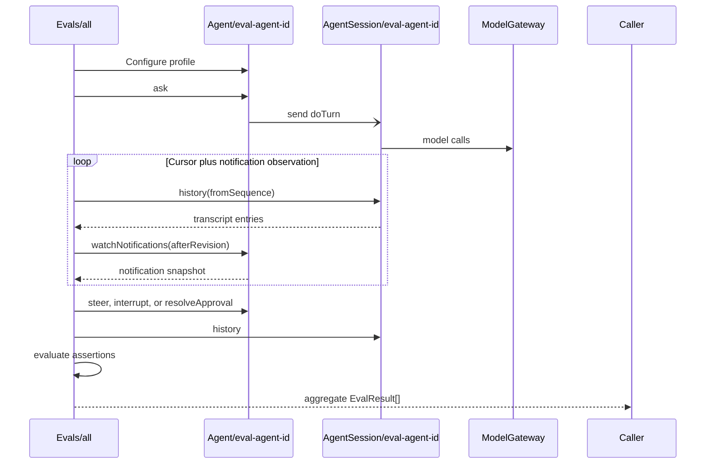

# Restate-native agent evaluations

`Evals/all` is the project's **evaluation harness**. It treats the durable
agent runtime as a black-box public protocol, runs an evaluation suite of named
tasks, and applies deterministic code-based graders. It is distinct from the
**agent harness** being evaluated.

## Execution

The single `Evals/all` handler spawns every selected evaluation task
concurrently. Each execution is one trial against a fresh agent instance.



The suite invocation provides durable execution, retries, cancellation, a
stable invocation identity, and a stored aggregate result. Each spawned trial
also has its own durable timeout.

Each attempt uses a fresh Agent key containing the eval handler invocation ID:

```ts
const agentId = `eval-${isolation}-${caseId}-${attempt}`;
```

An optional `runId` labels related suite work but never removes
invocation-level isolation. `attempt` labels one trial; it does not currently
ask the harness to run repeated trials automatically.

## Contracts

```ts
type EvalOptions = {
  runId?: string;
  attempt?: number;
  timeoutSeconds?: number;
  cases?: EvalCaseId[];
};

type EvalResult = {
  caseId: string;
  agentId: string;
  status: "passed" | "failed";
  assertions: Array<{
    name: string;
    passed: boolean;
    details?: string;
  }>;
  transcript: SequencedConversationEntry[];
};

type EvalSuiteResult = {
  status: "passed" | "failed";
  results: EvalResult[];
};
```

Every evaluation task has a separate trial-driver generator spawned by `all`.
Shared options and result assembly remain internal; there is no public case-ID
dispatcher or generic scenario language.

The wire contract retains the existing names `caseId` and `transcript`:

- a case is an evaluation **task** or test case;
- one case execution is a **trial**;
- each assertion is a code-based grader check; and
- `transcript` contains the public conversation event log, not the complete
  model/tool trajectory or Restate execution trace.

## History notifications

The eval reads available entries from `AgentSession.history`. When the cursor
is empty, it long-polls `Agent.watchNotifications` with its last revision and
a bounded wait window. Agent owns only the subscription and notification
watermarks; AgentSession remains the authoritative history owner.

The internal subscription handler re-checks the revision before storing the
caller's awakeable, closing the read/watch race. A transcript append publishes
the `history` topic; unrelated profile, approval, or schedule changes may also
wake the trial. After every wake the trial drains the normal history cursor
again. A timed-out window removes its own subscription, and each trial also
races the watch against its durable case deadline.

## Current cases

1. `basic-turn` checks idle dispatch, successful completion, one terminal
   entry, and a minimally relevant answer.
2. `steering` waits until sleep is pending, steers more work into the same
   turn, and checks event order, retained/new results, and that the model did
   not restart the existing timer.
3. `interruption` waits until sleep is pending, interrupts it, and checks
   graceful finalization and the interrupted terminal response.
4. `external-cancellation` waits until sleep is pending, cancels the `doTurn`
   invocation directly, and checks that cleanup records a cancellation
   boundary without graceful finalization before the Agent accepts new work.
5. `interruption-replacement` interrupts a pending turn while carrying a
   replacement request, then checks that the old turn finalizes before the
   successor session appends the queued replacement and adjacent dispatch
   boundary, and that a new turn answers it.
6. `context-reduction` makes one small call to the cheap turn-context model
   with synthetic completed, failed, and unresolved tool records. It verifies
   that all three survive reduction without paying for enough full agent runs
   to manufacture a 32 KB working context.
7. `memory` asks the agent to remember a preference and checks the metadata-only
   memory event, its ordering, and the durable profile entry.
8. `scheduling` creates, lists, and cancels one delayed message without model
   inference, then lets a one-shot schedule wake an idle Agent. It checks the
   firing route, adjacent user entry, terminal response, and one-shot state
   cleanup with one small agent run.
9. Six isolated guardrail cases cover:
   - `guardrail-approval` verifies the configured guardrail through the
     authoritative profile, verifies the pending request as a structured
     history event, approves exactly one request, and checks that the decision
     is recorded before completion. A follow-up turn must read that decision
     without reopening the approval.
   - `guardrail-scope` approves a Japan request, then verifies that U.S.
     clarification and New York weather remain outside the Japan-only policy.
   - `guardrail-denial` checks that a deny policy neither opens an approval nor
     starts the protected weather tool.
   - `guardrail-rejection` checks that a rejected request produces a compliant
     explanation without requesting approval again.
   - `guardrail-removal` rejects protected work, clears the guardrail between
     turns, and verifies that the same work runs without another approval under
     the new authoritative profile snapshot.
   - `guardrail-steering` approves one request, adds protected work, and checks
     that the old approval is invalidated and requested again for the updated
     work.

The code-based graders assert event-log structure, event ordering,
correlations, and durable outcome state rather than exact model prose.

Invoke the complete suite through Restate ingress:

```sh
curl localhost:8080/Evals/all \
  -H 'content-type: application/json' \
  -d '{}'
```

The focused context-reduction contract can be run by itself. It performs one
small `gpt-4o-mini` call and no full agent inference:

```sh
curl localhost:8080/Evals/all \
  -H 'content-type: application/json' \
  -d '{"cases":["context-reduction"]}'
```

The user-facing conversation event log records tool call IDs, names, and
lifecycle statuses, but intentionally omits tool inputs and results. Protocol
graders such as the steering timer-restart check consume these structured
events. Internal properties such as actual tool
parallelism still require a later journal/trace observation layer or a scripted
model/tool mode; the event log proves intent and settlement order, not physical
overlap.

## Later extensions

Add protocol cases for history pagination and for compaction: no case yet drives
an AgentSession past the 32-message checkpoint, so the reserved-prefix ordering that
keeps a dispatch boundary with the messages it activates is currently only
covered indirectly by `interruption-replacement`.

Add an `EvalSuite` virtual object, keyed by `runId`, only when suite
coordination is useful. It can spawn case invocations, aggregate their results,
expose shared status and result handlers, cancel a run, and repeat
probabilistic cases.

Add semantic grading after the deterministic suite is useful. A dedicated
model-based grader (often called an LLM-as-a-judge) should evaluate fulfillment,
steering incorporation, interruption summaries, memory use, and policy
compliance against explicit rubrics. It should not replace code-based protocol
graders or rely on exact-string snapshots.
