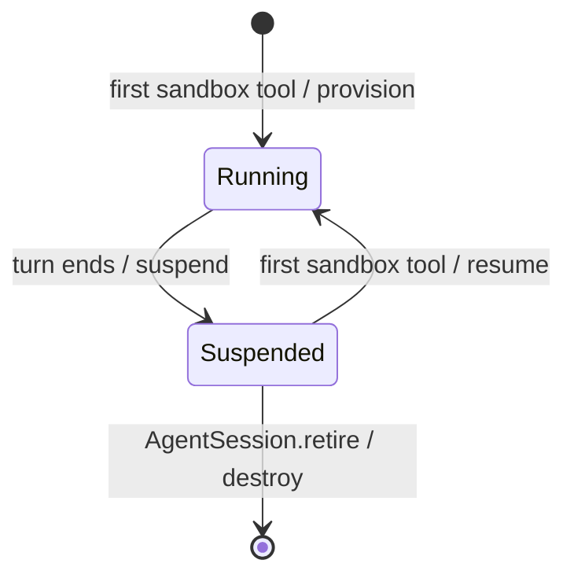

# Sandbox lifecycle and provider contract

The sandbox is the agent-scoped **tool execution environment** and persistent
workspace. Files created in one agent run remain available to later runs for
the same `agentId`. It is an external resource owned by the runtime, not agent
memory or model context.

The turn owns the durable lifecycle (`sandbox/turn.ts`). `SandboxProvider`
owns vendor operations. Tools consume only `SandboxClient`.

## Ownership model

There is no sandbox service. `AgentSession`, keyed by `agentId`, stores the
provider's `SandboxRef` under its `sandbox` state key. `doTurn` is exclusive
per agent, so at most one turn uses the sandbox at a time and no lease or
borrower check is needed.

The turn does not provision eagerly. The first sandbox tool of a turn acquires
the sandbox inline: it resumes the stored ref, or provisions one if none
exists, and stores the result. Parallel tools wait for that attempt instead of
starting their own, and later steps reuse its ref.

Acquisition is deliberately not a task spawned by the first tool. sdk-gen
cascades `interrupt` down a task's spawn subtree, so such a task would die with
its tool (a PTC `Promise.race` loser, a cancelled handed-off program) and every
other sandbox tool of the turn would inherit its rejection. Instead, when the
owning tool is interrupted, the next waiting tool takes over and acquires again;
provider operations are retry-safe (see below), so a half-finished provision is
recovered rather than duplicated. A failed attempt is not cached either: later
tools try again and report their own failure to the model.

When `doTurn` exits, including on failure and cancellation, it suspends the
sandbox if the turn acquired one and stores the provider's updated ref. A turn
that never used a sandbox tool does not touch it.

## Lifecycle



Suspension keeps files and releases compute: the local provider does nothing,
and the Modal provider terminates the Sandbox and keeps its Volume. Every turn
that uses the sandbox therefore pays one resume; for Modal that is a new
Sandbox start. Processes and anything outside the persistent workspace do not
survive between turns.

### Retirement

`Agent.retire` sends `AgentSession.retire` one-way. That handler is exclusive,
so it runs after the interrupted turn has suspended the sandbox. It asks the
provider to destroy the resource, including its files, then clears the ref.
Repeating it is a no-op.

## Provider boundary

The vendor-neutral interface is:

```ts
interface SandboxProvider {
  provision(options: {
    agentId: string;
    signal: AbortSignal;
  }): Promise<SandboxRef>;

  suspend(
    ref: SandboxRef,
    options: {signal: AbortSignal},
  ): Promise<SandboxRef>;

  resume(
    ref: SandboxRef,
    options: {signal: AbortSignal},
  ): Promise<SandboxRef>;

  destroy(
    ref: SandboxRef,
    options: {signal: AbortSignal},
  ): Promise<void>;

  connect(ref: SandboxRef): SandboxClient;
}
```

`connect` is synchronous and process-local. It only constructs a client around
an existing ref. Every provider lifecycle operation and every client method is
called separately inside `restate.run` with that run's `AbortSignal`.

This boundary is important:

- Restate journals the result of every external operation;
- retries preserve the same logical operation;
- invocation cancellation supplies an `AbortSignal` to the provider;
- provider clients do not leak into durable state;
- `SandboxRef` is the only provider data serialized by Restate.

Providers should make lifecycle operations retry-safe. A retry may follow an
external success whose response was not yet durably recorded.

## Client contract

```ts
interface SandboxClient {
  listFiles(
    path: string,
    options: {signal: AbortSignal},
  ): Promise<string[]>;

  readFile(
    path: string,
    options: {signal: AbortSignal},
  ): Promise<string>;

  writeFile(
    path: string,
    content: string,
    options: {signal: AbortSignal},
  ): Promise<void>;

  executeCommand(
    command: {
      command: string;
      cwd?: string;
      timeoutMs?: number;
    },
    options: {signal: AbortSignal},
  ): Promise<{
    exitCode: number;
    stdout: string;
    stderr: string;
  }>;
}
```

Paths are relative to the sandbox workspace and must not escape it. Files are
UTF-8 in this reference implementation.

Commands are one-shot foreground operations. They return only after the
process exits or times out. They are not turn-pending operations because an
external sandbox process is not automatically durable across provider failure
or Restate recovery. If the user deliberately wants detached work, the model
must create and manage a background shell script explicitly.

## Local provider

The default implementation stores each Agent workspace under:

```text
/tmp/restate-agent-sandboxes/<encoded-agentId>
```

It creates directories lazily and enforces path containment. Suspend is a
logical state change only; resume recreates the directory if needed. Destroy
removes the directory recursively.

This is a development adapter, not a security boundary:

- commands run with the service process's identity and permissions;
- it does not isolate CPU, memory, network, or system calls;
- `/tmp` may not survive host replacement;
- a single service host sees only its own local filesystem.

Do not use the local provider for untrusted commands.

## Modal provider

Set:

```text
SANDBOX_PROVIDER=modal
MODAL_TOKEN_ID=<token-id>
MODAL_TOKEN_SECRET=<token-secret>
```

Optional settings:

```text
MODAL_APP_NAME=restate-agent-sandboxes
MODAL_SANDBOX_NAMESPACE=<stable-resource-namespace>
MODAL_SANDBOX_IMAGE=mcr.microsoft.com/devcontainers/universal:noble
MODAL_SANDBOX_TIMEOUT_MS=86400000
```

The provider uses:

- one deterministic named Modal Volume per Agent for persistent files;
- disposable Modal Sandbox compute mounted at `/workspace`;
- a deterministic sandbox name to recover an already-created resource after a
  Restate retry;
- termination on suspend while retaining the Volume;
- new compute mounted to the same Volume on resume;
- Volume deletion on destroy.

The ref contains the Volume name and a nullable live Sandbox ID:

```ts
{
  provider: "modal";
  sandboxId: string | null;
  volumeName: string;
}
```

Modal credentials are read by its SDK. Export shell variables before starting
the service; assigning an unexported shell variable does not place it in the
Node process environment.

The Modal JavaScript API does not currently expose termination of one
individual `Sandbox.exec` process. The adapter checks cancellation at operation
boundaries and continues awaiting an in-flight command, bounded by its command
timeout, rather than claiming it stopped while remote work continues.
Suspending or destroying the resource terminates the whole Modal Sandbox.

The resource name hashes a namespace and `agentId`. Keep the namespace stable
if the same logical Agents should reconnect to their existing Volumes.

## Provider selection and existing state

New sandboxes use `SANDBOX_PROVIDER`, defaulting to `local`. An existing
`SandboxRef` always selects the provider that created it, even if process
configuration later changes.

Changing `SANDBOX_PROVIDER` therefore does not migrate existing Agent
workspaces. Destroy the old resource or use a new `agentId` when intentionally
switching a test Agent between providers.

## Adding a provider

1. Add a new discriminant and serializable fields to `SandboxRefSchema`.
2. Implement `SandboxProvider` in its own adapter module.
3. Keep credentials and process-local SDK clients out of `SandboxRef`.
4. Make `provision`, `suspend`, `resume`, and `destroy` safe under retry.
5. Return updated refs when external identity changes.
6. Honor every `AbortSignal`.
7. Detach or close process-local SDK handles after each operation.
8. Enforce workspace path containment.
9. Add the provider to `configuredProvider()` for new refs and `providerFor()`
   for existing refs.
10. Exercise provision, parallel first use, suspend/resume across turns,
    command cancellation, and destroy.

Do not put provider selection or lifecycle recovery into individual tools.
They should continue to depend only on `context.sandbox.client()`.

## Transcript policy

Sandbox provisioning and suspension are resource implementation details and
are not appended as special conversation events. Tool lifecycle entries still
show `listFiles`, `readFile`, `writeFile`, or `executeCommand` activity.
Provider calls and exact lifecycle operations remain visible in Restate's
invocation tree and journal.
