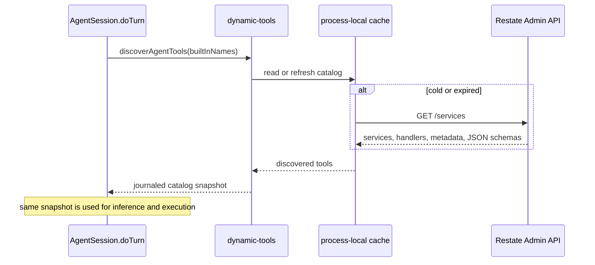

# Tool system

This project has three ways to make a capability available to the model:

1. a built-in tool implemented inside `AgentSession.doTurn`; or
2. an annotated Restate handler discovered at runtime; or
3. a tool from a configured MCP server.

All three become serializable `ToolManifest` values for model inference. Their
execution boundaries are intentionally different.

The built-in [programmatic tool calling (PTC)](#programmatic-tool-calling-ptc)
tool can compose capabilities from all three sources in one JavaScript program.
It is enabled by default and does not require a separate tool registration.

In standard agent terminology this is the **tool-use** or **function-calling**
layer. A model proposes tool actions; validated tool results become
observations in a later agent-loop iteration.

## The shared model contract

The model receives only a tool manifest describing its available action space:

```ts
type ToolManifest = {
  name: string;
  description: string;
  inputSchema: Record<string, unknown>;
  strict?: boolean; // defaults to true
};
```

A model response refers back to a tool by name:

```ts
type ToolCall = {
  toolCallId: string;
  toolName: string;
  input: unknown;
};
```

`gateway/model.ts` reconstructs AI SDK tool declarations from the manifests.
It does not receive tool executors. `session/tools.ts` owns execution, and
`session/step.ts` owns batch policy and concurrency.

That separation keeps these decisions explicit:

- the model chooses a tool from a serializable catalog;
- the guardrail model evaluates concrete tool calls before execution (PTC emits
  its concrete calls while its program runs);
- the active `agentStep` starts every allowed foreground call in the batch together;
- Restate journals every operation and its result;
- results are projected back into model messages as observations by
  `session/tools.ts`.

## Turn-local tool search

`searchTools({query: "github unread notifications"})` performs local full-text
search over the current turn's permitted tool catalog. Built-ins remain visible
upfront; MCP and dynamic Restate schemas are deferred until a search selects
them. Each search returns at most five names and short descriptions, and adds
their complete schemas to the next model request. Loaded schemas remain visible
for the rest of that turn, without duplicating schemas in the search result.

The MiniSearch index is built lazily in memory from the journaled discovery
snapshot. It searches names, provider names, descriptions, and parameter names,
splits camelCase/snake_case identifiers, boosts name/provider matches, and pins
exact tool-name matches first. Initial matching uses prefixes, not fuzzy or
semantic search. A miss should prompt different keywords or a provider name,
not a claim that the user has no connection.

Search selections are journaled in `search-tools-<toolCallId>`. On replay the
runtime restores those selections without reranking. The index and loaded set
are private to the turn, not stored in a new VO or shared across users. A new
turn starts with a fresh loaded set. Only permitted tools are indexed; execution
still enforces the same grants, guardrails and authorization flows. Tool
descriptions remain untrusted metadata. Search uses the normal built-in policy
path and does not execute matched tools.

PTC keeps the full permitted runtime catalog, even for tools whose schemas are
not yet visible. Search before writing code for unfamiliar tools: a search
inside a program loads schemas for the next model round, not the running
program. `manifests()` remains the complete runtime catalog;
`modelManifests()` provides the smaller inference catalog. If the agent's
built-in selection disables `searchTools`, inference falls back to the full
permitted catalog so external tools remain usable.

This reduces tool-schema context, not initial discovery/authentication work.
It adds a model round when a deferred tool is first needed; repeated searches
can still accumulate schemas during a long turn. No embeddings, hosted search,
or new search configuration are required.

## Built-in tools

Built-ins live in `packages/libs/core/src/session/tools.ts`. A definition owns
its name, model-facing description, Zod input schema, validation, durable
behavior, and optional pending completion:

```ts
const exampleTool = defineAgentTool({
  name: "example",
  description: "Explain exactly when the model should call this tool.",
  inputSchema: z.object({
    value: z.string().describe("What this field means."),
  }),
  *run({value}, context): restate.Operation<ToolExecution> {
    // Durable handler code.
    return {status: "succeeded", result: value};
  },
});
```

Add the definition to the `definitions` array. The rest follows from that one
registration:

- `agentTools.names` reserves the name from dynamic discovery;
- `agentTools.manifests()` converts the Zod schema to JSON Schema;
- `agentTools.execute()` validates input and dispatches the call;
- the tool becomes available to agent runs, subject to capability settings in
  the turn's profile snapshot.

Use `.describe()` on fields whose meaning is not obvious. Descriptions are part
of the model contract, not cosmetic documentation.

### Current built-ins

| Tool | Purpose | Execution kind |
| --- | --- | --- |
| `searchTools` | Find permitted tools and load their schemas for this turn | Foreground journaled local search |
| `getWeather` | Synthetic weather lookup used to demonstrate parallel calls | Foreground |
| `webSearch` | Tavily keyless web search with bounded source evidence | Foreground journaled HTTP request |
| `sleep` | Durable timer | Pending |
| `humanApproval` | Signal-backed human decision | Pending |
| `cancelOperation` | Cancel one pending operation by ID | Foreground control |
| `manageMemory` | Atomically set or delete shared user memories | Foreground Agent → User RPC |
| `createSubAgent` | Create a persistent child with inherited configuration and optional first task | Foreground Agent → User RPC |
| `listSubAgents` | Find existing direct children by name, ID and link | Foreground Agent → User RPC |
| `deleteSubAgent` | Delete a direct child's entire subtree | Foreground Agent → User RPC |
| `scheduleMessage` | Create or replace a per-Agent durable schedule | Foreground AgentScheduler RPC |
| `cancelSchedule` | Idempotently cancel a schedule | Foreground AgentScheduler RPC |
| `listSchedules` | Read active schedules for this Agent | Foreground AgentScheduler RPC |
| `listFiles` | List an agent sandbox directory | Foreground sandbox operation |
| `readFile` | Read a UTF-8 sandbox file | Foreground sandbox operation |
| `writeFile` | Replace a UTF-8 sandbox file | Foreground sandbox operation |
| `executeCommand` | Run one shell command to completion | Foreground sandbox operation |
| `executeProgram` | Coordinate tools in JavaScript and return a compact result | Foreground, with supervised child calls |

## Sub-agents

`createSubAgent` accepts `name`, plus nullable `instructions`, `guardrails`,
`tools`, `webSearchEnabled`, and `initialMessage`. Use `null` to inherit
configuration or omit a first task. Instructions and guardrails are additive;
tool selections can only narrow the parent's active turn grants. Guardrail IDs
cannot replace inherited rules. The child gets a separate sandbox and empty
conversation, so its first task must be self-contained. Parent history and
files are not copied. Existing tool policy enforcement applies both directly
and through `executeProgram`.

Creation returns `{agentId, name, parentAgentId, url, taskSubmitted}`. The first
task is sent asynchronously: this is not a join/wait tool and does not deliver
results to the parent automatically. Child IDs derive from the parent, user,
turn and tool-call ID, making retries idempotent. A new tool call creates a new
child. This version allows one level of children and at most 100 agents per user.

`listSubAgents({})` returns the caller's direct children with links, without
reading their conversations or credentials. Use it to resolve an existing
child's ID rather than guessing or recreating it in a later turn.

`deleteSubAgent({agentId})` accepts only the calling agent's direct children.
It removes the child's entire subtree, durably retires turns, schedules and
sandboxes, and preserves shared user credentials/memories. History remains
internally; deletion is not a permanent data purge. Use only for user-authorized
deletion. All three handlers reject stale or interrupting turns. See
[sub-agent ownership](user-identity.md#sub-agents).

## Web search

`webSearch({query, maxResults})` uses [Tavily keyless access](https://docs.tavily.com/documentation/keyless):
no API key, account, or OAuth setup is needed. It is enabled by default. In the
UI, open **Context → Web search** to enable or disable it for that Agent. The
switch saves immediately to `AgentProfile.webSearchEnabled`, publishes a
`profile` notification, and survives refreshes. Changes apply from the next
turn; an active turn keeps its original profile snapshot.

Disabled turns omit `webSearch` from both the model and PTC catalogs, and the
dispatcher rejects direct attempts to call it. This switch controls only this
built-in tool, not internet access through separately configured MCP tools or
the sandbox.

Both input fields are required: `query` is a non-empty public search query of
up to 1,000 characters, and `maxResults` is an integer from 1 to 10 (normally 5).
The result is `{query, results: [{title, url, snippet}]}`; it contains source
snippets, not full pages or a provider-generated answer. For example:

```js
async tools => {
  const result = await tools.webSearch({
    query: "Restate durable execution documentation",
    maxResults: 3,
  });
  return result.results;
}
```

Queries are sent to Tavily, so the tool instructions prohibit sending secrets
or private conversation data. Results are untrusted evidence, not instructions;
the model is told to cite relevant source URLs. Keyless access is free but
rate-limited, not unlimited. Quota and invalid-response failures are reported
as tool failures, never fabricated empty searches.

The HTTP request is inside `restate.run`; successful journaled results are
reused on replay. It uses basic search, at most two attempts for transient
failures, a 15-second timeout per attempt, and the turn's cancellation signal.
Quota/auth failures are not automatically retried. Responses are capped at
1 MB, titles at 300 characters, and snippets at 1,500 characters per result.
Normal tool guardrails and interruption apply, including calls emitted by PTC.

## Programmatic tool calling (PTC)

PTC reduces intermediate model context: instead of returning every tool response
to the model for the next decision, the model writes a program that calls tools,
branches on their results, and computes a compact answer. It is another tool in
the existing agent loop, not a separate agent or a replacement tool backend.

PTC is enabled by default. Set `AGENT_PTC_ENABLED=false` on the core service to
disable it, for example `AGENT_PTC_ENABLED=false pnpm dev:service`.
Only the exact value `false` disables PTC; leaving the variable unset or setting
it to `true` enables it. When disabled, new model calls omit the PTC tool and its
instructions.
Already-recorded program calls retain their normal execution and replay behavior.

The model can use `executeProgram({source})` to coordinate the same static,
Restate-discovered, and MCP tools that it can call directly. The source evaluates
to an async function accepting `tools`; each function takes the exact input
object described by its model-facing tool schema. PTC itself is excluded from
the guest catalog, so programs cannot recursively start programs.

```js
async tools => {
  const cities = ["Berlin", "Paris", "London"];
  const results = await Promise.allSettled(
    cities.map(city => tools.getWeather({city})),
  );
  return results.map((result, i) => ({
    city: cities[i],
    weather: result.status === "fulfilled" ? result.value : null,
    error: result.status === "rejected" ? result.reason.message : null,
  }));
}
```

`tools["exact-tool-name"]({...})` works for names that are not JavaScript
identifiers. Successful calls return parsed JSON when their result is JSON,
otherwise a string. MCP results retain `content` and `structuredContent` and
the existing size/attachment filtering. Failed tool outcomes reject promises.
Only the returned JSON or deterministic program error becomes an observation
for the agent model. Child activity and approval events still appear in the
transcript without raw arguments or results.

The tool description explains when to use PTC: dependent
lookups, parallel work, filtering, joins, and aggregation where carrying every
intermediate response through the agent model would waste context. Simple
actions can still use direct calls. Available tool schemas remain in the model's
catalog; this change reduces intermediate result context, not schema context.

### Try it in chat

With the core service running and PTC enabled, no MCP setup is needed for this
built-in-tool example:

> Use executeProgram to look up the demo weather for Berlin, Paris, and London
> in parallel. Return only the warmest city and its temperature, and report any
> failed lookups. Do the comparison in JavaScript, not in another model round.

`getWeather` returns text such as `24°C, sunny in Berlin`, not an object with a
`temp` field. Its synthetic temperature is a random integer from 10 to 40°C;
the tool journals that sample, so replay reuses it. The program can parse the
leading temperature and aggregate the results before returning JSON.

In the UI, expect `executeProgram` and its child `getWeather` activity; inspect
the Restate journal for the generated source and compact return value. The
model still chooses its tools, so enabling PTC does not force every task to use
it. Replacing the example calls with discovered tools uses their exact catalog
names and input schemas, with no separate PTC configuration.

### Durable execution

`ptc/guest.ts` runs QuickJS inside an embedded WebAssembly module. Each execution
attempt creates a fresh runtime. The model response already journals the source,
and discovery journals the turn's catalog. `ptc/runtime.ts` runs inline within
`AgentSession.doTurn` using its existing generator scheduler:

1. Drain guest microtasks synchronously.
2. Spawn emitted tool operations in order, with IDs `<outer-call-id>:call-N`.
3. Inspect the serialized root result.
4. Select one tool completion through Restate, deliver it to the corresponding
   guest promise, and repeat.

Tool operations reuse the existing dispatcher and own their existing durable
RPCs, runs, timers, and signals. Neither the whole program nor a compound tool
operation is wrapped in another `run`. Native `Promise.race`, `any`, `all`, and
`allSettled` work because result delivery is controlled at the host boundary.
Replay reconstructs the heap and promises using the recorded completion order.
The ordering contract depends on the pinned Restate SDK 1.17.0 and QuickJS
0.31.0; changes to the engine, bridge, budgets, or tool semantics require replay
compatibility review for in-flight turns.

### Policy, pending tools, and interruption

The PTC wrapper and its JavaScript source are not submitted for policy approval.
Each emitted concrete call goes through the normal guardrail gate with its
actual tool name and input. MCP authentication and sandbox access use the same
turn context as direct calls.

Inside a program, `sleep` and `humanApproval` promises resolve when their pending
completion arrives. Human approval returns its normal text decision; the program
must inspect it before taking dependent actions. `cancelOperation` can target an
existing turn-owned operation using an ID obtained from an earlier direct call.

Racing does not cancel losing branches while the program runs. When its root
returns or throws, outstanding child calls are interrupted and joined; await
`Promise.allSettled` on those branches before returning if they must finish.
Turn interruption also disposes the guest and stops its active child tasks.
Cancellation cannot undo effects that already occurred.

Known program failures (syntax, uncaught rejection, invalid output, or exhausted
computation budget) become repairable tool failures. Escaped host/SDK failures
and turn interruption propagate through the scheduler rather than becoming
guest rejections or model feedback.

Programs have no direct I/O, timers, module loader, `Date`, or `Math.random`.
Inputs and results cross as JSON copies. Limits are 128 tool calls, 64,000 source
characters, 64,000 output characters, 32 MiB memory, 512 KiB stack, 10,000
interrupt checks per attempt, and 10,000 microtasks per drain. The private bridge
is held by the host rather than exposed through guest globals.

### Verification

`pnpm --filter @restate-agents/core test:ptc` checks guest replay, full and partial
real-SDK protocol replay, failures and limits, mixed tool dispatch, MCP auth
retry, subtool policy enforcement, and child interruption. Protocol peers and
outbound tool fixtures are local to the tests; no real provider credentials or
model calls are needed.

The optional `test:ptc:restart` command expects a disposable Restate server with
admin on port 19070 and ingress on 18080. It starts a test endpoint on 19880,
registers it as `http://host.docker.internal:19880`, kills that endpoint after a
race and its branches have completed, and restarts it. It asserts the recovered
winner, completion order, and results, and verifies recorded tool bodies are
not repeated. It changes only the disposable server and its own test processes.

## Foreground and pending execution

A built-in `run` method returns one of four outcomes:

```ts
type ToolExecution =
  | {status: "succeeded"; result: string}
  | {status: "failed"; error: string}
  | {status: "pending"; result: Record<string, unknown>}
  | {status: "cancel_requested"; operationId: string; reason: string};
```

### Foreground tools

A foreground tool reaches `succeeded` or `failed` before its step finishes.
All calls proposed in one model response are spawned in parallel, then joined.
One failure is data returned to the model; it does not discard sibling
results.

External side effects belong inside `restate.run` or a Restate RPC. Preserve
`InterruptedError` and `CancelledError` instead of converting them into normal
tool failures, so invocation cancellation can propagate through `doTurn`.

Built-in tools are deliberately local handler code. Do not turn one into a
Restate service merely to fit a generic abstraction.

### Pending tools

A pending tool acknowledges immediately from `run`, then implements `complete`.
The turn runtime starts completion as a task that may survive across loop iterations:

```ts
const waitTool = defineAgentTool({
  // ...
  *run(_input, context) {
    return {
      status: "pending",
      result: {
        operationId: context.toolCallId,
        status: "running",
      },
    };
  },
  *complete(input, context) {
    // Durable timer or signal wait.
    return {status: "succeeded", result: "done"};
  },
});
```

The stable `toolCallId` is also the operation ID. Pending completion becomes a
runtime message in a later model round. A turn cannot finish while pending work
exists unless the model cancels it, the user interrupts, or the invocation is
externally cancelled.

Pending is appropriate only when later model work can proceed independently
while an operation waits. It is not a generic wrapper for a slow call.

### Selective cancellation

`cancelOperation` returns `cancel_requested`; the `doTurn` pending registry,
owns the task and applies that request to a matching pending operation.
Cancellation is represented as a runtime event for the next step. It does not
cancel foreground work or the agent run itself.

Completion and cancellation may race. The settled state is authoritative:
completed work stays completed.

## Tool context

Every built-in receives:

```ts
type AgentToolContext = {
  agentId: string;
  turnId: string;
  sandbox: {
    client(): restate.Operation<SandboxClient>;
  };
};
```

The internal call context also contains `toolCallId`. Use:

- `agentId` for Agent-owned state or resources;
- `turnId` for Agent-owned state that must be correlated with the current
  active turn, such as memory and approval;
- `toolCallId` for stable operation identity;
- `sandbox.client()` for a lazy, shared turn lease on the agent's sandbox.

The context intentionally does not expose general orchestration hooks.
Schedule mutations use `agentId` to address `AgentScheduler` directly. Once an
upsert completes, the schedule is an independent durable side effect and is
not rolled back if the originating turn later ends or is interrupted.

## Adding a built-in tool

1. Define it beside the existing tools in `session/tools.ts`.
2. Give it a unique model-safe name and a precise description.
3. Define the complete Zod object schema. Make nullable fields explicitly
   nullable rather than optional when strict model schemas require every
   property.
4. Return structured tool status rather than throwing ordinary domain errors.
5. Re-throw Restate interruption and SDK cancellation errors.
6. Put non-deterministic external work in `restate.run`, or call another
   Restate handler.
7. Add it to `definitions`.
8. Add or update an eval if it changes conversation semantics.
9. Run `pnpm lint`, `pnpm build`, and `pnpm bundle`.

Before making a tool pending, verify that the model can do useful work before
completion and that the runtime has a meaningful way to report, cancel, and later
incorporate its result.

## Dynamically discovered Restate tools

A deployed JSON Restate handler opts into the dynamic tool registry through
handler metadata:

```text
restate.dev/agent: query_grafana
```

The metadata value is the model-facing tool name. The current implementation
accepts `[A-Za-z0-9_-]{1,64}`.

With the generated TypeScript SDK used by this repository:

```ts
const Grafana = restate.service({
  name: "Grafana",
  handlers: {
    query: restate.schemas(
      {input: QuerySchema, output: QueryResultSchema},
      function* (input) {
        // ...
      },
    ),
  },
  options: {
    handlers: {
      query: {
        description:
          "Query Grafana for a metric over a requested time interval.",
        metadata: {
          "restate.dev/agent": "query_grafana",
        },
      },
    },
  },
});
```

Other Restate SDKs expose the same handler metadata through their own service
definition syntax. The contract that this agent reads is the annotation,
handler documentation, service type, and Admin API JSON input schema.

### Discovery lifecycle



The Admin API is cluster-global knowledge, so it is not stored behind one hot
Virtual Object key. Each service process maintains a read-through cache:

- successful entries refresh after five minutes;
- a failed refresh with a prior snapshot keeps the last-known-good catalog and
  retries after 30 seconds;
- Admin requests time out after five seconds;
- concurrent cold refreshes are coalesced;
- discovery failure without a prior snapshot degrades to built-ins only.

The selected catalog is returned through `restate.run`. Restate therefore
journals one stable snapshot for the turn. A deployment change cannot make the
model infer against one schema and execute against a different target during
replay.

Configure discovery with:

```text
RESTATE_ADMIN_URL=http://localhost:9070
RESTATE_ADMIN_TOKEN=<optional bearer token>
```

### Schema mapping

The handler's JSON input schema is nested under `input`:

```json
{
  "input": {
    "query": "rate(http_requests_total[5m])"
  }
}
```

For a Virtual Object or Workflow, the model schema also requires `key`:

```json
{
  "key": "tenant-42",
  "input": {
    "query": "..."
  }
}
```

If a handler has no input schema, `input` is omitted. Local JSON Schema
references are rewritten when the schema is nested. Handler documentation
becomes the model-facing description; otherwise a generated description names
the Restate target.

Discovered schemas use `strict: false`, because an arbitrary third-party JSON
Schema may not meet the model provider's stricter function-schema rules.

### Selection and conflicts

- Built-in names always win.
- Targets are sorted by `service/handler` before selection.
- When two annotated handlers claim one name, the first sorted target wins and
  a warning is logged.
- Invalid names are ignored with a warning.
- The name and target are fixed in the turn snapshot.

### Invocation contract

Dynamic tools run as foreground calls through generic `restate.call`:

```ts
yield* restate.call({
  service: target.service,
  method: target.handler,
  key: optionalKey,
  parameter: input,
  inputSerde: restate.serde.json,
  outputSerde: restate.serde.json,
});
```

Consequences:

- the child invocation is durable and visible in the Restate invocation tree;
- keyed handlers require a model-supplied key;
- input and output must use JSON;
- the complete call belongs to the current foreground batch;
- interruption or external cancellation propagates to the child;
- dynamic handlers cannot currently become turn-owned pending operations.

The called handler owns its own idempotency and side-effect semantics in the
normal Restate way.

The current catalog uses the input JSON Schema to guide the model. It does not
yet expose the handler's output schema to the model or validate the returned
value against it. The result must still be JSON-serializable and is converted
to a string for the next model round.

### Trust boundary

The annotation is an opt-in capability, not just documentation. An annotated
handler can be selected by the model and is called with this endpoint's Restate
authority. Its documentation and schema also enter the model prompt.

Deployers must therefore treat the set of annotated handlers as trusted
cluster configuration. This reference does not implement a tenant allowlist,
per-Agent capability set, or an authorization broker in front of dynamic
calls. A production system should add those controls before discovering
handlers from a cluster shared with untrusted service owners.

## Adding a dynamically discovered tool

1. Deploy a Restate JSON handler to the same cluster.
2. Add `restate.dev/agent: <unique-name>` to its handler metadata.
3. Add concise handler documentation written for the model.
4. Publish an accurate JSON input schema and JSON output.
5. For a keyed service, ensure the model can know the appropriate key.
6. Wait for cache refresh, restart this endpoint, or temporarily lower the
   refresh interval while developing.
7. Start a new turn. Existing turns retain their journaled catalog.
8. Inspect logs for discovery warnings and the Restate invocation tree for the
   generic child call.

Choose a built-in when execution needs access to turn-owned pending tasks,
Agent profile mutations, or the shared sandbox context. Choose discovery when
the capability is already a well-defined Restate handler and should be
deployable independently.

## MCP tools

The runtime can also discover tools from User-configured MCP Streamable HTTP
endpoints. Every entry declares one protocol mode: `stateless` pins revision
[`2026-07-28`](https://modelcontextprotocol.io/specification/2026-07-28) and
uses `server/discover`; `stateful` uses the 2025-era `initialize` handshake.
The runtime does not guess or silently fall back between these modes.

MCP is a second external-tool backend, not a replacement for dynamic Restate
handlers. Both produce serializable model manifests and both are snapshotted
once per turn. Their execution remains distinct:

- a dynamic Restate tool uses durable `restate.call`;
- an MCP tool uses Streamable HTTP inside `restate.run`, either as an
  independent stateless request or on a turn-scoped stateful connection.

### Configuration

Add each trusted server to the user's **Profile & connectors** page or trusted
`User.upsertConnection`, then authorize it. Each new turn automatically includes
the owner's authorized connections unless explicitly opted out in Agent tool
access. `Agent.setTools` can save an empty selection to disable a connection or
a nonempty selection to restrict its tools:

```json
{
  "id": "notion",
  "type": "http",
  "url": "https://mcp.notion.com/mcp",
  "protocol": "stateless",
  "auth": {"type": "oauth"}
}
```

Fields:

| Field | Required | Meaning |
| --- | --- | --- |
| `id` | yes | Stable 1-64 character server identifier used in model-facing names |
| `type` | yes | `http` for Streamable HTTP |
| `url` | yes | MCP Streamable HTTP endpoint |
| `protocol` | yes | `stateless` for 2026-07-28 discovery, or `stateful` for the 2025-era initialize protocol |
| `auth.type` | yes | `none`, `oauth`, or `bearer` for a user-supplied access token |

Server IDs are unique per User. Configuration is credential-free and User-owned;
the Agent profile holds only tool overrides. User resolves default-on access
and explicit overrides into concrete grants, and snapshots permitted
connections into each turn with a durable connection revision. Credentials stay
encrypted in User state and only `{serverId, encryptedToken}` enters a turn.
Full OAuth state remains on the User/BFF boundary. See
[user identity and grants](user-identity.md) and
[credential encryption](credential-encryption.md).

An MCP endpoint is a trusted outbound capability. Do not take URLs or tokens
from conversation input. “All tools” grants include future tools; selected
grants use raw remote names. Both direct calls and PTC enforce the same grants.

### Compatibility gate

An endpoint fits this integration when all of these conditions hold:

- it uses Streamable HTTP rather than stdio or the deprecated standalone
  HTTP+SSE transport;
- its connection entry selects the matching protocol mode: handshake-free MCP
  `2026-07-28` with `server/discover` for `stateless`, or the 2025-era
  `initialize` handshake for `stateful`; and
- it is anonymous, uses the MCP OAuth authorization-code flow supported by the
  official client SDK, or accepts a configured bearer token.

The runtime deliberately does not auto-detect or fall back between protocol
modes. A mismatched entry fails discovery so configuration errors remain
visible.

### OAuth lifecycle

1. Agent asks its owner User for the permitted connection/credential snapshot.
2. Discovery or invocation requests authorization through the Agent, which
   records a UI action and attaches its turn to the User's shared flow.
3. The turn waits on its own named signal. The BFF authenticates the user and
   handles discovery, refresh, registration, authorization code and PKCE.
4. User stores encrypted flow state; OAuth callbacks are bound to the initiating
   browser session. Save/completion compares encrypted flow versions.
5. User saves credentials and notifies each attached Agent. Agent signals only
   its matching active, non-interrupting turn with a minimal encrypted token.
6. Interrupted turns detach independently. Other agents' authorization work
   continues. Disconnecting a connection invalidates every turn's generation.

A rejected replacement can trigger another authorization round, bounded to
four rounds per call. Full refresh and registration state never enters the
turn. [User identity](user-identity.md) details the ownership model.

### Bearer-token lifecycle

Bearer actions use the same waiter path without an OAuth redirect. A password
input sends the token only to the authenticated same-origin BFF, which encrypts
it before `User.completeMcpBearerAuthorization`. User stores it and notifies
the waiting Agents. MCP execution decrypts only inside its HTTP run.

Tokens have no automatic refresh. Saving one does not prove it is valid:
discovery or a remote call must validate it. Never paste tokens into chat.

### Discovery and names

At turn start, `session/mcp-tools.ts` does the following for every configured
server:

1. For `stateless`, pins the official TypeScript MCP client to `2026-07-28`
   and calls `server/discover`. For `stateful`, performs the 2025-era
   `initialize` handshake and retains the connection for that turn.
2. Calls `tools/list`; the SDK walks pagination and validates MCP wire types and
   `x-mcp-header` declarations.
3. Applies schema-size limits, deterministic sorting, and the per-server
   tool-count limit.
4. Returns the selected protocol verdict and exact tool definitions through
   `restate.run`.
5. Adds that stable result to the same turn catalog used for inference and
   execution.

Model-facing names are qualified to avoid cross-server collisions:

```text
mcp__github__search_issues
mcp__slack__send_message
```

Characters outside `[A-Za-z0-9_-]` become `_`. Names longer than 64 characters
or colliding with a built-in or Restate-discovered tool are shortened with a
stable identity hash. The snapshotted target retains the original MCP name;
execution never tries to reverse the alias.

The process-local catalog cache is isolated by server configuration, protocol,
and a hash of the current access token, but stores only protocol verdicts and
tool definitions—not the token itself. It is capped at 256 least-recently-used
entries. Stateless entries live for the smaller TTL advertised by
`server/discover` and `tools/list`, capped at five minutes; a missing, invalid,
or zero TTL disables reuse for the next turn. Stateful entries are immediately
stale so a new turn always establishes its own session. Concurrent refreshes
are coalesced. After a successful stateless read, a refresh failure may use the
last-known-good catalog and retry after 30 seconds. The process cache is only an
optimization; the `restate.run` result is the durable turn snapshot.

### Invocation and results

MCP calls are foreground tools and participate in the existing parallel tool
batch. Stateless execution creates an ephemeral client and adopts the
snapshotted discovery result without another probe. Stateful execution lazily
reuses the connection initialized during discovery for subsequent calls in the
same turn; process loss or a broken connection causes a safe re-initialization.
Both modes call `tools/call` with the exact snapshotted `Tool` definition.
Supplying that definition lets the SDK perform `x-mcp-header` mirroring and
validate `structuredContent` against the advertised output schema without
re-listing the catalog.

Interruption and external cancellation abort the request signal. Under
Streamable HTTP, closing a request-scoped SSE response is the MCP
cancellation signal. Tool-level `isError` results become ordinary failed tool
outcomes so the model can correct its action; protocol and transport failures
are also projected as tool failures unless the enclosing Restate operation was
interrupted or cancelled.

The model observation contains MCP text, structured content, textual embedded
resources, and resource-link metadata. Image, audio, and blob base64 payloads
are omitted with their MIME type and encoded size retained. Rendered results
are capped at 128,000 characters before entering model context. Raw results do
not enter the canonical conversation transcript.

### Delivery guarantees

Each call carries:

```text
Idempotency-Key: <turnId>:<toolCallId>
```

This is a stable opt-in deduplication key for cooperating servers, not an MCP
guarantee. MCP does not standardize idempotency, and an HTTP side effect may
succeed before Restate records its response. Crash recovery can therefore
repeat an uncommitted mutation. The runtime disables eager retry of the
`tools/call` operation, but MCP tools must still be treated as potentially
at-least-once. Prefer a Restate handler, or an MCP server that durably honors
the key, for mutations that require deduplication.

### Deliberate exclusions

The MCP client advertises no elicitation, sampling, or roots capability and
disables automatic multi-round-trip request fulfillment. A server that still
returns `input_required` produces an actionable tool failure. Supporting form
elicitation would require a new durable form-response protocol; the existing
boolean approval state is not sufficient.

This implementation also excludes MCP prompts, resources, the Tasks extension,
`subscriptions/listen`, stdio, the deprecated standalone HTTP+SSE transport,
explicit user-facing disconnect/revocation controls, and cross-turn session
continuity. Prompts and resources should not be flattened into model-controlled
tools without first defining their context and trust semantics.

## Guardrails and tools

The agent model proposes a complete batch. The guardrail model evaluates direct
calls against the configured policy set before any member starts. PTC wrappers
are excluded from that check; their concrete child calls are evaluated as they
are emitted, before the child tool executes. The gate
returns one aggregate decision, referencing one policy when blocked:

- `allow`;
- `deny`; or
- `require_approval`.

Every non-allow candidate is checked by a second policy review call. An
unconfirmed denial or approval requirement becomes `allow`.

An approval applies to the exact proposed batch at that point in the turn.
After steering or a changed proposal, the runtime evaluates again. Guardrails
do not invoke tools themselves; they allow, deny, or pause the agent model's
proposal.

## Transcript and observability

The canonical history records structured tool lifecycle summaries—tool names,
counts, and final statuses—so clients can show useful progress. It deliberately
does not persist raw arguments or results.

Use the Restate invocation tree and journal for:

- exact model input/output;
- raw tool arguments and results;
- retries;
- child invocation IDs;
- signal and cancellation propagation.

Use AgentSession history for the stable user-facing conversation and semantic
execution events.
