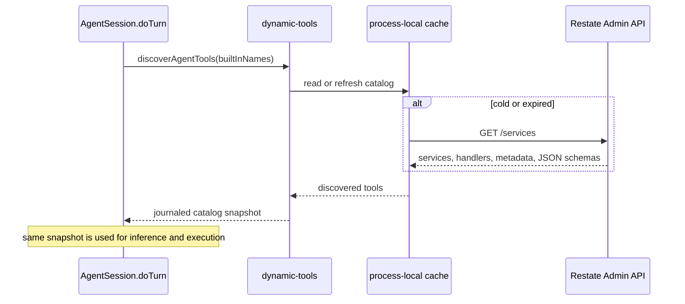

# Tool system

This project has three ways to make a capability available to the model:

1. a built-in tool implemented inside `AgentSession.doTurn`; or
2. an annotated Restate handler discovered at runtime; or
3. a tool from a configured MCP server.

All three become serializable `ToolManifest` values for model inference. Their
execution boundaries are intentionally different.

The built-in [programmatic tool calling (PTC)](#programmatic-tool-calling-ptc)
tool can compose capabilities from all three sources in one JavaScript program.
It is enabled by default and does not require a separate tool registration.

In standard agent terminology this is the **tool-use** or **function-calling**
layer. A model proposes tool actions; validated tool results become
observations in a later agent-loop iteration.

## The shared model contract

The model receives only a tool manifest describing its available action space:

```ts
type ToolManifest = {
  name: string;
  description: string;
  inputSchema: Record<string, unknown>;
  strict?: boolean; // defaults to true
  instructions?: string; // built-ins only
};
```

`instructions` is not part of the tool declaration the provider sees. While a
built-in is offered, `agentSystemPrompt` in `model/provider.ts` adds its
instructions to the system prompt, after the base instructions from
`agent-config.ts` and before the user's persistent instructions. Dynamic and
MCP tools never set it, so third-party text never reaches the system prompt.

A model response refers back to a tool by name:

```ts
type ToolCall = {
  toolCallId: string;
  toolName: string;
  input: unknown;
};
```

`model/provider.ts` reconstructs AI SDK tool declarations from the manifests.
It does not receive tool executors. `session/tools.ts` owns execution, and
`session/step.ts` owns batch policy and concurrency.

That separation keeps these decisions explicit:

- the model chooses a tool from a serializable catalog;
- the guardrail model evaluates concrete tool calls before execution (PTC emits
  its concrete calls while its program runs);
- the active `agentStep` starts every allowed foreground call in the batch together;
- Restate journals every operation and its result;
- results are projected back into model messages as observations by
  `session/tools.ts`.

## Turn-local tool search

`searchTools({query: "github unread notifications"})` performs local full-text
search over the current turn's permitted tool catalog. Built-ins remain visible
upfront; MCP and dynamic Restate schemas are deferred until a search selects
them. Each search returns at most five names and short descriptions, and adds
their complete schemas to the next model request. Loaded schemas remain visible
for the rest of that turn, without duplicating schemas in the search result.

The MiniSearch index is built lazily in memory from the journaled discovery
snapshot. It searches names, provider names, descriptions, and parameter names,
splits camelCase/snake_case identifiers, boosts name/provider matches, and pins
exact tool-name matches first. Initial matching uses prefixes, not fuzzy or
semantic search. A miss should prompt different keywords or a provider name,
not a claim that the user has no connection.

Search selections are journaled in `search-tools-<toolCallId>`. On replay the
runtime restores those selections without reranking. The index and loaded set
are private to the turn, not stored in a new VO or shared across users. A new
turn starts with a fresh loaded set. Only permitted tools are indexed; execution
still enforces the same grants, guardrails and permission checks. Tool
descriptions remain untrusted metadata. Search uses the normal built-in policy
path and does not execute matched tools.

PTC keeps the full permitted runtime catalog, even for tools whose schemas are
not yet visible. Search before writing code for unfamiliar tools: a search
inside a program loads schemas for the next model round, not the running
program. `manifests()` remains the complete runtime catalog;
`modelManifests()` provides the smaller inference catalog. If the agent's
built-in selection disables `searchTools`, inference falls back to the full
permitted catalog so external tools remain usable.

This reduces tool-schema context, not initial discovery/authentication work.
It adds a model round when a deferred tool is first needed; repeated searches
can still accumulate schemas during a long turn. No embeddings, hosted search,
or new search configuration are required.

## Built-in tools

The agent's built-ins live in `packages/libs/core/src/tools/`, one module per
capability (`weather`, `web-search`, `operations`, `approval`, `memory`,
`schedules`, `sub-agents`, `sandbox`), and `src/agent-config.ts` lists the ones
the agent has. `searchTools` and `executeProgram` are the exception: they work
on the turn's catalog, so the runtime provides them itself (`session/tool-search.ts`
and `ptc/`). A definition owns its name, model-facing description, Zod input
schema, validation, durable behavior, and optional pending completion:

```ts
const exampleTool = defineAgentTool({
  name: "example",
  description: "Explain exactly when the model should call this tool.",
  inputSchema: z.object({
    value: z.string().describe("What this field means."),
  }),
  *run({value}) {
    // Durable handler code.
    return succeeded(value);
  },
});
```

`defineAgentTool` and its helpers are in `src/tools-api.ts`. They include
`toolRun(name, action, retry)` for a tool whose work is one journaled side
effect, `agentCall(codes, op)` for calls into the Agent whose rejections the
model should see, and `toolFailure(name, error)`. All of them rethrow
cancellation. Tools call the Agent through its contract,
`restate.client(AgentDefinition, context.agentId)`, not through the Agent
implementation, so the tools do not depend on the runtime that runs them.

Two optional fields keep everything about a tool in its own definition:

- `instructions` is guidance for the system prompt, added in turns where the
  tool is offered: when to use it, beyond what the description says about one
  call. The memory tools use it to say when to search and what to remember, so
  an agent without them is never told to.
- `unavailable(context)` returns why the tool cannot be used in this turn, for
  the tool's own switches. `webSearch` uses it for the profile's web-search
  setting. An unavailable tool is hidden from the model and its calls are
  refused, like one the agent has no permission for.

Add the definition to `tools` in `agent-config.ts`. The rest follows from that
one registration:

- `agentTools.names` reserves the name from dynamic discovery;
- `agentTools.manifests()` converts the Zod schema to JSON Schema;
- `agentTools.execute()` dispatches the call to the tool's `run`, which
  validates the input against the schema first;
- the tool becomes available to agent runs, subject to capability settings in
  the turn's profile snapshot.

Use `.describe()` on fields whose meaning is not obvious. Descriptions are part
of the model contract, not cosmetic documentation.

### Current built-ins

| Tool | Purpose | Execution kind |
| --- | --- | --- |
| `searchTools` | Find permitted tools and load their schemas for this turn | Foreground journaled local search |
| `getWeather` | Synthetic weather lookup used to demonstrate parallel calls | Foreground |
| `webSearch` | Tavily keyless web search with bounded source evidence | Foreground journaled HTTP request |
| `sleep` | Durable timer | Pending |
| `humanApproval` | Signal-backed human decision | Pending |
| `cancelOperation` | Cancel one pending operation by ID | Foreground control |
| `searchMemories` | Search memory descriptions by keyword; returns IDs and descriptions | Foreground Agent RPC |
| `readMemories` | Read memory content by ID | Foreground Agent RPC |
| `manageMemory` | Atomically create, update or delete agent-local memories | Foreground Agent RPC |
| `createSubAgent` | Create a persistent child and await its optional first task | Durable child-turn wait |
| `messageSubAgent` | Ask a direct child a follow-up and return its answer | Durable child-turn wait |
| `listSubAgents` | Find existing direct children by name, ID and link | Foreground Agent RPC |
| `deleteSubAgent` | Delete a direct child's entire subtree | Foreground Agent RPC |
| `createSchedule` | Create or replace a message timer for this conversation | Foreground Agent RPC (turn-checked) |
| `cancelSchedule` | Idempotently cancel a schedule | Foreground Agent RPC (turn-checked) |
| `listSchedules` | Read schedules for this agent | Foreground Agent RPC |
| `listFiles` | List an agent sandbox directory | Foreground sandbox operation |
| `readFile` | Read a UTF-8 sandbox file | Foreground sandbox operation |
| `writeFile` | Replace a UTF-8 sandbox file | Foreground sandbox operation |
| `executeCommand` | Run one shell command to completion | Foreground sandbox operation |
| `executeProgram` | Coordinate tools in JavaScript and return a compact result | Foreground, with supervised child calls |

## Sub-agents

`createSubAgent` accepts a name, nullable configuration overrides and optional
initial message. It copies parent instructions, guardrails and current tool
grants, then applies narrower access or additional policy. The child starts
with an empty memory. Children
keep separate conversations and sandbox files. Later parent changes do not
rewrite a child's snapshot. Children cannot create children or schedules.

The parent Agent owns the child directory. Creation uses a deterministic child
ID derived from parent ID, turn ID and tool-call ID, so replay does not create
a duplicate. The child stores its parent ID. All coordination validates the
active parent turn and allowed tools.

An initial message starts a durable child turn. The parent session waits for
that exact invocation; its controller stays responsive. `messageSubAgent`
reuses the child's conversation for follow-ups. Different children can run in
parallel, directly or through PTC. A child accepts only one task at a time.
Parent interruption, completion and abandoned PTC branches clean up recorded
child turns; delayed cleanup cannot interrupt a newer follow-up.

`listSubAgents` returns direct children. `deleteSubAgent` retires a direct
child's subtree and separate sandboxes. It preserves the parent's memories and
operator configuration; retained conversation history is not purged. The UI
permits child inspection, interruption and approvals; task input comes from
the parent.

## Web search

`webSearch({query, maxResults})` uses [Tavily keyless access](https://docs.tavily.com/documentation/keyless):
no API key, account, or OAuth setup is needed. It is enabled by default. In the
UI, open **Context → Web search** to enable or disable it for that Agent. The
switch saves immediately to `AgentProfile.webSearchEnabled`, publishes a
`profile` notification, and survives refreshes. Changes apply from the next
turn; an active turn keeps its original profile snapshot.

Disabled turns omit `webSearch` from both the model and PTC catalogs, and the
dispatcher rejects direct attempts to call it. This switch controls only this
built-in tool, not internet access through separately configured MCP tools or
the sandbox.

Both input fields are required: `query` is a non-empty public search query of
up to 1,000 characters, and `maxResults` is an integer from 1 to 10 (normally 5).
The result is `{query, results: [{title, url, snippet}]}`; it contains source
snippets, not full pages or a provider-generated answer. For example:

```js
async tools => {
  const result = await tools.webSearch({
    query: "Restate durable execution documentation",
    maxResults: 3,
  });
  return result.results;
}
```

Queries are sent to Tavily, so the tool description prohibits sending secrets
or private conversation data. Results are untrusted evidence, not instructions;
the model is told to cite relevant source URLs. Keyless access is free but
rate-limited, not unlimited. Quota and invalid-response failures are reported
as tool failures, never fabricated empty searches.

The HTTP request is inside `restate.run`; successful journaled results are
reused on replay. It uses basic search, at most two attempts for transient
failures, a 15-second timeout per attempt, and the turn's cancellation signal.
Quota/auth failures are not automatically retried. Responses are capped at
1 MB, titles at 300 characters, and snippets at 1,500 characters per result.
Normal tool guardrails and interruption apply, including calls emitted by PTC.

## Programmatic tool calling (PTC)

PTC reduces intermediate model context: instead of returning every tool response
to the model for the next decision, the model writes a program that calls tools,
branches on their results, and computes a compact answer. It is another tool in
the existing agent loop, not a separate agent or a replacement tool backend.

PTC is enabled by default. Set `programTool: false` in
`packages/libs/core/src/agent-config.ts` to disable it. The catalogs read it
once, when the service loads. When disabled, `executeProgram` is left
out of every catalog: the model's tools (`manifests()`), the tool-search index,
the tool-permission UI (`builtinCatalog`) and the `searchTools` description.
Its name stays reserved, and already-recorded program calls retain their
normal execution and replay behavior, so deploying the change does not break
an in-flight turn.

The model can use `executeProgram({source})` to coordinate the same static,
Restate-discovered, and MCP tools that it can call directly. The source evaluates
to an async function accepting `tools`; each function takes the exact input
object described by its model-facing tool schema. PTC itself is excluded from
the guest catalog, so programs cannot recursively start programs.

```js
async tools => {
  const cities = ["Berlin", "Paris", "London"];
  const results = await Promise.allSettled(
    cities.map(city => tools.getWeather({city})),
  );
  return results.map((result, i) => ({
    city: cities[i],
    weather: result.status === "fulfilled" ? result.value : null,
    error: result.status === "rejected" ? result.reason.message : null,
  }));
}
```

`tools["exact-tool-name"]({...})` works for names that are not JavaScript
identifiers. Successful calls return parsed JSON when their result is JSON,
otherwise a string. MCP results retain `content` and `structuredContent` and
the existing attachment filtering. Failed tool outcomes reject promises.
Only the returned JSON or deterministic program error becomes an observation
for the agent model. Child activity and approval events still appear in the
transcript without raw arguments or results.

The tool description explains when to use PTC: dependent
lookups, parallel work, filtering, joins, and aggregation where carrying every
intermediate response through the agent model would waste context. Simple
actions can still use direct calls. Available tool schemas remain in the model's
catalog; this change reduces intermediate result context, not schema context.

### Try it in chat

With the core service running and PTC enabled, no MCP setup is needed for this
built-in-tool example:

> Use executeProgram to look up the demo weather for Berlin, Paris, and London
> in parallel. Return only the warmest city and its temperature, and report any
> failed lookups. Do the comparison in JavaScript, not in another model round.

`getWeather` returns text such as `24°C, sunny in Berlin`, not an object with a
`temp` field. Its synthetic temperature is a random integer from 10 to 40°C;
the tool journals that sample, so replay reuses it. The program can parse the
leading temperature and aggregate the results before returning JSON.

In the UI, expect `executeProgram` and its child `getWeather` activity; inspect
the Restate journal for the generated source and compact return value. The
model still chooses its tools, so enabling PTC does not force every task to use
it. Replacing the example calls with discovered tools uses their exact catalog
names and input schemas, with no separate PTC configuration.

### Durable execution

`ptc/guest.ts` runs QuickJS inside an embedded WebAssembly module. Each execution
attempt creates a fresh runtime. The model response already journals the source,
and discovery journals the turn's catalog. `ptc/runtime.ts` runs inline within
`AgentSession.doTurn` using its existing generator scheduler:

1. Drain guest microtasks synchronously.
2. Spawn emitted tool operations in order, with IDs `<outer-call-id>:call-N`.
3. Inspect the serialized root result.
4. Select one tool completion through Restate, deliver it to the corresponding
   guest promise, and repeat.

Tool operations reuse the existing dispatcher and own their existing durable
RPCs, runs, timers, and signals. Neither the whole program nor a compound tool
operation is wrapped in another `run`. Native `Promise.race`, `any`, `all`, and
`allSettled` work because result delivery is controlled at the host boundary.
Replay reconstructs the heap and promises using the recorded completion order.
The ordering contract depends on the pinned Restate SDK 1.17.0 and QuickJS
0.31.0; changes to the engine, bridge, budgets, or tool semantics require replay
compatibility review for in-flight turns.

### Policy, pending tools, and interruption

The PTC wrapper and its JavaScript source are not submitted for policy approval.
Each emitted concrete call goes through the normal guardrail gate with its
actual tool name and input. MCP authentication and sandbox access use the same
turn context as direct calls.

Inside a program, `sleep` and `humanApproval` promises resolve when their pending
completion arrives. Human approval returns its normal text decision; the program
must inspect it before taking dependent actions. `cancelOperation` can target an
existing turn-owned operation using an ID obtained from an earlier direct call.

If steering arrives while a program is running, the step stops waiting for it.
The program continues in the background as a turn-owned pending operation: the
model receives `{pending: true, operationId, status: "running"}` for the
`executeProgram` call, reads the steering, and later receives the program's
return value as a runtime completion. `cancelOperation` with that operation ID
stops the program. Approvals the program obtains after the handoff are not
reused by later steps' guardrail checks.

Racing does not cancel losing branches while the program runs. When its root
returns or throws, outstanding child calls are interrupted and joined; await
`Promise.allSettled` on those branches before returning if they must finish.
Turn interruption also disposes the guest and stops its active child tasks.
Cancellation cannot undo effects that already occurred.

Known program failures (syntax, uncaught rejection, invalid output, or exhausted
computation budget) become repairable tool failures. Escaped host/SDK failures
and turn interruption propagate through the scheduler rather than becoming
guest rejections or model feedback.

Programs have no direct I/O, timers, module loader, `Date`, or `Math.random`.
Inputs and results cross as JSON copies. Limits are 128 tool calls, 64,000 source
characters, 64,000 output characters, 32 MiB memory, 512 KiB stack, 10,000
interrupt checks per attempt, and 10,000 microtasks per drain. The private bridge
is held by the host rather than exposed through guest globals.

### Verification

`pnpm --filter @restate-agents/core test` checks guest replay, full and partial
real-SDK protocol replay, failures and limits, mixed tool dispatch, MCP auth
retry, subtool policy enforcement, and child interruption. Protocol peers and
outbound tool fixtures are local to the tests; no real provider credentials or
model calls are needed.

The optional `test:restart` command expects a disposable Restate server with
admin on port 19070 and ingress on 18080. It starts a test endpoint on 19880,
registers it as `http://host.docker.internal:19880`, kills that endpoint after a
race and its branches have completed, and restarts it. It asserts the recovered
winner, completion order, and results, and verifies recorded tool bodies are
not repeated. It changes only the disposable server and its own test processes.

## Foreground and pending execution

A built-in `run` method returns one of four outcomes:

```ts
type ToolExecution =
  | {status: "succeeded"; result: string}
  | {status: "failed"; error: string}
  | {status: "pending"; result: Record<string, unknown>}
  | {status: "cancel_requested"; operationId: string; reason: string};
```

### Foreground tools

A foreground tool reaches `succeeded` or `failed` before its step finishes.
All calls proposed in one model response are spawned in parallel, then joined.
One failure is data returned to the model; it does not discard sibling
results.

Results and errors of every tool kind are capped once, at 128,000 characters,
where they become model messages (`toModelMessage` and `toRuntimeMessage` in
`session/tools.ts`); a longer text is cut and ends with a
`[truncated by the runtime: …]` marker. Tools do not add their own model-facing
caps. A source that could journal unbounded data limits it inside its run
instead: web search responses (1 MB), sandbox file reads and command
stdout/stderr (1,000,000 characters each). PTC programs see results before the
central cap and can filter them; the program's own return is limited to 64,000
characters.

External side effects belong inside `restate.run` or a Restate RPC. Preserve
`InterruptedError` and `CancelledError` instead of converting them into normal
tool failures, so invocation cancellation can propagate through `doTurn`.

Give every `restate.run` in a tool an explicit retry policy. One without it
retries until it succeeds, which is wrong for a model-facing call: a bounded
failure is feedback the model can act on. Operations that are safe to repeat
(`listFiles`, `readFile`, `writeFile`, `getWeather`, `webSearch`) use a small
bounded retry. Operations that are not (`executeCommand`, MCP calls) use
`{maxAttempts: 1}`: a transport error can arrive after the command already
ran, and the model can inspect the result rather than have it silently run
again. Crash recovery can still repeat an effect whose result was not yet
journaled.

Built-in tools are deliberately local handler code. Do not turn one into a
Restate service merely to fit a generic abstraction.

### Pending tools

A pending tool acknowledges immediately from `run`, then implements `complete`.
The turn runtime starts completion as a task that may survive across loop iterations:

```ts
const waitTool = defineAgentTool({
  // ...
  *run(_input, context) {
    return {
      status: "pending",
      result: {
        operationId: context.toolCallId,
        status: "running",
      },
    };
  },
  *complete(input, context) {
    // Durable timer or signal wait.
    return {status: "succeeded", result: "done"};
  },
});
```

The stable `toolCallId` is also the operation ID. Pending completion becomes a
runtime message in a later model round. Because the original call was already
answered with `{pending: true}`, that message is a user-role message, so its
outcome (for a handed-off program or sub-agent, arbitrary web, MCP or tool
output) is never pasted in as text. `toRuntimeMessage` puts it in an
`<untrusted-tool-output>` block as JSON, with `<`, `>` and `&` escaped so the
payload cannot close the block, and the system prompt tells the model to treat
that block as data. A turn cannot finish while pending work
exists unless the model cancels it, the user interrupts, or the invocation is
externally cancelled.

Pending is appropriate only when later model work can proceed independently
while an operation waits. It is not a generic wrapper for a slow call.

### Selective cancellation

`cancelOperation` returns `cancel_requested`; the `doTurn` pending registry
owns the task and applies that request to a matching pending operation.
Cancellation is represented as a runtime event for the next step. It does not
cancel foreground work or the agent run itself.

Completion and cancellation may race. The settled state is authoritative:
completed work stays completed.

## Tool context

Every built-in receives:

```ts
type AgentToolContext = {
  agentId: string;
  turnId: string;
  webSearchEnabled: boolean;
  permissions: AgentTools;
  toolSearch?: TurnToolSearch;
  sandbox: TurnSandbox; // client() and release()
};
```

The internal call context also contains `toolCallId`. Use:

- `agentId` for Agent-owned state or resources;
- `turnId` for Agent-owned state that must be correlated with the current
  active turn, such as memory, approvals and schedules;
- `toolCallId` for stable operation identity;
- `sandbox.client()` for the agent's sandbox, acquired lazily once per turn.

The context exposes capabilities used by concrete tools, without general
orchestration hooks. Schedule mutations go through the Agent with the current
`turnId`, which authorizes them against the live turn. Once saved, the
schedule is an independent durable side effect; a later
interruption of the creating turn does not roll it back.

## Adding a built-in tool

1. Define it in a `src/tools/*.ts` module with `defineAgentTool`, and add it
   to `tools` in `src/agent-config.ts`. Put usage guidance in its
   `description` and `instructions`, not in the base instructions.
2. Give it a unique model-safe name and a precise description.
3. Define the complete Zod object schema. Make nullable fields explicitly
   nullable rather than optional when strict model schemas require every
   property.
4. Return structured tool status rather than throwing ordinary domain errors.
5. Re-throw Restate interruption and SDK cancellation errors.
6. Put non-deterministic external work in `restate.run` with an explicit
   retry policy (see [Foreground tools](#foreground-tools)), or call another
   Restate handler.
7. Add or update a test if it changes conversation semantics.
8. Run `pnpm lint`, `pnpm build`, and `pnpm bundle`.

Before making a tool pending, verify that the model can do useful work before
completion and that the runtime has a meaningful way to report, cancel, and later
incorporate its result.

## Dynamically discovered Restate tools

A deployed JSON Restate handler opts into the dynamic tool registry through
handler metadata:

```text
restate.dev/agent: query_grafana
```

The metadata value is the model-facing tool name. The current implementation
accepts `[A-Za-z0-9_-]{1,64}`.

With the generated TypeScript SDK used by this repository:

```ts
const Grafana = restate.service({
  name: "Grafana",
  handlers: {
    query: restate.schemas(
      {input: QuerySchema, output: QueryResultSchema},
      function* (input) {
        // ...
      },
    ),
  },
  options: {
    handlers: {
      query: {
        description:
          "Query Grafana for a metric over a requested time interval.",
        metadata: {
          "restate.dev/agent": "query_grafana",
        },
      },
    },
  },
});
```

Other Restate SDKs expose the same handler metadata through their own service
definition syntax. The contract that this agent reads is the annotation,
handler documentation, service type, and Admin API JSON input schema.

### Discovery lifecycle



The Admin API is cluster-global knowledge, so it is not stored behind one hot
Virtual Object key. Each service process maintains a read-through cache:

- successful entries refresh after five minutes;
- a failed refresh with a prior snapshot keeps the last-known-good catalog and
  retries after 30 seconds;
- Admin requests time out after five seconds;
- concurrent cold refreshes are coalesced;
- discovery failure without a prior snapshot degrades to built-ins only.

The selected catalog is returned through `restate.run`. Restate therefore
journals one stable snapshot for the turn. A deployment change cannot make the
model infer against one schema and execute against a different target during
replay.

Configure discovery with:

```text
RESTATE_ADMIN_URL=http://localhost:9070
RESTATE_ADMIN_TOKEN=<optional bearer token>
```

### Schema mapping

The handler's JSON input schema is nested under `input`:

```json
{
  "input": {
    "query": "rate(http_requests_total[5m])"
  }
}
```

For a Virtual Object or Workflow, the model schema also requires `key`:

```json
{
  "key": "tenant-42",
  "input": {
    "query": "..."
  }
}
```

If a handler has no input schema, `input` is omitted. Local JSON Schema
references are rewritten when the schema is nested. Handler documentation
becomes the model-facing description; otherwise a generated description names
the Restate target.

Discovered schemas use `strict: false`, because an arbitrary third-party JSON
Schema may not meet the model provider's stricter function-schema rules.

### Selection and conflicts

- Built-in names always win.
- Targets are sorted by `service/handler` before selection.
- When two annotated handlers claim one name, the first sorted target wins and
  a warning is logged.
- Invalid names are ignored with a warning.
- The name and target are fixed in the turn snapshot.

### Invocation contract

Dynamic tools run as foreground calls through generic `restate.call`:

```ts
yield* restate.call({
  service: target.service,
  method: target.handler,
  key: optionalKey,
  parameter: input,
  inputSerde: restate.serde.json,
  outputSerde: restate.serde.json,
});
```

Consequences:

- the child invocation is durable and visible in the Restate invocation tree;
- keyed handlers require a model-supplied key;
- input and output must use JSON;
- the complete call belongs to the current foreground batch;
- interruption or external cancellation propagates to the child;
- dynamic handlers cannot currently become turn-owned pending operations.

The called handler owns its own idempotency and side-effect semantics in the
normal Restate way.

The current catalog uses the input JSON Schema to guide the model. It does not
yet expose the handler's output schema to the model or validate the returned
value against it. The result must still be JSON-serializable and is converted
to a string for the next model round.

### Trust boundary

The annotation is an opt-in capability, not just documentation. An annotated
handler can be selected by the model and is called with this endpoint's Restate
authority. Its documentation and schema also enter the model prompt.

Treat the annotated handlers as trusted cluster configuration. Per-agent tool
selections narrow the available catalog, but the example has no tenant identity
or separate authorization broker for cluster capabilities.

## Adding a dynamically discovered tool

1. Deploy a Restate JSON handler to the same cluster.
2. Add `restate.dev/agent: <unique-name>` to its handler metadata.
3. Add concise handler documentation written for the model.
4. Publish an accurate JSON input schema and JSON output.
5. For a keyed service, ensure the model can know the appropriate key.
6. Wait for cache refresh, restart this endpoint, or temporarily lower the
   refresh interval while developing.
7. Start a new turn. Existing turns retain their journaled catalog.
8. Inspect logs for discovery warnings and the Restate invocation tree for the
   generic child call.

Choose a built-in when execution needs access to turn-owned pending tasks,
Agent profile mutations, or the shared sandbox context. Choose discovery when
the capability is already a well-defined Restate handler and should be
deployable independently.

## MCP tools

MCP servers contribute foreground tools to the same dispatcher as built-ins
and discovered Restate handlers. Configure endpoints with `MCP_SERVERS_JSON`
on the core process; see [MCP configuration](mcp-configuration.md) for examples,
protocol selection and the environment credential boundary.

Discovery records a turn-local snapshot of permitted remote definitions.
`stateless` uses handshake-free 2026-07-28 discovery; `stateful` uses a supported
2025-era initialize handshake. The selected protocol is explicit. In-memory
catalog caches and stateful connections are optimizations. Cache identity
includes the endpoint and credential fingerprint; a changed token does not
reuse a catalog/session authenticated under the old token.

Model names use `mcp__<serverId>__<remoteName>` with deterministic normalization
and collision handling. The original remote name and schema remain on the
runtime target. `searchTools` loads permitted external schemas on demand;
PTC dispatches through the same permissions and policy gate.

Each HTTP effect resolves the referenced token immediately before transport
use. Missing credentials or changed configuration fail with a safe error.
Provider exceptions are sanitized before being journaled: transport, HTTP and
auth failures become fixed messages. A JSON-RPC error answering a tool call
(invalid params, unknown tool, or the client's output-schema check) keeps its
code and message, bounded to 1,000 characters with the resolved token
redacted, so the model can correct its input. There are no OAuth
signals, browser authorization actions or refresh-state storage. Stateful
connections are released at turn completion and discarded after failed calls.

Calls pass the snapshotted definition for output validation. Successful results
are projected into JSON-compatible model observations, bounded by the central
result cap; remote `isError`
results and failed HTTP effects become tool failures. Unsupported content is
represented by summaries rather than hidden binary payloads in model context.
Raw tool data stays outside the public conversation history.

MCP calls include a stable `Idempotency-Key` derived from turn and tool-call IDs,
but servers must implement deduplication themselves. The HTTP run permits one
attempt to avoid eager retries. A crash after remote completion but before
recording the result can repeat a side effect. Recorded successful results
replay without another HTTP request.

Catalogs and tool results may contain sensitive data supplied by the remote
server. Credential isolation is not a general-purpose response redactor.
Endpoints, remote schemas and descriptions remain a trusted operator choice
and untrusted model input.

## Guardrails and tools

The agent model proposes a complete batch. The guardrail model evaluates direct
calls against the configured policy set before any member starts. PTC wrappers
are excluded from that check; their concrete child calls are evaluated as they
are emitted, before the child tool executes. The gate
returns one aggregate decision, referencing one policy when blocked:

- `allow`;
- `deny`; or
- `require_approval`.

Every non-allow candidate is checked by a second policy review call. An
unconfirmed denial or approval requirement becomes `allow`.

An approval applies to the exact proposed batch at that point in the turn.
After steering or a changed proposal, the runtime evaluates again. Guardrails
do not invoke tools themselves; they allow, deny, or pause the agent model's
proposal.

## Transcript and observability

The canonical history records structured tool lifecycle summaries—tool names,
counts, and final statuses—so clients can show useful progress. It deliberately
does not persist raw arguments or results. A built-in's activity label is a
fixed `summary` string on its definition (`"Read a file"`, `"Searched tools"`),
not a function of its input, so paths, queries, commands and names cannot
leak into the transcript through a label.

Use the Restate invocation tree and journal for:

- exact model input/output;
- raw tool arguments and results;
- retries;
- child invocation IDs;
- signal and cancellation propagation.

Use AgentSession history for the stable user-facing conversation and semantic
execution events.
