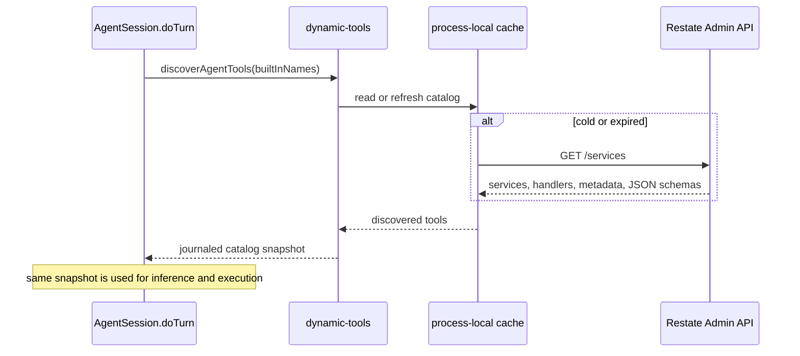

# Tool system

This project has three ways to make a capability available to the model:

1. a built-in tool implemented inside `AgentSession.doTurn`; or
2. an annotated Restate handler discovered at runtime; or
3. a tool from a configured stateless MCP server.

All three become serializable `ToolManifest` values for model inference. Their
execution boundaries are intentionally different.

In standard agent terminology this is the **tool-use** or **function-calling**
layer. A model proposes tool actions; validated tool results become
observations in a later agent-loop iteration.

## The shared model contract

The model receives only a tool manifest describing its available action space:

```ts
type ToolManifest = {
  name: string;
  description: string;
  inputSchema: Record<string, unknown>;
  strict?: boolean; // defaults to true
};
```

A model response refers back to a tool by name:

```ts
type ToolCall = {
  toolCallId: string;
  toolName: string;
  input: unknown;
};
```

`gateway/model.ts` reconstructs AI SDK tool declarations from the manifests.
It does not receive tool executors. `session/tools.ts` owns execution, and
`session/step.ts` owns batch policy and concurrency.

That separation keeps these decisions explicit:

- the model chooses a tool from a serializable catalog;
- the guardrail model evaluates the complete proposed batch before execution;
- the active `agentStep` starts every allowed foreground call in the batch together;
- Restate journals every operation and its result;
- results are projected back into model messages as observations by
  `session/tools.ts`.

## Built-in tools

Built-ins live in `packages/libs/core/src/session/tools.ts`. A definition owns
its name, model-facing description, Zod input schema, validation, durable
behavior, and optional pending completion:

```ts
const exampleTool = defineAgentTool({
  name: "example",
  description: "Explain exactly when the model should call this tool.",
  inputSchema: z.object({
    value: z.string().describe("What this field means."),
  }),
  *run({value}, context): restate.Operation<ToolExecution> {
    // Durable handler code.
    return {status: "succeeded", result: value};
  },
});
```

Add the definition to the `definitions` array. The rest follows from that one
registration:

- `agentTools.names` reserves the name from dynamic discovery;
- `agentTools.manifests()` converts the Zod schema to JSON Schema;
- `agentTools.execute()` validates input and dispatches the call;
- the tool becomes available to every agent run.

Use `.describe()` on fields whose meaning is not obvious. Descriptions are part
of the model contract, not cosmetic documentation.

### Current built-ins

| Tool | Purpose | Execution kind |
| --- | --- | --- |
| `getWeather` | Synthetic weather lookup used to demonstrate parallel calls | Foreground |
| `sleep` | Durable timer | Pending |
| `humanApproval` | Signal-backed human decision | Pending |
| `cancelOperation` | Cancel one pending operation by ID | Foreground control |
| `manageMemory` | Atomically set or delete Agent memories | Foreground Agent RPC |
| `scheduleMessage` | Create or replace a per-Agent durable schedule | Foreground AgentScheduler RPC |
| `cancelSchedule` | Idempotently cancel a schedule | Foreground AgentScheduler RPC |
| `listSchedules` | Read active schedules for this Agent | Foreground AgentScheduler RPC |
| `listFiles` | List an agent sandbox directory | Foreground sandbox operation |
| `readFile` | Read a UTF-8 sandbox file | Foreground sandbox operation |
| `writeFile` | Replace a UTF-8 sandbox file | Foreground sandbox operation |
| `executeCommand` | Run one shell command to completion | Foreground sandbox operation |

## Foreground and pending execution

A built-in `run` method returns one of four outcomes:

```ts
type ToolExecution =
  | {status: "succeeded"; result: string}
  | {status: "failed"; error: string}
  | {status: "pending"; result: Record<string, unknown>}
  | {status: "cancel_requested"; operationId: string; reason: string};
```

### Foreground tools

A foreground tool reaches `succeeded` or `failed` before its step finishes.
All calls proposed in one model response are spawned in parallel, then joined.
One failure is data returned to the model; it does not discard sibling
results.

External side effects belong inside `restate.run` or a Restate RPC. Preserve
`InterruptedError` and `CancelledError` instead of converting them into normal
tool failures, so invocation cancellation can propagate through `doTurn`.

Built-in tools are deliberately local handler code. Do not turn one into a
Restate service merely to fit a generic abstraction.

### Pending tools

A pending tool acknowledges immediately from `run`, then implements `complete`.
The turn runtime starts completion as a task that may survive across loop iterations:

```ts
const waitTool = defineAgentTool({
  // ...
  *run(_input, context) {
    return {
      status: "pending",
      result: {
        operationId: context.toolCallId,
        status: "running",
      },
    };
  },
  *complete(input, context) {
    // Durable timer or signal wait.
    return {status: "succeeded", result: "done"};
  },
});
```

The stable `toolCallId` is also the operation ID. Pending completion becomes a
runtime message in a later model round. A turn cannot finish while pending work
exists unless the model cancels it, the user interrupts, or the invocation is
externally cancelled.

Pending is appropriate only when later model work can proceed independently
while an operation waits. It is not a generic wrapper for a slow call.

### Selective cancellation

`cancelOperation` returns `cancel_requested`; the `doTurn` pending registry,
owns the task and applies that request to a matching pending operation.
Cancellation is represented as a runtime event for the next step. It does not
cancel foreground work or the agent run itself.

Completion and cancellation may race. The settled state is authoritative:
completed work stays completed.

## Tool context

Every built-in receives:

```ts
type AgentToolContext = {
  agentId: string;
  turnId: string;
  sandbox: {
    client(): restate.Operation<SandboxClient>;
  };
};
```

The internal call context also contains `toolCallId`. Use:

- `agentId` for Agent-owned state or resources;
- `turnId` for Agent-owned state that must be correlated with the current
  active turn, such as memory and approval;
- `toolCallId` for stable operation identity;
- `sandbox.client()` for a lazy, shared turn lease on the agent's sandbox.

The context intentionally does not expose general orchestration hooks.
Schedule mutations use `agentId` to address `AgentScheduler` directly. Once an
upsert completes, the schedule is an independent durable side effect and is
not rolled back if the originating turn later ends or is interrupted.

## Adding a built-in tool

1. Define it beside the existing tools in `session/tools.ts`.
2. Give it a unique model-safe name and a precise description.
3. Define the complete Zod object schema. Make nullable fields explicitly
   nullable rather than optional when strict model schemas require every
   property.
4. Return structured tool status rather than throwing ordinary domain errors.
5. Re-throw Restate interruption and SDK cancellation errors.
6. Put non-deterministic external work in `restate.run`, or call another
   Restate handler.
7. Add it to `definitions`.
8. Add or update an eval if it changes conversation semantics.
9. Run `pnpm lint`, `pnpm build`, and `pnpm bundle`.

Before making a tool pending, verify that the model can do useful work before
completion and that the runtime has a meaningful way to report, cancel, and later
incorporate its result.

## Dynamically discovered Restate tools

A deployed JSON Restate handler opts into the dynamic tool registry through
handler metadata:

```text
restate.dev/agent: query_grafana
```

The metadata value is the model-facing tool name. The current implementation
accepts `[A-Za-z0-9_-]{1,64}`.

With the generated TypeScript SDK used by this repository:

```ts
const Grafana = restate.service({
  name: "Grafana",
  handlers: {
    query: restate.schemas(
      {input: QuerySchema, output: QueryResultSchema},
      function* (input) {
        // ...
      },
    ),
  },
  options: {
    handlers: {
      query: {
        description:
          "Query Grafana for a metric over a requested time interval.",
        metadata: {
          "restate.dev/agent": "query_grafana",
        },
      },
    },
  },
});
```

Other Restate SDKs expose the same handler metadata through their own service
definition syntax. The contract that this agent reads is the annotation,
handler documentation, service type, and Admin API JSON input schema.

### Discovery lifecycle



The Admin API is cluster-global knowledge, so it is not stored behind one hot
Virtual Object key. Each service process maintains a read-through cache:

- successful entries refresh after five minutes;
- a failed refresh with a prior snapshot keeps the last-known-good catalog and
  retries after 30 seconds;
- Admin requests time out after five seconds;
- concurrent cold refreshes are coalesced;
- discovery failure without a prior snapshot degrades to built-ins only.

The selected catalog is returned through `restate.run`. Restate therefore
journals one stable snapshot for the turn. A deployment change cannot make the
model infer against one schema and execute against a different target during
replay.

Configure discovery with:

```text
RESTATE_ADMIN_URL=http://localhost:9070
RESTATE_ADMIN_TOKEN=<optional bearer token>
```

### Schema mapping

The handler's JSON input schema is nested under `input`:

```json
{
  "input": {
    "query": "rate(http_requests_total[5m])"
  }
}
```

For a Virtual Object or Workflow, the model schema also requires `key`:

```json
{
  "key": "tenant-42",
  "input": {
    "query": "..."
  }
}
```

If a handler has no input schema, `input` is omitted. Local JSON Schema
references are rewritten when the schema is nested. Handler documentation
becomes the model-facing description; otherwise a generated description names
the Restate target.

Discovered schemas use `strict: false`, because an arbitrary third-party JSON
Schema may not meet the model provider's stricter function-schema rules.

### Selection and conflicts

- Built-in names always win.
- Targets are sorted by `service/handler` before selection.
- When two annotated handlers claim one name, the first sorted target wins and
  a warning is logged.
- Invalid names are ignored with a warning.
- The name and target are fixed in the turn snapshot.

### Invocation contract

Dynamic tools run as foreground calls through generic `restate.call`:

```ts
yield* restate.call({
  service: target.service,
  method: target.handler,
  key: optionalKey,
  parameter: input,
  inputSerde: restate.serde.json,
  outputSerde: restate.serde.json,
});
```

Consequences:

- the child invocation is durable and visible in the Restate invocation tree;
- keyed handlers require a model-supplied key;
- input and output must use JSON;
- the complete call belongs to the current foreground batch;
- interruption or external cancellation propagates to the child;
- dynamic handlers cannot currently become turn-owned pending operations.

The called handler owns its own idempotency and side-effect semantics in the
normal Restate way.

The current catalog uses the input JSON Schema to guide the model. It does not
yet expose the handler's output schema to the model or validate the returned
value against it. The result must still be JSON-serializable and is converted
to a string for the next model round.

### Trust boundary

The annotation is an opt-in capability, not just documentation. An annotated
handler can be selected by the model and is called with this endpoint's Restate
authority. Its documentation and schema also enter the model prompt.

Deployers must therefore treat the set of annotated handlers as trusted
cluster configuration. This reference does not implement a tenant allowlist,
per-Agent capability set, or an authorization broker in front of dynamic
calls. A production system should add those controls before discovering
handlers from a cluster shared with untrusted service owners.

## Adding a dynamically discovered tool

1. Deploy a Restate JSON handler to the same cluster.
2. Add `restate.dev/agent: <unique-name>` to its handler metadata.
3. Add concise handler documentation written for the model.
4. Publish an accurate JSON input schema and JSON output.
5. For a keyed service, ensure the model can know the appropriate key.
6. Wait for cache refresh, restart this endpoint, or temporarily lower the
   refresh interval while developing.
7. Start a new turn. Existing turns retain their journaled catalog.
8. Inspect logs for discovery warnings and the Restate invocation tree for the
   generic child call.

Choose a built-in when execution needs access to turn-owned pending tasks,
Agent profile mutations, or the shared sandbox context. Choose discovery when
the capability is already a well-defined Restate handler and should be
deployable independently.

## Stateless MCP tools

The runtime can also discover tools from Agent-configured MCP Streamable HTTP
endpoints. This integration deliberately supports only protocol revision
[`2026-07-28`](https://modelcontextprotocol.io/specification/2026-07-28): the
stateless revision with per-request metadata, no `initialize` handshake, and no
`Mcp-Session-Id`. It does not fall back to initialize-era sessions or the
legacy HTTP+SSE transport.

MCP is a second external-tool backend, not a replacement for dynamic Restate
handlers. Both produce serializable model manifests and both are snapshotted
once per turn. Their execution remains distinct:

- a dynamic Restate tool uses durable `restate.call`;
- an MCP tool uses one stateless `tools/call` HTTP request inside
  `restate.run`.

### Configuration

Add each trusted server to the Agent profile through the Web UI or
`Agent.upsertMcpServer`:

```json
{
  "id": "notion",
  "type": "http",
  "url": "https://mcp.notion.com/mcp",
  "auth": {"type": "oauth"}
}
```

Fields:

| Field | Required | Meaning |
| --- | --- | --- |
| `id` | yes | Stable 1-64 character server identifier used in model-facing names |
| `type` | yes | `http` for stateless Streamable HTTP |
| `url` | yes | MCP Streamable HTTP endpoint |
| `auth.type` | yes | `none` or `oauth` |

Server IDs must be unique. The server definition is part of `AgentProfile` and
the journaled Turn snapshot, so do not put secrets in its fields. Full OAuth
state is separate private Agent VO state and is serialized without
application-level encryption in this reference implementation. A Turn receives
only `{serverId, accessToken}`; refresh tokens, redirect details, dynamic-client
registration, and discovery metadata remain on the private Agent/BFF boundary.
Neither form is returned by `Agent.profile` or the pending-authorization API.

An MCP endpoint is a trusted capability boundary. Its tool names,
descriptions, and schemas enter the model action space, and its handlers run
with the Agent's credential. Conversation input must never choose an endpoint
or credential.

### Compatibility gate

An endpoint fits this integration only when both of these conditions hold:

- it implements the handshake-free MCP `2026-07-28` protocol, including
  `server/discover`; and
- it is anonymous or uses the MCP OAuth authorization-code flow supported by
  the official client SDK.

Streamable HTTP alone is not sufficient. An initialize-era endpoint that uses
`Mcp-Session-Id` is a different lifecycle, even though it uses the same HTTP
transport name.

### OAuth lifecycle

MCP OAuth is coordinated by Agent state but split across the Turn and BFF:

1. Agent projects each stored OAuth state to `{serverId, accessToken}` and
   snapshots those minimal credentials into a new Turn.
2. An OAuth server with no credential, or a discovery/invocation 401 or
   insufficient-scope challenge, calls `Agent.requestMcpAuthorization`.
3. Agent verifies the active Turn, coalesces requests for the same server,
   stores the pending action, and publishes `mcpAuth` invalidation.
4. The Turn waits on a named signal belonging to its own invocation.
5. The Web UI re-reads `Agent.mcpAuthorizations` and presents an Authorize
   action. The BFF performs OAuth discovery, refresh when possible, dynamic
   client registration, and authorization-code plus PKCE flow.
6. Agent durably stores discovery, registered-client, OAuth state, and PKCE
   material across the browser redirect. Those private values never enter the
   profile, Turn, or browser response.
7. The callback validates OAuth state, exchanges the code, and calls
   `Agent.completeMcpAuthorization` with the resulting full OAuth state.
8. Agent stores the OAuth state, removes the pending flow, publishes `mcpAuth`,
   and signals the waiting Turn with only `{serverId, accessToken}`. The Turn
   retries the failed operation. A repeated identical challenge fails; a
   different scope challenge may start another authorization round, bounded to
   four rounds per tool call.

Completion is rejected for a stale, terminal, or interrupting Turn. Changing
or removing a server clears its credential and cancels related waiters. Turn
cleanup removes abandoned authorization actions and redirect state.

### Discovery and names

At turn start, `session/mcp-tools.ts` does the following for every configured
server:

1. Pins the official TypeScript MCP client to `2026-07-28` and calls
   `server/discover`.
2. Calls `tools/list`; the SDK walks pagination and validates MCP wire types and
   `x-mcp-header` declarations.
3. Applies schema-size limits, deterministic sorting, and the per-server
   tool-count limit.
4. Returns the server discovery result and exact tool definitions through
   `restate.run`.
5. Adds that stable result to the same turn catalog used for inference and
   execution.

Model-facing names are qualified to avoid cross-server collisions:

```text
mcp__github__search_issues
mcp__slack__send_message
```

Characters outside `[A-Za-z0-9_-]` become `_`. Names longer than 64 characters
or colliding with a built-in or Restate-discovered tool are shortened with a
stable identity hash. The snapshotted target retains the original MCP name;
execution never tries to reverse the alias.

The process-local cache is isolated by server configuration and a hash of the
current access token, but stores only discovery and tool definitions—not the
token itself. It is capped at 256 least-recently-used entries. Each entry's
lifetime is the smaller TTL advertised by `server/discover` and `tools/list`,
capped at five minutes; a missing, invalid, or zero TTL disables reuse for the
next turn. Concurrent refreshes are coalesced. After a successful read, a
refresh failure may use the last-known-good catalog and retry after 30 seconds.
The process cache is only an optimization; the `restate.run` result is the
durable turn snapshot.

### Invocation and results

MCP calls are foreground tools and participate in the existing parallel tool
batch. Execution creates an ephemeral client, adopts the snapshotted modern
discovery result without another probe, and calls `tools/call` with the exact
snapshotted `Tool` definition. Supplying that definition lets the SDK perform
`x-mcp-header` mirroring and validate `structuredContent` against the advertised
output schema without re-listing the catalog.

Interruption and external cancellation abort the request signal. Under
stateless Streamable HTTP, closing a request-scoped SSE response is the MCP
cancellation signal. Tool-level `isError` results become ordinary failed tool
outcomes so the model can correct its action; protocol and transport failures
are also projected as tool failures unless the enclosing Restate operation was
interrupted or cancelled.

The model observation contains MCP text, structured content, textual embedded
resources, and resource-link metadata. Image, audio, and blob base64 payloads
are omitted with their MIME type and encoded size retained. Rendered results
are capped at 128,000 characters before entering model context. Raw results do
not enter the canonical conversation transcript.

### Delivery guarantees

Each call carries:

```text
Idempotency-Key: <turnId>:<toolCallId>
```

This is a stable opt-in deduplication key for cooperating servers, not an MCP
guarantee. MCP does not standardize idempotency, and an HTTP side effect may
succeed before Restate records its response. Crash recovery can therefore
repeat an uncommitted mutation. The runtime disables eager retry of the
`tools/call` operation, but MCP tools must still be treated as potentially
at-least-once. Prefer a Restate handler, or an MCP server that durably honors
the key, for mutations that require deduplication.

### Deliberate exclusions

The MCP client advertises no elicitation, sampling, or roots capability and
disables automatic multi-round-trip request fulfillment. A server that still
returns `input_required` produces an actionable tool failure. Supporting form
elicitation would require a new durable form-response protocol; the existing
boolean approval state is not sufficient.

This implementation also excludes MCP prompts, resources, the Tasks extension,
`subscriptions/listen`, stdio, explicit disconnect/revocation controls, and
legacy MCP sessions. Prompts and resources should not be flattened into
model-controlled tools without first defining their context and trust
semantics.

## Guardrails and tools

The agent model proposes a complete batch. The guardrail model evaluates the
proposal against the configured policy set before any member starts and
returns one aggregate decision, referencing one policy when blocked:

- `allow`;
- `deny`; or
- `require_approval`.

Every non-allow candidate is checked by a second policy review call. An
unconfirmed denial or approval requirement becomes `allow`.

An approval applies to the exact proposed batch at that point in the turn.
After steering or a changed proposal, the runtime evaluates again. Guardrails
do not invoke tools themselves; they allow, deny, or pause the agent model's
proposal.

## Transcript and observability

The canonical history records structured tool lifecycle summaries—tool names,
counts, and final statuses—so clients can show useful progress. It deliberately
does not persist raw arguments or results.

Use the Restate invocation tree and journal for:

- exact model input/output;
- raw tool arguments and results;
- retries;
- child invocation IDs;
- signal and cancellation propagation.

Use AgentSession history for the stable user-facing conversation and semantic
execution events.
