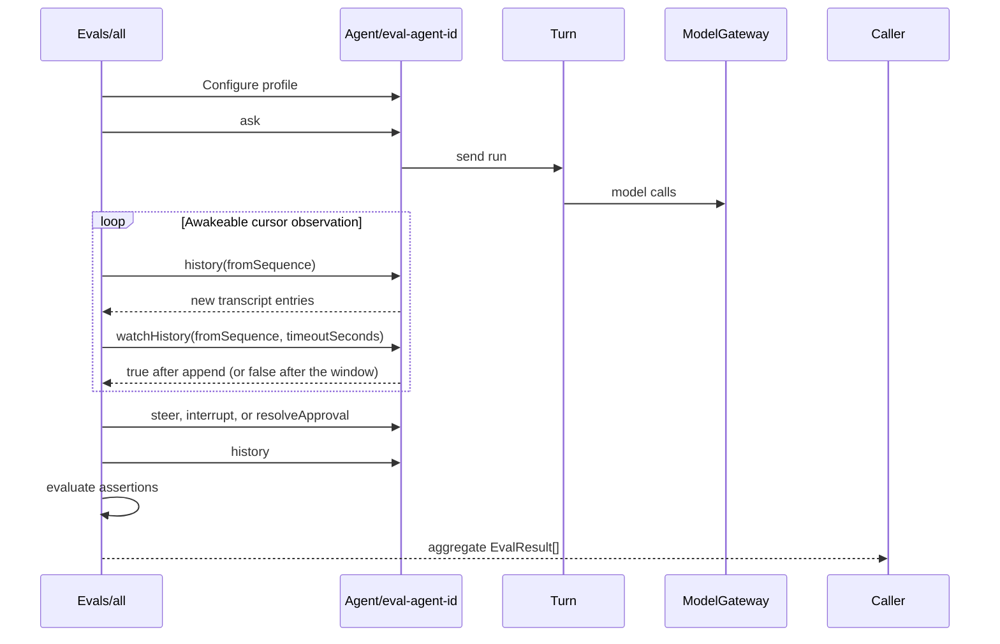

# Restate-native evals

The first evaluation slice runs inside Restate and treats the Agent as a
black-box public protocol.

## Execution

The single `Evals/all` handler spawns every durable scenario concurrently
against a fresh Agent virtual object.



The service invocation provides durable execution, retries, cancellation, a
stable invocation identity, and a stored aggregate result. Each spawned case
also has its own durable timeout.

Each attempt uses a fresh Agent key containing the eval handler invocation ID:

```ts
const agentId = `eval-${isolation}-${caseId}-${attempt}`;
```

An optional `runId` labels related suite work but never removes
invocation-level isolation.

## Contracts

```ts
type EvalOptions = {
  runId?: string;
  attempt?: number;
  timeoutSeconds?: number;
  cases?: EvalCaseId[];
};

type EvalResult = {
  caseId: string;
  agentId: string;
  status: "passed" | "failed";
  assertions: Array<{
    name: string;
    passed: boolean;
    details?: string;
  }>;
  transcript: SequencedConversationEntry[];
};

type EvalSuiteResult = {
  status: "passed" | "failed";
  results: EvalResult[];
};
```

Every scenario is a separate generator operation spawned by `all`. Shared
options and result assembly remain internal; there is no public case-ID
dispatcher or generic scenario language.

## History notifications

The eval reads all currently available entries from the Agent's existing
cursor API. When the cursor is empty, it long-polls the shared `watchHistory`
handler with that cursor and a bounded wait window.

Registration closes the empty-read race:

- If history changed before the wait registered, `watchHistory` returns
  immediately: the internal exclusive registration re-checks the cursor.
- Otherwise, the Agent stores the watcher and `history.append` resolves it when
  the cursor becomes readable.
- The wait parks in a shared handler, so no exclusive handler is held open and
  transcript writers are never blocked. A timed-out window cleans up its own
  registration; the eval simply selects the call against its case deadline.

After the notification, the eval reads the regular cursor again. The
notification contains no transcript data and the append-only history remains
the source of truth.

## Current cases

1. `basicTurn` checks idle dispatch, successful completion, one terminal
   entry, and a minimally relevant answer.
2. `steering` waits until sleep is pending, steers more work into the same
   Turn, and checks event order, retained/new results, and that the model did
   not restart the existing timer.
3. `interruption` waits until sleep is pending, interrupts it, and checks
   graceful finalization and the interrupted terminal response.
4. `interruption-replacement` interrupts a pending turn while carrying a
   replacement request, then checks that the replacement is recorded as a
   queued user message *before* the interruption boundary, that the old Turn
   finalizes before dispatch, that the dispatch boundary activates exactly one
   message, and that a new Turn answers it.
5. `execution-limit` asks for more weather lookups than the 24-tool-call budget
   allows, in small batches. It checks that the budget stops the Turn through
   the guarded finalization path — a `stopped` outcome with a `tool_limit`
   boundary carrying completed work — rather than publishing an internal budget
   error as a failed answer, and that every completed city result survives into
   that answer.
6. `context-reduction` makes one small call to the cheap Turn-context model
   with synthetic completed, failed, and unresolved tool records. It verifies
   that all three survive reduction without paying for enough full agent turns
   to manufacture a 32 KB working context.
7. `memory` asks the agent to remember a preference and checks the metadata-only
   memory event, its ordering, and the durable profile entry.
8. `scheduling` creates, lists, and cancels one delayed message without model
   inference, then lets a one-shot schedule wake an idle Agent. It checks the
   firing route, adjacent user entry, terminal response, and one-shot state
   cleanup with one small agent turn.
9. Six isolated guardrail cases cover:
   - Approval verifies that the guardrail profile update and pending request
     are discoverable as structured history events, approves exactly one
     request, and checks that the decision is recorded before completion. A
     follow-up Turn must read that decision without reopening the approval.
   - Scope approves a Japan request, then verifies that U.S. clarification and
     New York weather remain outside the Japan-only policy.
   - Denial checks that a deny policy neither opens an approval nor starts the
     protected weather tool.
   - Rejection checks that a rejected request produces a compliant explanation
     without requesting approval again.
   - Removal rejects protected work, clears the guardrail between Turns, and
     verifies that the same work runs without another approval under the new
     authoritative profile snapshot.
   - Steering approves one request, adds protected work, and checks that the
     old approval is invalidated and requested again for the updated work.

The cases assert transcript structure, event ordering, correlations, and
durable state rather than exact model prose.

Invoke the complete suite through Restate ingress:

```sh
curl localhost:8080/Evals/all \
  -H 'content-type: application/json' \
  -d '{}'
```

Pass `cases` to re-run a subset with identical isolation and assertions, which
keeps a probabilistic case cheap to repeat:

```sh
curl localhost:8080/Evals/all \
  -H 'content-type: application/json' \
  -d '{"cases":["execution-limit"],"timeoutSeconds":300}'
```

The focused context-reduction contract can be run by itself. It performs one
small `gpt-4o-mini` call and no full agent inference:

```sh
curl localhost:8080/Evals/all \
  -H 'content-type: application/json' \
  -d '{"cases":["context-reduction"]}'
```

The user-facing transcript records tool call IDs, names, and lifecycle statuses,
but intentionally omits tool inputs and results. Protocol assertions such as
the steering timer-restart check and execution-budget check consume these
structured events. Internal properties such as actual tool parallelism still
require a later journal-observation layer or a scripted model/tool mode; the
transcript proves intent and settlement order, not physical overlap.

## Later extensions

Add protocol cases for history pagination and for compaction: no case yet drives
an Agent past the 32-message checkpoint, so the reserved-prefix ordering that
keeps a dispatch boundary with the messages it activates is currently only
covered indirectly by `interruption-replacement`.

Add an `EvalSuite` virtual object, keyed by `runId`, only when suite
coordination is useful. It can spawn case invocations, aggregate their results,
expose shared status and result handlers, cancel a run, and repeat
probabilistic cases.

Add semantic grading after the deterministic suite is useful. A dedicated
judge model handler should evaluate fulfillment, steering incorporation,
interruption summaries, memory use, and policy compliance against explicit
rubrics. It should not replace protocol assertions or rely on exact-string
snapshots.
