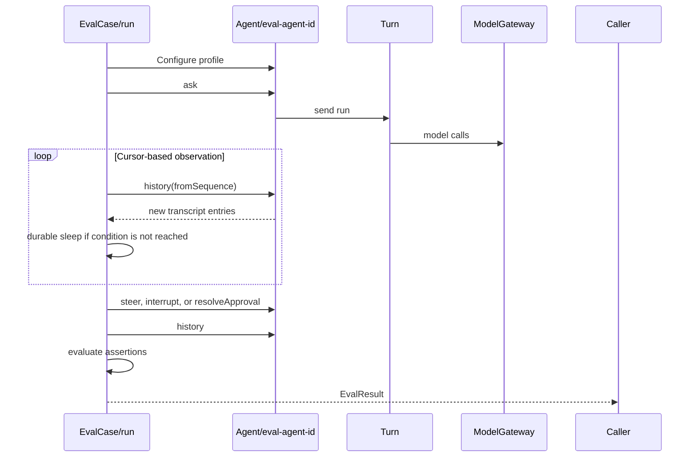

# Restate-native evals

This is a parked design for evaluating the durable agent from inside Restate.
It is intentionally not implemented yet.

## Starting point

Use one `EvalCase` service whose `run` handler executes a single durable
scenario against a fresh Agent virtual object.



A service handler is sufficient for an individual case because its invocation
already provides durable execution, retries, cancellation, a stable invocation
identity, and a stored result.

Each attempt should use a fresh Agent key:

```ts
const agentId = `eval-${runId}-${caseId}-${attempt}`;
```

## Initial contracts

```ts
type EvalRequest = {
  caseId: string;
  runId: string;
  attempt?: number;
};

type EvalResult = {
  caseId: string;
  agentId: string;
  status: "passed" | "failed";
  assertions: Array<{
    name: string;
    passed: boolean;
    details?: string;
  }>;
  transcript: SequencedConversationEntry[];
};
```

Keep cases as generator functions selected by `caseId` at first. A generic
scenario language is unnecessary until repeated patterns justify one, and
functions or predicates cannot be passed through service inputs.

An eval driver needs only a few operations:

- Configure instructions and guardrails on a fresh Agent.
- Call `ask`, `steer`, `interrupt`, and `resolveApproval`.
- Consume `history` incrementally from its existing sequence cursor.
- Read `approvals` and `profile`.
- Durably sleep between reads until a transcript or approval condition holds.
- Return structured assertions and the observed transcript.

## First cases

Start with deterministic protocol assertions:

1. A basic turn produces exactly one terminal assistant entry.
2. `ask` while busy queues the message and dispatches it after the active Turn.
3. Steering incorporates queued messages into the active Turn.
4. Steering while sleep is pending preserves that operation.
5. Interruption cancels unfinished work and produces an accurate interrupted
   result.
6. Interruption with a replacement message starts a new Turn with the complete
   transcript.
7. A guardrail opens exactly one approval and protected work runs only after
   approval.
8. Rejected approval prevents the protected action.
9. Memory written in one Turn is available in a later Turn.
10. History pagination never skips or duplicates sequence numbers.

These cases should assert transcript structure, event ordering, correlations,
and durable state rather than exact model prose.

The user-facing transcript intentionally omits raw tool calls. Assertions about
internal properties such as actual tool parallelism require a later
journal-observation layer or a scripted model/tool mode; progress text alone
does not prove those properties.

## Later extensions

Add an `EvalSuite` virtual object, keyed by `runId`, only when suite
coordination is useful. It can spawn case invocations, aggregate their results,
expose shared status and result handlers, cancel a run, and repeat
probabilistic cases.

Add semantic grading after the deterministic suite is useful. A dedicated
judge model handler should evaluate fulfillment, steering incorporation,
interruption summaries, memory use, and policy compliance against explicit
rubrics. It should not replace protocol assertions or rely on exact-string
snapshots.
