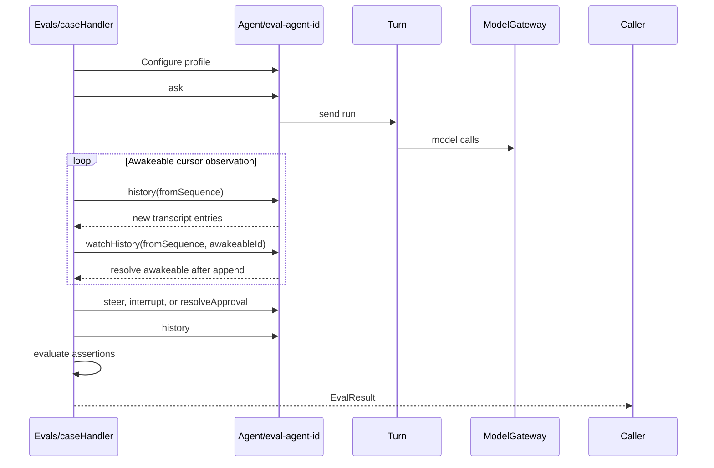

# Restate-native evals

The first evaluation slice runs inside Restate and treats the Agent as a
black-box public protocol.

## Execution

Each handler on the `Evals` service executes durable scenarios against fresh
Agent virtual objects. The `guardrails` handler spawns its four policy cases
concurrently.



A service handler is sufficient for an individual case because its invocation
already provides durable execution, retries, cancellation, a stable invocation
identity, and a stored result. One overall durable timer bounds every case.

Each attempt uses a fresh Agent key containing the eval handler invocation ID:

```ts
const agentId = `eval-${isolation}-${caseId}-${attempt}`;
```

An optional `runId` labels related suite work but never removes
invocation-level isolation.

## Contracts

```ts
type EvalOptions = {
  runId?: string;
  attempt?: number;
  timeoutSeconds?: number;
};

type EvalResult = {
  caseId: string;
  agentId: string;
  status: "passed" | "failed";
  assertions: Array<{
    name: string;
    passed: boolean;
    details?: string;
  }>;
  transcript: SequencedConversationEntry[];
};
```

The conversation cases have individual handlers. The guardrail scenarios are
separate generator operations spawned by one `guardrails` handler. Shared
options and result assembly remain internal; there is no case-ID dispatcher or
generic scenario language.

## History notifications

The eval reads all currently available entries from the Agent's existing
cursor API. When the cursor is empty, it creates an awakeable and passes its ID
and the cursor to the exclusive `watchHistory` handler.

Registration closes the empty-read race:

- If history changed before registration ran, the Agent resolves the awakeable
  immediately.
- Otherwise, the Agent stores the watcher and `history.append` resolves it when
  the cursor becomes readable.
- The eval waits on the awakeable outside the Agent, so an exclusive handler is
  never held open.

After the notification, the eval reads the regular cursor again. The
notification contains no transcript data and the append-only history remains
the source of truth.

## Current cases

1. `basicTurn` checks idle dispatch, successful completion, one terminal
   entry, and a minimally relevant answer.
2. `steering` waits until sleep is pending, steers more work into the same
   Turn, and checks event order and retained/new results.
3. `interruption` waits until sleep is pending, interrupts it, and checks
   graceful finalization and the interrupted terminal response.
4. `guardrails` concurrently spawns four isolated cases:
   - Approval verifies exactly one pending request, approves it, and checks
     completion.
   - Denial checks that a deny policy neither opens an approval nor starts the
     protected weather tool.
   - Rejection checks that a rejected request produces a compliant explanation
     without requesting approval again.
   - Steering approves one request, adds protected work, and checks that the
     old approval is invalidated and requested again for the updated work.

The cases assert transcript structure, event ordering, correlations, and
durable state rather than exact model prose.

Invoke a case through Restate ingress:

```sh
curl localhost:8080/Evals/basicTurn \
  -H 'content-type: application/json' \
  -d '{}'
```

The user-facing transcript intentionally omits raw tool calls. Assertions about
internal properties such as actual tool parallelism require a later
journal-observation layer or a scripted model/tool mode; progress text alone
does not prove those properties.

## Later extensions

Add protocol cases for queued dispatch, interruption replacement messages,
memory, and pagination.

Add an `EvalSuite` virtual object, keyed by `runId`, only when suite
coordination is useful. It can spawn case invocations, aggregate their results,
expose shared status and result handlers, cancel a run, and repeat
probabilistic cases.

Add semantic grading after the deterministic suite is useful. A dedicated
judge model handler should evaluate fulfillment, steering incorporation,
interruption summaries, memory use, and policy compliance against explicit
rubrics. It should not replace protocol assertions or rely on exact-string
snapshots.
